Modeling the visibility of saccade-like motion (simple model)
================
Richard Schweitzer
2023-02-07

# Setup of the model

Do we want to output every figure as a vector graphics instead of png?
If so, determine here:

``` r
output_form <- 'svg'
knitr::opts_chunk$set(dev = output_form) # set output device to svg or pdf
```

Load dependencies …

``` r
# libraries
library(R.matlab)
```

    ## R.matlab v3.7.0 (2022-08-25 21:52:34 UTC) successfully loaded. See ?R.matlab for help.

    ## 
    ## Attaching package: 'R.matlab'

    ## The following objects are masked from 'package:base':
    ## 
    ##     getOption, isOpen

``` r
library(lme4)
```

    ## Loading required package: Matrix

``` r
library(data.table)
library(pracma)
```

    ## 
    ## Attaching package: 'pracma'

    ## The following objects are masked from 'package:Matrix':
    ## 
    ##     expm, lu, tril, triu

``` r
library(ggplot2)
library(viridis)
```

    ## Loading required package: viridisLite

``` r
library(psyphy)
library(cowplot)
library(latex2exp)
library(reshape2)
```

    ## 
    ## Attaching package: 'reshape2'

    ## The following objects are masked from 'package:data.table':
    ## 
    ##     dcast, melt

``` r
library(assertthat)
library(torch)
cuda_is_available() # check: is cuda available?
```

    ## [1] TRUE

``` r
# relevant custom functions
source("self_avoiding_walk.R")
source("visual_proc_func_rev.R")
source("pop_mean_function.R")
source("ggplot2_theme.R")
source("get_max_se.R")
```

Paths, model parameters and stimulus data here:

``` r
# path to trajectories
slmf_fig_path <- "resulting_figures"  # here we'll save the model figures
mat <- readMat("SLMFAG01_Block1.mat") # this is the stimulus data from the actual experiment

# constants relating to the experiment
scr_fd <- (1000/1440) # duration of a single frame
scr_ppd <- 30.162 / 2 # pixels per degree of visual angle [dva]
stim_sd <- 0.3  # Gabor aperture SD in dva

# constants relating to the model
rf_sd <- 0.15 # RF size in dva
masking_times <- c(0, 12.5, 50, 200) # what masking times to test
spat_res <- 0.05 # spatial resolution of the visual processing grid
lat <- 40 # latency of the temporal response function
all_sca <- c(12.5) # scale/s of the temporal response function
all_sha <- c(1.6) # shape/s of the temporal response function
# make sure we'll only run one temporal response function:
assert_that(length(all_sca)==length(all_sha))
```

    ## [1] TRUE

``` r
assert_that(length(all_sca)==1)
```

    ## [1] TRUE

``` r
(n_visual_proc_conditions <- length(all_sca))
```

    ## [1] 1

``` r
(sca <- all_sca[1])
```

    ## [1] 12.5

``` r
(sha <- all_sha[1])
```

    ## [1] 1.6

``` r
# related to Naka-Rushton normalization and probability summation
c50 <- 0.3 # prop of maximum input signal at which the hyperbolic function is at 50%
beta <- 1.5 # slope of psychometric function
# for Model response fits
lapse_rate <- 0.02
guess_rate <- 0.5

# Noise to the model:
# ... the ocular-drift random walk
lattice_size <- round(2*scr_ppd)+1 # what should be the size of the grid?
lattice_lambda <- 1 # the steepness of the gradient
# ... response-amplitude dependent noise:
add_amp_noise <- TRUE

# how to run the model simulation
do_result_plot <- FALSE
do_this_on_GPU <- TRUE
n_cores <- 2 # think about how much GPU memory you have!
n_iterations <- 250 # for tests: 25
do_compute_pop_mean <- TRUE # TRUE: stimulus position signal using the 'population response'
```

# Preparation of the visual stimulus

Now parse the mat-file to extract the unique stimulus trajectories.

``` r
# How many block do we have?
(n_blocks <- length(mat$design[, ,1]$b))
```

    ## [1] 8

``` r
(n_trials_per_block <- length(mat$design[, ,1]$b[ , ,1]$trial[1, , ]))
```

    ## [1] 84

``` r
conditions <- NULL # here we'll store the trial descriptives
trajectories <- NULL # here we'll store the actual trajectory in that trial
max_num_pos_samples <- NaN # this is the maximum number of samples in the position vector we detected

# parse the entire block
for (block in (1:n_blocks)) {
  for (trial_b in (1:n_trials_per_block)) {
    # get trial data
    this_condition <- data.table(block = block, trial = trial_b, 
                                 amp = mat$design[ , ,1]$b[ , ,block]$trial[ , ,trial_b]$staAmp[1,1], 
                                 vel = mat$design[ , ,1]$b[ , ,block]$trial[ , ,trial_b]$movVel[1,1], 
                                 velFac = mat$design[ , ,1]$b[ , ,block]$trial[ , ,trial_b]$spdFac[1,1],
                                 dur = mat$design[ , ,1]$b[ , ,block]$trial[ , ,trial_b]$sacDur[1,1], 
                                 iniPos = mat$design[ , ,1]$b[ , ,block]$trial[ , ,trial_b]$iniPos[1,1], 
                                 curDir = mat$design[ , ,1]$b[ , ,block]$trial[ , ,trial_b]$curDir[1,1], 
                                 sf = mat$design[ , ,1]$b[ , ,block]$trial[ , ,trial_b]$staFrq[1,1])
    conditions <- rbind(conditions, this_condition)
    # get trajectory
    this_trajectory <- data.table(x = mat$design[ , ,1]$b[ , ,block]$trial[ , ,trial_b]$stim[ , ,1]$posVec[1,], 
                                  y = mat$design[ , ,1]$b[ , ,block]$trial[ , ,trial_b]$stim[ , ,1]$posVec[2,] )
    this_trajectory <- this_trajectory[x!=0 & y!=0] # these are time points when contrast is zero
    this_trajectory$t <- seq(0, length(this_trajectory$x)*scr_fd, 
                             length.out = length(this_trajectory$x) )
    this_trajectory$block <- block
    this_trajectory$trial <- trial_b
    trajectories <- rbind(trajectories, this_trajectory)
    # check length of trajectory
    if (is.na(max_num_pos_samples) || nrow(this_trajectory) > max_num_pos_samples ) {
      max_num_pos_samples <- nrow(this_trajectory)
    }
  }
}
print(paste("Maximum number of samples detected:", max_num_pos_samples))
```

    ## [1] "Maximum number of samples detected: 773"

``` r
# get a unique condition identifier:
conditions[ , condition_ID := paste(amp, round(velFac, 2), iniPos, curDir)]
# find unique conditions:
unique_conditions <- conditions[ , .(block = block[1], 
                                     trial = trial[1], 
                                     amp = unique(amp), 
                                     velFac = unique(velFac), vel = unique(vel),
                                     dur = unique(dur),
                                     iniPos = unique(iniPos), 
                                     curDir = unique(curDir)), 
                                 by = .(condition_ID)]
unique_conditions <- unique_conditions[iniPos==1 & curDir==1] # one direction is sufficient
unique_conditions <- unique_conditions[order(amp, velFac)]
head(unique_conditions)
```

    ##    condition_ID block trial amp    velFac      vel    dur iniPos curDir
    ## 1:   4 0.25 1 1     1    43   4 0.2500000 178.7832 0.0338      1      1
    ## 2:   4 0.33 1 1     1    49   4 0.3333333 178.7832 0.0338      1      1
    ## 3:    4 0.5 1 1     3     8   4 0.5000000 178.7832 0.0338      1      1
    ## 4:   4 0.67 1 1     1    84   4 0.6666667 178.7832 0.0338      1      1
    ## 5:    4 0.8 1 1     2    61   4 0.8000000 178.7832 0.0338      1      1
    ## 6:      4 1 1 1     3    42   4 1.0000000 178.7832 0.0338      1      1

Now we’ll merge conditions with the respective stimulus trajectories.
We’ll then transform the trajectories, specified in pixels, to
retinotopic coordinates, given that observers fixate at screen center,
that is, right at the midpoint of the trajectory. Finally, we’ll prepare
the samples to make them a bit more convenient to work with.

``` r
st <- merge.data.table(x = unique_conditions, y = trajectories, 
                       by = c("block", "trial"), all.x = TRUE)
st <- st[order(amp, velFac, t)]
head(st)
```

    ##    block trial condition_ID amp velFac      vel    dur iniPos curDir   x   y
    ## 1:     1    43   4 0.25 1 1   4   0.25 178.7832 0.0338      1      1 450 270
    ## 2:     1    43   4 0.25 1 1   4   0.25 178.7832 0.0338      1      1 450 270
    ## 3:     1    43   4 0.25 1 1   4   0.25 178.7832 0.0338      1      1 450 270
    ## 4:     1    43   4 0.25 1 1   4   0.25 178.7832 0.0338      1      1 450 270
    ## 5:     1    43   4 0.25 1 1   4   0.25 178.7832 0.0338      1      1 450 270
    ## 6:     1    43   4 0.25 1 1   4   0.25 178.7832 0.0338      1      1 450 270
    ##            t
    ## 1: 0.0000000
    ## 2: 0.6954408
    ## 3: 1.3908816
    ## 4: 2.0863223
    ## 5: 2.7817631
    ## 6: 3.4772039

``` r
table(st$amp, round(st$velFac, 2)) # make sure we have all conditions
```

    ##     
    ##      0.25 0.33 0.5 0.67 0.8   1 1.25
    ##   4   698  668 638  623 615 608  602
    ##   8   734  695 656  637 627 617  609
    ##   12  773  724 676  651 639 627  617

``` r
# convert to retinotopic reference frame
st$x <- st$x / scr_ppd
st[ , x := x - x[1], by = .(condition_ID)]
st[ , x := x - max(x)/2, by = .(condition_ID)]
st$y <- st$y / scr_ppd
st[ , y := y - y[1], by = .(condition_ID)]

# now mark those samples that specify moving stimulus and plot these
st[ , is_static := (x == x[1] & y == y[1]) | (x == x[length(x)] & y == y[length(y)]), 
    by = .(condition_ID)]
# ... xy plot
ggplot(data = st, aes(x = x, y = y, color = is_static)) + 
  geom_point(alpha = 0.5) + 
  facet_grid(amp~velFac) + 
  theme_minimal() + SlomTheme()
```

<!-- -->

``` r
# ... over-time plot
ggplot(data = st, aes(x = t, y = x, color = is_static, shape = "x")) + 
  geom_point(alpha = 0.5) + 
  geom_point(data = st, aes(x = t, y = y, color = is_static, shape = "y"), 
             alpha = 0.5) + 
  facet_grid(amp~velFac) + 
  theme_minimal() + SlomTheme()
```

<!-- -->

``` r
# determine move onset and offset
st[ , t_on := t - t[min(which(is_static==FALSE))-1], by = .(condition_ID)]
st[ , t_off := t - t[max(which(is_static==FALSE))+1], by = .(condition_ID)]
# ... y relative to onset
ggplot(data = st, aes(x = t_on, y = y, color = is_static)) + 
  geom_vline(xintercept = 0, linetype = "dashed") + 
  geom_point(alpha = 0.5) + facet_wrap(~condition_ID) + 
  facet_grid(amp~velFac) + 
  theme_minimal() + SlomTheme()
```

<!-- -->

``` r
# ... x relative to offset
ggplot(data = st, aes(x = t_off, y = x, color = is_static)) + 
  geom_vline(xintercept = 0, linetype = "dashed") + 
  geom_point(alpha = 0.5) + facet_wrap(~condition_ID) + 
  facet_grid(amp~velFac) + 
  theme_minimal() + SlomTheme()
```

<!-- -->

``` r
# quick aggregate: number of samples
n_samples <- st[ ,
                .(n_samples = sum(is_static==FALSE), 
                  n_samples_all = length(t),
                  vel = unique(vel),
                  dur = unique(dur),
                  abs_vel = unique(vel*velFac)), 
                by = .(amp, velFac)]
n_samples[ , abs_dur := amp / abs_vel]
n_samples[ , dur_2 := n_samples*scr_fd/1000]
n_samples
```

    ##     amp    velFac n_samples n_samples_all      vel    dur   abs_vel    abs_dur
    ##  1:   4 0.2500000       118           698 178.7832 0.0338  44.69580 0.08949386
    ##  2:   4 0.3333333        90           668 178.7832 0.0338  59.59440 0.06712040
    ##  3:   4 0.5000000        60           638 178.7832 0.0338  89.39160 0.04474693
    ##  4:   4 0.6666667        45           623 178.7832 0.0338 119.18881 0.03356020
    ##  5:   4 0.8000000        37           615 178.7832 0.0338 143.02657 0.02796683
    ##  6:   4 1.0000000        30           608 178.7832 0.0338 178.78321 0.02237347
    ##  7:   4 1.2500000        24           602 178.7832 0.0338 223.47901 0.01789877
    ##  8:   8 0.2500000       156           734 286.5366 0.0446  71.63414 0.11167859
    ##  9:   8 0.3333333       117           695 286.5366 0.0446  95.51219 0.08375895
    ## 10:   8 0.5000000        78           656 286.5366 0.0446 143.26828 0.05583930
    ## 11:   8 0.6666667        59           637 286.5366 0.0446 191.02437 0.04187947
    ## 12:   8 0.8000000        49           627 286.5366 0.0446 229.22925 0.03489956
    ## 13:   8 1.0000000        39           617 286.5366 0.0446 286.53656 0.02791965
    ## 14:   8 1.2500000        31           609 286.5366 0.0446 358.17070 0.02233572
    ## 15:  12 0.2500000       195           773 351.4799 0.0554  87.86998 0.13656541
    ## 16:  12 0.3333333       146           724 351.4799 0.0554 117.15998 0.10242405
    ## 17:  12 0.5000000        98           676 351.4799 0.0554 175.73997 0.06828270
    ## 18:  12 0.6666667        73           651 351.4799 0.0554 234.31996 0.05121203
    ## 19:  12 0.8000000        61           639 351.4799 0.0554 281.18395 0.04267669
    ## 20:  12 1.0000000        49           627 351.4799 0.0554 351.47993 0.03414135
    ## 21:  12 1.2500000        39           617 351.4799 0.0554 439.34992 0.02731308
    ##     amp    velFac n_samples n_samples_all      vel    dur   abs_vel    abs_dur
    ##          dur_2
    ##  1: 0.08194444
    ##  2: 0.06250000
    ##  3: 0.04166667
    ##  4: 0.03125000
    ##  5: 0.02569444
    ##  6: 0.02083333
    ##  7: 0.01666667
    ##  8: 0.10833333
    ##  9: 0.08125000
    ## 10: 0.05416667
    ## 11: 0.04097222
    ## 12: 0.03402778
    ## 13: 0.02708333
    ## 14: 0.02152778
    ## 15: 0.13541667
    ## 16: 0.10138889
    ## 17: 0.06805556
    ## 18: 0.05069444
    ## 19: 0.04236111
    ## 20: 0.03402778
    ## 21: 0.02708333
    ##          dur_2

``` r
# plot duration and velocity of stimulus for all conditions
# the thick dots are values based on the saccadic main sequence
ggplot(n_samples, aes(x = abs_vel, y = dur_2, color = amp, group = amp, 
                      label = round(velFac, 2) )) + 
  geom_point(data = n_samples, aes(x = vel, y = dur, 
                                group = amp, 
                                color = amp, label = NA), 
             size = 4, alpha = 0.1) + 
  geom_line() + geom_point() + geom_text(hjust=0, vjust=0) + 
  theme_minimal() + SlomTheme() + 
  labs(x = "Stimulus velocity [dva/s]", y = "Stimulus duration [ms]", 
       color = "Motion amplitude [dva]")
```

    ## Warning: Ignoring unknown aesthetics: label

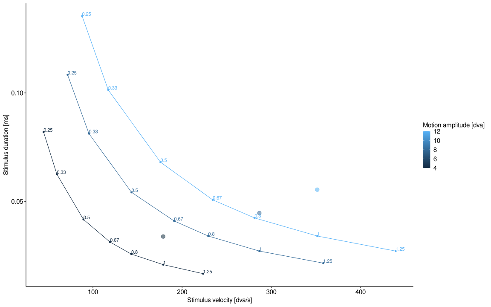<!-- -->

# Preparation of the model

Now we’ll empirically determine the maximum weight that can be achieved
in this simulation - normalization will be relative to this estimated
maximum, which heavily depends on the shape of the spatial and temporal
response functions.  
To do that, we’ll use the 200-ms of the lowest speed and the shortest
amplitude and then define noise level and normalization based on that:

``` r
max_resp_index <- st$amp==4 & st$velFac==0.25 & st$iniPos==1 & st$curDir==1
max_resp <- visual_proc_func(do_on_GPU = do_this_on_GPU, 
                             temporal_latency = lat, # temporal delay
                             temporal_scale = sca, temporal_shape = sha, # temporal dynamics
                             contrast_thres = 0.01, 
                             signal_x = st[max_resp_index, x], 
                             signal_y = st[max_resp_index, y], 
                             signal_t = st[max_resp_index, t],
                             signal_x_range = NULL,
                             signal_y_range = NULL,
                             signal_t_range = NULL,
                             temporal_resolution = scr_fd, 
                             spatial_resolution = spat_res, # in dva
                             gaussian_aperture_sd = stim_sd, # in dva
                             spatial_field_sd = rf_sd, # in dva
                             debug_mode = FALSE, show_result_plot = TRUE, 
                             skip_zeros = TRUE, output_final_matrices = TRUE) 
```

<!-- -->

``` r
max_resp_df <- melt(max_resp[[2]], # 2: not normalized, 3: normalized
                    varnames = c("y", "x", "t"), value.name = "w")
rm(max_resp)
# this is the maximum response we can expect based on the visual processing parameters:
(total_max <- max(max_resp_df$w)) 
```

    ## [1] 459.5818

``` r
total_max_plus_noise <- total_max + total_max/2
rm(max_resp_df)

# prop of maximum input signal at which the hyperbolic function is at 50%
C <- total_max * c50
total_max_O <- total_max^2 / (total_max^2 + C^2 )
total_max_plus_noise_O <- total_max_plus_noise^2 / (total_max_plus_noise^2 + C^2)
# simple plot to elucidate this
plot(seq(0, total_max_plus_noise, 1), 
     seq(0, total_max_plus_noise, 1)^2 / (seq(0, total_max_plus_noise, 1)^2 + C^2 ), 
     type = "l", 
     xlab = "Activity [a.u.]", ylab = "Naka-Rushton transform (O)", ylim = c(0, 1))
points(total_max, total_max_O, col = "black") # max
points(C, C^2 / (C^2 + C^2 ), col = "red") # C point
```

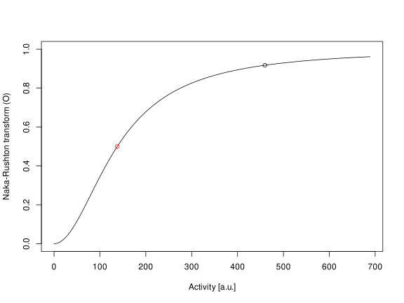<!-- -->

# Illustration of the model

First, make a nice plot the Naka-Rushton transformation of activity:

``` r
NR_df <- NULL
for (c50_test in c(seq(0.1, 1, 0.1) ) ) {
  NR_df <- rbind(NR_df, 
                 data.frame(x = seq(0, total_max_plus_noise, 1), 
                            y = seq(0, total_max_plus_noise, 1)^2 / (seq(0, total_max_plus_noise, 1)^2 +
                                                                       (c50_test*total_max)^2), 
                            c50_test = c50_test, 
                            total_max = total_max,
                            C = c50_test*total_max))
}
p_NR <- ggplot(NR_df, aes(x = x, y = y, color = c50_test, group = c50_test)) + 
  geom_hline(yintercept = 0.5, linetype = "solid", alpha = 0.2) + 
  geom_vline(xintercept = total_max, linetype = "solid", alpha = 0.2) + 
  geom_line(size = 0.75) + 
  geom_line(data = NR_df[round(NR_df$c50_test, 1)==c50, ], aes(x = x, y = y, color = c50_test), 
            size = 1.5) + 
  theme_classic(base_size = 12) + SlomTheme() + 
  coord_cartesian(expand = FALSE, ylim = c(0,1)) + 
  scale_color_continuous(breaks = c(0.1, 0.4, 0.7, 1.0)) + 
  labs(x = "Response, R", y = "Output, O", # Naka-Rushton transform -> 
       color = "C [% ref activity]", fill = "C [% ref activity]" )  +
  annotate("text", x = 500, y = 0.25, 
           label = TeX("$O = \\frac{R^{2}}{ R^{2}+C^{2} }$"), size = 6)
p_NR
```

    ## Warning in is.na(x): is.na() applied to non-(list or vector) of type
    ## 'expression'

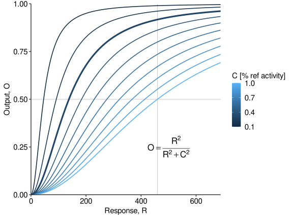<!-- -->

Second, illustrate the concept of visual processing. To do that, we’ll
showcase the results of visually processing a stimulus of two velocities
and perform an aggregate in the horizontal and vertical dimension.

``` r
t_lim <- c(0, 600) # temporal limit (aesthetic question only)
speed_df_long <- NULL
for (velFac_now in c(0.25, 1)) {
  for (is_static_now in c(FALSE, TRUE)) {
    # take the relevant subset to get the right stimulus
    speed_1_index <- st$amp==4 & st$velFac==velFac_now & st$iniPos==1 & st$curDir==1 & 
      st$t_on>=(-200) & st$t_off<=200
    # perform visual processing
    speed_1_resp_s <- visual_proc_func(do_on_GPU = do_this_on_GPU, 
                                       temporal_latency = lat, # temporal delay
                                       temporal_scale = sca, temporal_shape = sha, # temporal dynamics
                                       contrast_thres = 0, 
                                       signal_x = st[speed_1_index & is_static==is_static_now, x], 
                                       signal_y = st[speed_1_index & is_static==is_static_now, y], 
                                       signal_t = st[speed_1_index & is_static==is_static_now, t],
                                       signal_x_range = c(-2, 2),
                                       signal_y_range = c(-0.5, 1),
                                       signal_t_range = t_lim,
                                       temporal_resolution = scr_fd, 
                                       spatial_resolution = spat_res, # in dva
                                       gaussian_aperture_sd = stim_sd, # in dva
                                       spatial_field_sd = rf_sd, # in dva
                                       debug_mode = FALSE, show_result_plot = FALSE, 
                                       output_final_matrices = TRUE) 
    speed_1_df_s <- reshape2::melt(speed_1_resp_s[[2]], # 2: not normalized, 3: normalized
                                   varnames = c("y", "x", "t"), value.name = "w")
    rm(speed_1_resp_s)
    speed_1_df_s$is_static <- is_static_now
    speed_1_df_s$speed_fac <- velFac_now
    speed_df_long <- rbind(speed_df_long, speed_1_df_s)
    rm(speed_1_df_s)
  }
}
setDT(speed_df_long)
speed_df_long[ , speed_fac_f := factor(speed_fac)]
levels(speed_df_long$speed_fac_f) <- paste(levels(speed_df_long$speed_fac_f), "* peak vel")

## aggregate ...
# ... X over time
speed_df_x <- merge.data.table(speed_df_long[is_static==TRUE, .(w_absent = max(w)), 
                                             by = c("speed_fac", "t", "x")], 
                               speed_df_long[is_static==FALSE, .(w_present = max(w)), 
                                             by = c("speed_fac", "t", "x")], 
                               by = c("t", "x", "speed_fac"))
speed_df_x[ , w_full := w_absent + w_present]
p_speed_x <- ggplot(speed_df_x, aes(x = t, y = x, fill = w_full)) + 
  geom_raster(interpolate = TRUE) + 
  facet_wrap(~speed_fac) + 
  scale_fill_viridis_c(option = "rocket", breaks = c(0, 200, 400)) + 
  theme_classic(base_size = 12) + SlomTheme() + 
  coord_cartesian(expand = FALSE, xlim = t_lim) + 
  scale_y_continuous(breaks = c(-2, 0, 2)) + 
  labs(x = "Time [ms]", y = "X retinotopic space [dva]", 
       fill = "Response, R", fill = "Response, R" )
# ... Y over time
speed_df_y <- merge.data.table(speed_df_long[is_static==TRUE, .(w_absent = max(w)), 
                                             by = c("speed_fac", "t", "y")], 
                               speed_df_long[is_static==FALSE, .(w_present = max(w)), 
                                             by = c("speed_fac", "t", "y")], 
                               by = c("t", "y", "speed_fac"))
speed_df_y[ , w_full := w_absent + w_present]
p_speed_y <- ggplot(speed_df_y, aes(x = t, y = y, fill = w_full)) + 
  geom_raster(interpolate = TRUE) + 
  facet_wrap(~speed_fac) + 
  scale_fill_viridis_c(option = "rocket", breaks = c(0, 200, 400)) + 
  theme_classic(base_size = 12) + SlomTheme() + 
  coord_cartesian(expand = FALSE, ylim = c(-1, 1.5), xlim = t_lim) + 
  scale_y_continuous(breaks = c(-1, 0, 1)) + 
  labs(x = "Time [ms]", y = "Y retinotopic space [dva]", 
       fill = "Response, R", fill = "Response, R" )

# ... and show the combined plot:
plot_grid(p_speed_x, p_speed_y, nrow = 2, align = "hv")
```

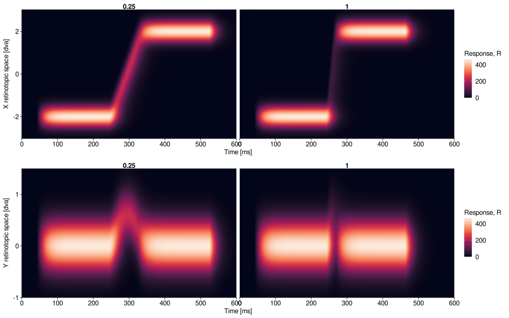<!-- -->

Third, we perform a readout – that is, just the maximum activation at
each time point – to make a comparison between static and static+moving
conditions, our measure of evidence (that we’ll accumulate later).

``` r
# Max output over time, for absent/static and present/moving conditions, respectively
speed_df_w <- merge.data.table(x = speed_df_long[is_static==TRUE, 
                                                 c(get_max_se(x = w, n_reps = 4*n_iterations)), 
                                                 by = c("speed_fac", "t")], 
                               y = speed_df_long[is_static==FALSE, 
                                                 c(get_max_se(x = w, n_reps = 4*n_iterations)), 
                                                 by = c("speed_fac", "t")], 
                               by = c("t", "speed_fac"))
```

    ## Loading required package: boot

    ## 
    ## Attaching package: 'boot'

    ## The following object is masked from 'package:pracma':
    ## 
    ##     logit

``` r
colnames(speed_df_w) <- gsub(x = colnames(speed_df_w), pattern = ".x", replacement = "_absent")
colnames(speed_df_w) <- gsub(x = colnames(speed_df_w), pattern = ".y", replacement = "_present")

# our final comparison should be static vs static+moving
speed_df_w[ , w_full := w_absent + w_present]
speed_df_w[ , m_full := m_absent + m_present]
speed_df_w[ , O_present := w_present^2 / (w_present^2 + C^2)]
speed_df_w[ , O_absent := w_absent^2 / (w_absent^2 + C^2)]
speed_df_w[ , O_full := w_full^2 / (w_full^2 + C^2)]
head(speed_df_w)
```

    ##            t speed_fac w_absent w_se_absent w_lower_absent w_upper_absent
    ## 1: 0.0000000      0.25        0           0              0              0
    ## 2: 0.0000000      1.00        0           0              0              0
    ## 3: 0.6944444      0.25        0           0              0              0
    ## 4: 0.6944444      1.00        0           0              0              0
    ## 5: 1.3888889      0.25        0           0              0              0
    ## 6: 1.3888889      1.00        0           0              0              0
    ##    m_absent w_present w_se_present w_lower_present w_upper_present m_present
    ## 1:      NaN         0            0               0               0       NaN
    ## 2:      NaN         0            0               0               0       NaN
    ## 3:      NaN         0            0               0               0       NaN
    ## 4:      NaN         0            0               0               0       NaN
    ## 5:      NaN         0            0               0               0       NaN
    ## 6:      NaN         0            0               0               0       NaN
    ##    w_full m_full O_present O_absent O_full
    ## 1:      0    NaN         0        0      0
    ## 2:      0    NaN         0        0      0
    ## 3:      0    NaN         0        0      0
    ## 4:      0    NaN         0        0      0
    ## 5:      0    NaN         0        0      0
    ## 6:      0    NaN         0        0      0

``` r
# plot O(t)
p_speed_w <- ggplot(speed_df_w, aes(x = t, y = O_full)) + 
  geom_line(data = speed_df_w, aes(x = t, y = O_absent, color = "1 static"), 
            size = 1.2, alpha = 0.8) + 
  geom_line(data = speed_df_w, aes(x = t, y = O_present, color = "2 moving"), 
            size = 1.2, alpha = 0.8) + 
  geom_line(aes(color = "3 static+moving"), 
            size = 1.2, alpha = 0.8) + 
  scale_color_manual(values = rev(c("#252525", "#d7191c", "#2c7bb6")), 
                     labels=lapply(sprintf('$O_{%s}$', c("static","moving","static+moving")), TeX) ) +
  facet_wrap(~speed_fac) + 
  theme_classic(base_size = 12) + SlomTheme() + 
  coord_cartesian(expand = FALSE, xlim = t_lim) + 
  scale_y_continuous(breaks = c(0, 0.5, 1), limits = c(0, 1)) + 
  labs(x = "Time [ms]", y = "Maximum output, O", 
       color = " ", fill = " " ) 
p_speed_w
```

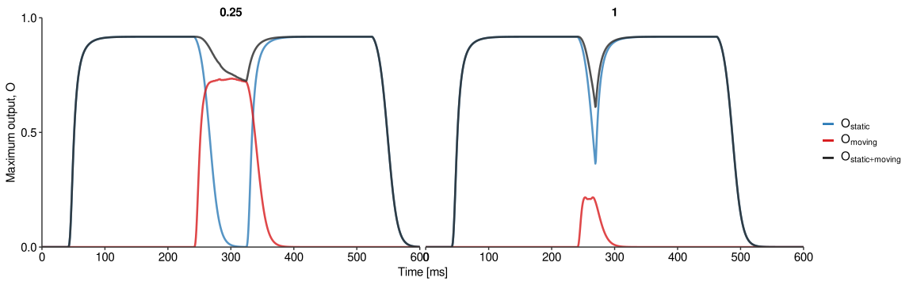<!-- -->

Finally, visualize the probability summation concept by comparing four
different beta parameters.

``` r
speed_df_w$prob_sum_1 <- 0
speed_df_w$prob_sum_2 <- 0
speed_df_w$prob_sum_3 <- 0
speed_df_w$prob_sum_4 <- 0
betas <- c(1, 1.5, 2, 3)
for (sfac in unique(speed_df_w$speed_fac)) {
  for (t_now in speed_df_w$t) {
    speed_df_w[t==t_now & speed_fac==sfac, 
               prob_sum_1 := sum(abs(speed_df_w[t<=t_now & speed_fac==sfac, O_full]-
                                       speed_df_w[t<=t_now & speed_fac==sfac, O_absent])^betas[1])^(1/betas[1])]
    speed_df_w[t==t_now & speed_fac==sfac, 
               prob_sum_2 := sum(abs(speed_df_w[t<=t_now & speed_fac==sfac, O_full]-
                                       speed_df_w[t<=t_now & speed_fac==sfac, O_absent])^betas[2])^(1/betas[2])]
    speed_df_w[t==t_now & speed_fac==sfac, 
               prob_sum_3 := sum(abs(speed_df_w[t<=t_now & speed_fac==sfac, O_full]-
                                       speed_df_w[t<=t_now & speed_fac==sfac, O_absent])^betas[3])^(1/betas[3])]
    speed_df_w[t==t_now & speed_fac==sfac, 
               prob_sum_4 := sum(abs(speed_df_w[t<=t_now & speed_fac==sfac, O_full]-
                                       speed_df_w[t<=t_now & speed_fac==sfac, O_absent])^betas[4])^(1/betas[4])]
  }
}

# plot the development of the evidence over time
p_evidence_acc <- ggplot(speed_df_w, aes(x = t, y = prob_sum_1)) + 
  geom_line(aes(color = as.character(betas[1])), size = 1.2) + 
  geom_line(data = speed_df_w, aes(x = t, y = prob_sum_2, color = as.character(betas[2])), size = 1.2) + 
  geom_line(data = speed_df_w, aes(x = t, y = prob_sum_3, color = as.character(betas[3])), size = 1.2) + 
  geom_line(data = speed_df_w, aes(x = t, y = prob_sum_4, color = as.character(betas[4])), size = 1.2) + 
  scale_y_log10(
    breaks = scales::trans_breaks("log10", function(x) 10^x),
    labels = scales::trans_format("log10", scales::math_format(10^.x))
  ) + annotation_logticks(sides = "l") +
  scale_color_viridis_d(option = "mako", end = 0.8) + 
  facet_wrap(~speed_fac) + 
  theme_classic(base_size = 12) + SlomTheme() + 
  # annotate("text", x = 500, y = 10, 
  #          label = TeX("$(\\sum_{0}^{t} |O_{static+moving}(t)-O_{static}(t)|^{\\beta})^\\frac{1}{\\beta}$"), size = 6) + 
  scale_x_continuous(limits = t_lim, expand = c(0,0)) + 
  labs(x = "Time [ms]", y = TeX("$(\\sum_{t}^{} |O_{static+moving}(t)-O_{static}(t)|^{\\beta})^{\\frac{1}{\\beta}}$"), 
       color = TeX("$\\beta"))
p_evidence_acc
```

    ## Warning: Transformation introduced infinite values in continuous y-axis
    ## Transformation introduced infinite values in continuous y-axis
    ## Transformation introduced infinite values in continuous y-axis
    ## Transformation introduced infinite values in continuous y-axis

    ## Warning: Removed 244 row(s) containing missing values (geom_path).
    ## Removed 244 row(s) containing missing values (geom_path).
    ## Removed 244 row(s) containing missing values (geom_path).
    ## Removed 244 row(s) containing missing values (geom_path).

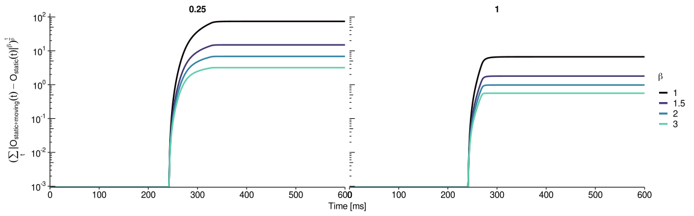<!-- -->

Now we can combine all of those in one plot and export it.

``` r
p_all_aligned <- plot_grid(p_speed_x, 
                           p_speed_y, 
                           p_speed_w, 
                           p_evidence_acc, 
                           nrow = 4, align = "hv")
```

    ## Warning: Transformation introduced infinite values in continuous y-axis
    ## Transformation introduced infinite values in continuous y-axis
    ## Transformation introduced infinite values in continuous y-axis
    ## Transformation introduced infinite values in continuous y-axis

    ## Warning: Removed 244 row(s) containing missing values (geom_path).
    ## Removed 244 row(s) containing missing values (geom_path).
    ## Removed 244 row(s) containing missing values (geom_path).
    ## Removed 244 row(s) containing missing values (geom_path).

``` r
p_all_aligned
```

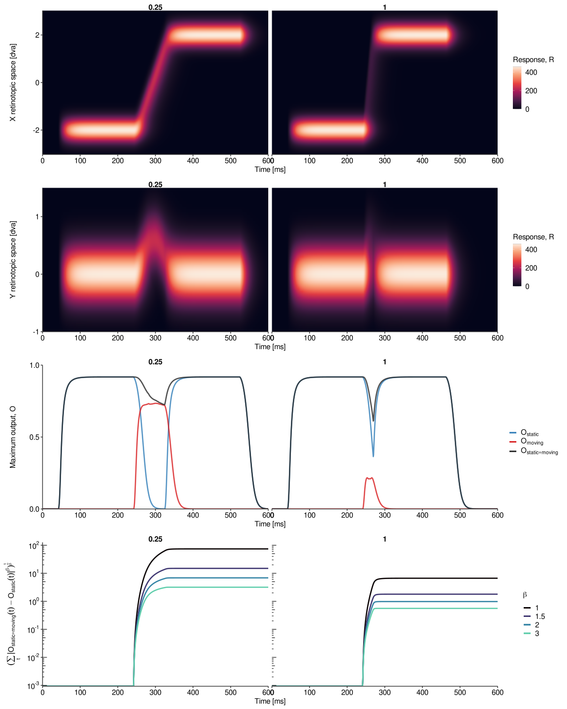<!-- -->

``` r
ggsave(filename = file.path(slmf_fig_path, paste0("p_all_aligned", ".", output_form)), 
       plot = p_all_aligned,
       width = 12, height = 14, units = "in")
```

… another version, with normalization:

``` r
p_example <- plot_grid(p_speed_x + 
                         theme(legend.position = "bottom", legend.direction = "horizontal"), 
                       p_speed_y + 
                         theme(legend.position = "bottom", legend.direction = "horizontal"), 
                       plot_grid(p_NR + 
                                   theme(legend.position = "bottom", legend.direction = "horizontal"), 
                                 p_NR + 
                                   theme(legend.position = "bottom", legend.direction = "horizontal"), 
                                 nrow = 1), 
                       p_speed_w + 
                         theme(legend.position = "bottom", legend.direction = "horizontal"), 
                       nrow = 2, align = "hv")
```

    ## Warning in is.na(x): is.na() applied to non-(list or vector) of type
    ## 'expression'

    ## Warning in is.na(x): is.na() applied to non-(list or vector) of type
    ## 'expression'

    ## Warning: Graphs cannot be vertically aligned unless the axis parameter is set.
    ## Placing graphs unaligned.

    ## Warning: Graphs cannot be horizontally aligned unless the axis parameter is set.
    ## Placing graphs unaligned.

``` r
p_example
```

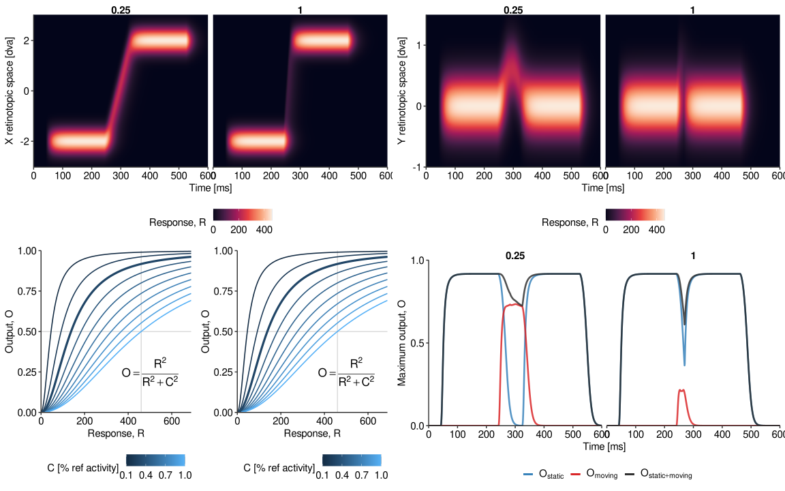<!-- -->

``` r
ggsave(filename = file.path(slmf_fig_path, paste0("p_example", ".", output_form)), 
       plot = p_example,
       width = 14, height = 7, units = "in")
```

Clean up:

``` r
rm(speed_df_long, speed_df_w, speed_df_x, speed_df_y, NR_df,
   p_speed_x, p_speed_y, p_speed_w, p_evidence_acc, p_NR)
gc()
```

    ##            used  (Mb) gc trigger   (Mb)  max used   (Mb)
    ## Ncells  2690614 143.7    4513964  241.1   4513964  241.1
    ## Vcells 15657878 119.5  610150295 4655.1 762687843 5818.9

# Running the model

Now this is where the heavy computation starts. We’ll run through all
conditions and perform a number of iterations for each single condition,
adding noise add each step.

``` r
# shall we compute it again or should we simply load the results?
do_run_model <- FALSE

# run the simulation?
if (do_run_model) {
  
  # these are the lists where results will be saved
  all_res <- vector(mode = "list", 
                    length = length(unique(st$condition_ID))*length(masking_times)*n_visual_proc_conditions)
  all_stim <- vector(mode = "list", 
                     length = length(unique(st$condition_ID))*length(masking_times)*n_visual_proc_conditions)
  
  # run through conditions
  all_condition_i <- 0
  for (visual_proc_condition_i in 1:n_visual_proc_conditions) {
    for (masking_time in masking_times) {
      for (this_condition_i in 1:length(unique(st$condition_ID))) {
        
        # get the right condition
        all_condition_i <- all_condition_i + 1
        this_condition <- unique(st$condition_ID)[this_condition_i]
        condition_def <- paste(all_condition_i, 
                               paste(all_sca[visual_proc_condition_i], all_sha[visual_proc_condition_i], 
                                     masking_time, this_condition), sep = ", ")
        print(condition_def)
        
        # this is the condition specification that we'll save for later
        this_readout <- st[condition_ID==this_condition, c("amp", "velFac")]
        this_readout <- this_readout[ , lapply(.SD, unique)]
        this_readout$t_start <- st[condition_ID==this_condition & t_on>=(-masking_time), min(t)]
        this_readout$t_end <- st[condition_ID==this_condition & t_off<=(masking_time), max(t)]
        this_readout$mask_time <- masking_time
        sca <- all_sca[visual_proc_condition_i]
        this_readout$visual_scale <- sca
        sha <- all_sha[visual_proc_condition_i]
        this_readout$visual_shape <- sha
        
        # find the stimulus according to this condition
        trial_index <- st$condition_ID==this_condition & st$t>=this_readout$t_start & st$t<=this_readout$t_end
        # get (and save) that stimulus
        st_trial <- st[trial_index]
        st_trial$mask_time <- masking_time
        st_trial$visual_scale <- sca
        st_trial$visual_shape <- sha
        all_stim[[all_condition_i]] <- st_trial
        rm(st_trial)
        
        # make a cluster
        if (n_iterations > 1 & n_cores > 1) {
          require(doSNOW)
          snowCluster <- makeCluster(n_cores) # , outfile=""
          Sys.sleep(0.01)
          registerDoSNOW(snowCluster)
          Sys.sleep(0.01)
          `%dofun%` <- `%dopar%`
        } else {
          snowCluster <- NULL
          `%dofun%` <- `%do%`
        }
        # do the iterations
        res <- foreach(iter_i = 1:n_iterations, .verbose = FALSE, .errorhandling = "stop",
                       .packages = c("data.table", "assertthat", "doSNOW", "foreach", "torch"), 
                       #.export = c('visual_proc_func', 'self_avoiding_walk', 'noise_gen'),
                       .combine = 'rbind' ) %dofun% {
                         
                         # this is this iteration's trial
                         st_trial <- st[trial_index]
                         
                         # simulate drift motion for this iteration
                         walk_present <- self_avoiding_walk(n_steps=nrow(st_trial), # how many steps for the random walk?
                                                            L=lattice_size, # dimensions of the lattice
                                                            U_slope=lattice_lambda, # the slope of the 2D quadratic potential
                                                            do_final_smooth=TRUE) 
                         walk_present$x <- (walk_present$x - lattice_size/2) / scr_ppd
                         walk_present$y <- (walk_present$y - lattice_size/2) / scr_ppd
                         # add the drift, i.e., the noise
                         st_trial$x <- st_trial$x + walk_present$x
                         st_trial$y <- st_trial$y + walk_present$y
                         rm(walk_present)
                         
                         # find the range
                         trial_x_range <- c(min(st_trial[ , x]), max(st_trial[ , x]))
                         trial_y_range <- c(min(st_trial[ , y]), max(st_trial[ , y]))
                         trial_t_range <- c(min(st_trial[ , t]), max(st_trial[ , t]))
                         # select the conditions
                         st_present <- st_trial[is_static==FALSE]
                         st_absent <- st_trial[is_static==TRUE]
                         
                         ## perform visual processing
                         # present
                         sim_present <- visual_proc_func(do_on_GPU = do_this_on_GPU, 
                                                         temporal_latency = lat, # temporal delay
                                                         temporal_scale = sca, temporal_shape = sha, # temporal dynamics
                                                         contrast_thres = 0, 
                                                         signal_x = st_present[ , x], 
                                                         signal_y = st_present[ , y], 
                                                         signal_t = st_present[ , t],
                                                         signal_x_range = trial_x_range,
                                                         signal_y_range = trial_y_range,
                                                         signal_t_range = trial_t_range,
                                                         temporal_resolution = scr_fd, 
                                                         spatial_resolution = spat_res, # in dva
                                                         gaussian_aperture_sd = stim_sd, # in dva
                                                         spatial_field_sd = rf_sd, # in dva
                                                         debug_mode = FALSE, show_result_plot = FALSE, 
                                                         output_final_matrices = TRUE) 
                         sim_sac_df_present <- reshape2::melt(sim_present[[2]], # 2: not normalized, 3: normalized
                                                              varnames = c("y", "x", "t"), value.name = "w_present")
                         setDT(sim_sac_df_present)
                         rm(sim_present)
                         # absent
                         sim_absent <- visual_proc_func(do_on_GPU = do_this_on_GPU, 
                                                        temporal_latency = lat, # temporal delay
                                                        temporal_scale = sca, temporal_shape = sha, # temporal dynamics
                                                        contrast_thres = 0, 
                                                        signal_x = st_absent[ , x], 
                                                        signal_y = st_absent[ , y], 
                                                        signal_t = st_absent[ , t],
                                                        signal_x_range = trial_x_range,
                                                        signal_y_range = trial_y_range,
                                                        signal_t_range = trial_t_range,
                                                        temporal_resolution = scr_fd, 
                                                        spatial_resolution = spat_res, # in dva
                                                        gaussian_aperture_sd = stim_sd, # in dva
                                                        spatial_field_sd = rf_sd, # in dva
                                                        debug_mode = FALSE, show_result_plot = FALSE, 
                                                        output_final_matrices = TRUE) 
                         sim_sac_df_absent <- reshape2::melt(sim_absent[[2]], # 2: not normalized, 3: normalized
                                                             varnames = c("y", "x", "t"), value.name = "w_absent")
                         setDT(sim_sac_df_absent)
                         rm(sim_absent)
                         
                         # # merge the two activity patterns
                         # sim_sac_df <- merge.data.table(sim_sac_df_absent, sim_sac_df_present, by = c("y", "x", "t"))
                         # setDT(sim_sac_df)
                         
                         # instead of merging, which takes considerable time, let us cbind
                         # check whether data frames are identical (they should be)
                         assert_that(all(sim_sac_df_absent[ , c("t","x","y")]==sim_sac_df_present[ , c("t","x","y")]))
                         # now cbind, only via reference
                         sim_sac_df <- sim_sac_df_present
                         sim_sac_df[ , w_absent := sim_sac_df_absent[ , c("w_absent")] ]
                         # clean up
                         rm(sim_sac_df_present, sim_sac_df_absent)
                         
                         # add amplitude-dependent noise
                         if (add_amp_noise) {
                           sim_sac_df[ , w_absent := w_absent + rnorm(n = length(w_absent), 
                                                                      mean = 0, sd = w_absent/8)]
                           sim_sac_df[ , w_present := w_present + rnorm(n = length(w_present), 
                                                                        mean = 0, sd = w_present/8)]
                         }
                         
                         # combine activity
                         sim_sac_df[ , w_full := w_absent + w_present]
                         # compute the model by Diamond et al (2000)
                         sim_sac_df[ , O_present := w_present^2 / (w_present^2 + C^2)]
                         sim_sac_df[ , O_absent := w_absent^2 / (w_absent^2 + C^2)]
                         sim_sac_df[ , O_full := w_full^2 / (w_full^2 + C^2)]
                         
                         # compute the locus of maximum evidence at each time point
                         max_O <- sim_sac_df[ , c(pop_mean(x = x, y = y, z = w_present, w = O_present, 
                                                           do_compute_pop_mean = do_compute_pop_mean), 
                                                  pop_mean(x = x, y = y, z = w_absent, w = O_absent, 
                                                           do_compute_pop_mean = do_compute_pop_mean), 
                                                  pop_mean(x = x, y = y, z = w_full, w = O_full, 
                                                           do_compute_pop_mean = do_compute_pop_mean)), 
                                              by = .(t)]
                         colnames(max_O) <- c("t", 
                                              "O_present", "x_present", "y_present", "w_present", 
                                              "x_present_m", "y_present_m", "w_present_m", 
                                              "O_absent", "x_absent", "y_absent", "w_absent", 
                                              "x_absent_m", "y_absent_m", "w_absent_m", 
                                              "O_full", "x_full", "y_full", "w_full", 
                                              "x_full_m", "y_full_m", "w_full_m")
                         
                         # now perform the probability summation (Pelli, 1987)
                         max_O$prob_sum <- 0
                         for (t_now in max_O$t) {
                           max_O$prob_sum[max_O$t==t_now] <- sum(abs(max_O$O_full[max_O$t<=t_now]-
                                                                       max_O$O_absent[max_O$t<=t_now])^beta)^(1/beta)
                         }
                         max_O$iter_i <- iter_i
                         rm(sim_sac_df)
                         
                         # return this readout
                         return(max_O)
                       } # end of iterations
        # stop cluster
        if (!is.null(snowCluster)) {
          Sys.sleep(0.01)
          stopCluster(snowCluster)
          Sys.sleep(0.01)
        }
        
        # aggregate across iterations!
        res_agg <- res[ , .(O_present = mean(O_present), O_present_SD = sd(O_present), 
                            x_present = mean(x_present), x_present_SD = sd(x_present), 
                            y_present = mean(y_present), y_present_SD = sd(y_present),
                            w_present = mean(w_present), w_present_SD = sd(w_present),
                            x_present.m = mean(x_present_m), x_present.m_SD = sd(x_present_m), 
                            y_present.m = mean(y_present_m), y_present.m_SD = sd(y_present_m),
                            w_present.m = mean(w_present_m), w_present.m_SD = sd(w_present_m),
                            O_absent = mean(O_absent), O_absent_SD = sd(O_absent), 
                            x_absent = mean(x_absent), x_absent_SD = sd(x_absent), 
                            y_absent = mean(y_absent), y_absent_SD = sd(y_absent), 
                            w_absent = mean(w_absent), w_absent_SD = sd(w_absent),
                            x_absent.m = mean(x_absent_m), x_absent.m_SD = sd(x_absent_m), 
                            y_absent.m = mean(y_absent_m), y_absent.m_SD = sd(y_absent_m),
                            w_absent.m = mean(w_absent_m), w_absent.m_SD = sd(w_absent_m),
                            O_full = mean(O_full), O_full_SD = sd(O_full), 
                            x_full = mean(x_full), x_full_SD = sd(x_full), 
                            y_full = mean(y_full), y_full_SD = sd(y_full),
                            w_full = mean(w_full), w_full_SD = sd(w_full),
                            x_full.m = mean(x_full_m), x_full.m_SD = sd(x_full_m), 
                            y_full.m = mean(y_full_m), y_full.m_SD = sd(y_full_m),
                            w_full.m = mean(w_full_m), w_full.m_SD = sd(w_full_m),
                            prob_sum = mean(prob_sum), prob_sum_SD = sd(prob_sum) ), 
                        by = .(t)]
        res_agg <- cbind(res_agg, this_readout) # append condition descriptions
        
        # plot current results, if that's needed
        if (do_result_plot) {
          par(mfrow=c(1,5))
          # also, add a 5th plot for the maximum weights over time
          plot(res_agg$t, res_agg$w_full, main = condition_def, type = "l", col = "red", 
               ylim = c(0, max(res_agg$w_full))) 
          lines(res_agg$t, res_agg$w_present, col = "blue")
          lines(res_agg$t, res_agg$w_absent, col = "black")
          # O over time
          plot(res_agg$t, res_agg$O_full, type = "l", col = "red", ylim = c(0, 1))
          lines(res_agg$t, res_agg$O_present, col = "blue")
          lines(res_agg$t, res_agg$O_absent, col = "black")
          # compute evidence for signal 
          plot(res_agg$t, res_agg$prob_sum, type = "l")
          abline(h = k)
          # show the real retinal trajectory
          plot(st[trial_index, t], st[trial_index, x], col = "red", type = "l", 
               ylim = c(min(st[trial_index, x])-0.2, max(st[trial_index, x])+0.2))
          lines(st[trial_index, t], st[trial_index, y], col = "red")
          points(st[trial_index & is_static==TRUE, t], st[trial_index & is_static==TRUE, x], col = "black", pch = '.')
          points(st[trial_index & is_static==TRUE, t], st[trial_index & is_static==TRUE, y], col = "black", pch = '.')
          # show the position signal
          plot(res_agg$t[round(res_agg$t, 1)>res_agg$t[1]+lat], 
               res_agg$x_full.m[round(res_agg$t, 1)>res_agg$t[1]+lat], col = "red", type = "l", 
               ylim = c(min(st[trial_index, x])-0.2, max(st[trial_index, x])+0.2))
          lines(res_agg$t[round(res_agg$t, 1)>res_agg$t[1]+lat], 
                res_agg$y_full.m[round(res_agg$t, 1)>res_agg$t[1]+lat], col = "red")
          points(res_agg$t[round(res_agg$t, 1)>res_agg$t[1]+lat], 
                 res_agg$x_absent.m[round(res_agg$t, 1)>res_agg$t[1]+lat], col = "black", pch = '.')
          points(res_agg$t[round(res_agg$t, 1)>res_agg$t[1]+lat], 
                 res_agg$y_absent.m[round(res_agg$t, 1)>res_agg$t[1]+lat], col = "black", pch = '.')
          # end of plot
          par(mfrow=c(1,1))
        }
        
        # save current results
        all_res[[all_condition_i]] <- res_agg
      }
    }
  }
  
  ## convert to data frame
  all_res <- rbindlist(all_res)
  all_stim <- rbindlist(all_stim)
  
  # save the entire image
  save.image(file = paste0("visual_proc_on_SLMF_rev_sca", sca, ".rda"), compress = "xz")
  
} else { # simply load the results file
  
  load(file = paste0("visual_proc_on_SLMF_rev_sca", sca, ".rda"))
  
}
```

Okay, done.

# Analysis of model output

Now let’s apply some aesthetics before we get to the results …

``` r
# merge with stimulus data frame to get the absolute velocity
abs_vels <- st[ , .(vel = unique(vel)), by = .(amp, velFac)]
all_res <- merge.data.table(x = all_res, all.x = TRUE, 
                            y = abs_vels)
all_res[ , abs_vel := vel * velFac]

# now apply aesthetics to ...
# ... results
all_res$velFac_f <- ordered(round(all_res$velFac, 2))
all_res$amp_f <- ordered(all_res$amp)
levels(all_res$amp_f) <- paste(levels(all_res$amp_f), 'dva')
all_res$mask_time_f <- ordered(all_res$mask_time)
levels(all_res$mask_time_f) <- paste(levels(all_res$mask_time_f), 'ms')
all_res$visual_scale_f <- ordered(all_res$visual_scale)
levels(all_res$visual_scale_f) <- paste0("sca=", levels(all_res$visual_scale_f))
# ... stimulus data
all_stim$velFac_f <- ordered(round(all_stim$velFac, 2))
all_stim$amp_f <- ordered(all_stim$amp)
levels(all_stim$amp_f) <- paste(levels(all_stim$amp_f), 'dva')
all_stim$mask_time_f <- ordered(all_stim$mask_time)
levels(all_stim$mask_time_f) <- paste(levels(all_stim$mask_time_f), 'ms')
all_stim$visual_scale_f <- ordered(all_stim$visual_scale)
levels(all_stim$visual_scale_f) <- paste0("sca=", levels(all_stim$visual_scale_f))
```

Now we can look at the difference in output over time for each
condition.

``` r
p_O <- ggplot(data = all_res, aes(x = t, y = O_full-O_absent, color = velFac_f)) + 
  geom_ribbon(aes(x = t, 
                  ymax = (O_full-O_absent)+O_full_SD, 
                  ymin = (O_full-O_absent)-O_full_SD, 
                  fill = velFac_f), 
              alpha = 0.3, color = NA) + 
  geom_line(size = 1.2) + 
  geom_hline(yintercept = 0, linetype = "solid", size = 1) + 
  scale_color_viridis_d(option = "viridis") + 
  scale_fill_viridis_d(option = "viridis") + 
  facet_grid(mask_time_f~amp_f) + 
  theme_classic(base_size = 12) + SlomTheme() + 
  coord_cartesian(expand = FALSE, ylim = c(0, 0.9)) + 
  labs(x = "Time [ms]", y = TeX('$O_{static+moving}(t)\ -\ O_{static}(t)$'), 
       color = "Velocity [% Peak Vel.]", fill = "Velocity [% Peak Vel.]")
p_O
```

<!-- -->

And according to the probability summation idea, we can sum this
difference to compute evidence.

``` r
# the highest velocity is 1.25 * vpeak, but Martin usually plots to 1.5 * vpeak
expand_to <- 0.15 # set to 0 to just plot until 1.25 * vpeak
# probability summation results
prob_sum_agg <- all_res[ , .(prob_sum = max(prob_sum), 
                             prob_sum_SD = mean(prob_sum_SD[prob_sum==max(prob_sum)]), 
                             abs_vel = unique(abs_vel)), 
                         by = .(mask_time_f, visual_scale_f, amp_f, velFac_f, velFac)]
prob_sum_agg$fa <- "Evidence"
prob_sum_agg[velFac==1, prob_sum, by = .(mask_time_f, visual_scale_f, amp_f)]
```

    ##     mask_time_f visual_scale_f  amp_f  prob_sum
    ##  1:        0 ms       sca=12.5  4 dva 3.9561165
    ##  2:     12.5 ms       sca=12.5  4 dva 1.1637090
    ##  3:       50 ms       sca=12.5  4 dva 0.6106204
    ##  4:      200 ms       sca=12.5  4 dva 0.6731442
    ##  5:        0 ms       sca=12.5  8 dva 2.3450491
    ##  6:     12.5 ms       sca=12.5  8 dva 0.7077782
    ##  7:       50 ms       sca=12.5  8 dva 0.4365544
    ##  8:      200 ms       sca=12.5  8 dva 0.4472524
    ##  9:        0 ms       sca=12.5 12 dva 1.9039976
    ## 10:     12.5 ms       sca=12.5 12 dva 0.6396582
    ## 11:       50 ms       sca=12.5 12 dva 0.4060718
    ## 12:      200 ms       sca=12.5 12 dva 0.4035794

``` r
# here comes the plot
p_prob_sum <- ggplot(data = prob_sum_agg, aes(x = velFac, y = prob_sum, 
                                              color = amp_f, group = amp_f)) + 
  geom_vline(xintercept = 1, linetype = "dashed") + 
  geom_hline(yintercept = 0, linetype = "dashed") + 
  geom_ribbon(data = prob_sum_agg, aes(x = velFac, ymax = prob_sum+prob_sum_SD*2, 
                                       ymin = prob_sum-prob_sum_SD*2, fill = amp_f), 
              alpha = 0.3, color = NA) + 
  geom_line(size = 1.2) + 
  scale_color_viridis_d(option = "mako", begin = 0.3, end = 0.6, direction = -1) + 
  scale_fill_viridis_d(option = "mako", begin = 0.3, end = 0.6, direction = -1) + 
  facet_grid(mask_time_f~fa) + 
  theme_classic(base_size = 12) + SlomTheme() + 
  scale_y_sqrt(breaks = round(seq(sqrt(0), sqrt(20), length.out = 5)^2, 1), 
               expand = c(0,0)) + 
  scale_x_continuous(breaks = c(0.2, 0.6, 1, 1.25+expand_to), 
                     limits = c(0.2, 1.25+expand_to)) + 
  labs(x = "Velocity [% Peak Vel.]", 
       y = TeX("$(\\sum_{t}^{} |O_{static+moving}(t)\ -\ O_{static}(t)|^{\\beta})^{\\frac{1}{\\beta}}$"), 
       color = "Amplitude [dva]", fill = "Amplitude [dva]")
p_prob_sum
```

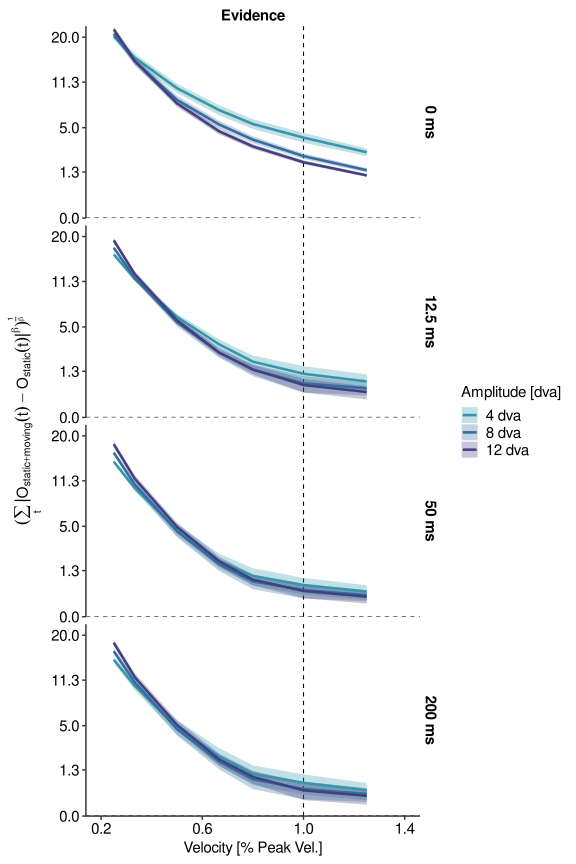<!-- -->

``` r
# horizontal version:
p_prob_sum_2 <- p_prob_sum + facet_grid(fa~mask_time_f)
```

Now we can think about how to convert this evidence to some behavioral
report. I’ve implemented two options: 1. The binomial sampler: We’ll
sample normally around the evidence value in each condition, using a
standard deviation that is a third of the mean. We’ll get a evidence
distribution. Above a certain evidence threshold k, reports are correct
(but taking into account a certain lapse rate), whereas below the
threshold, reports are guessed, that is, they are 50% correct.

``` r
# below this threshold, we'll guess:
k_threshold <- 2.5

# simulate responses based on the given evidence
binom_sampler <- function(e_mean, e_sd, k=1, n_trials=200, lapse_rate=0.02, guess_rate=0.5, n_rep=1000) {
  # produce n_rep estimates of correct trials
  all_sum <- vector(mode = "numeric", length = n_rep)
  for (rep_i in 1:length(all_sum)) {
    # sample from evidence distribution
    gauss_sample = rnorm(n = n_trials, mean = e_mean, sd = e_sd)
    # here's the binomial sample
    binom_sample = vector(mode = "numeric", length = length(gauss_sample))
    binom_sample[gauss_sample>=k] <- rbinom(n = sum(gauss_sample>=k), size = 1, prob = 1-lapse_rate)
    binom_sample[gauss_sample<k] <- rbinom(n = sum(gauss_sample<k), size = 1, prob = guess_rate)
    # save this iteration
    all_sum[rep_i] <- sum(binom_sample)
  }
  # make the output
  res_list <- list(m = mean(all_sum), n_trials = n_trials, sd = sd(all_sum), 
                   m_upper = quantile(all_sum, 0.975, names = FALSE), 
                   m_lower = quantile(all_sum, 0.025, names = FALSE) )
  return(res_list)
}

# simulate correct responses based on the data - threshold style
sim_p_correct <- prob_sum_agg[ , c(binom_sampler(e_mean = prob_sum, e_sd = prob_sum/3, 
                                                 k = k_threshold, 
                                                 guess_rate = guess_rate,
                                                 lapse_rate = lapse_rate)), 
                               by = .(mask_time_f, visual_scale_f, amp_f, velFac_f, velFac, abs_vel)]
sim_p_correct$n_correct <- round(sim_p_correct$m)
sim_p_correct$fa <- "Model report (binomial sampler)"

# define contrasts for fitting: we'll use sum coding
contrasts(sim_p_correct$mask_time_f) <- 'contr.sum'
contrasts(sim_p_correct$amp_f) <- 'contr.sum'
# ... and fit psychometric functions
glm_sim_p_correct <- glm(data = sim_p_correct, 
                         formula = cbind(n_correct, n_trials-n_correct) ~ velFac * mask_time_f * amp_f, 
                         family = binomial(link = logit.2asym(g = guess_rate, lam = lapse_rate)) )
summary(glm_sim_p_correct)
```

    ## 
    ## Call:
    ## glm(formula = cbind(n_correct, n_trials - n_correct) ~ velFac * 
    ##     mask_time_f * amp_f, family = binomial(link = logit.2asym(g = guess_rate, 
    ##     lam = lapse_rate)), data = sim_p_correct)
    ## 
    ## Deviance Residuals: 
    ##      Min        1Q    Median        3Q       Max  
    ## -0.97318  -0.39526  -0.02042   0.00494   0.44235  
    ## 
    ## Coefficients:
    ##                             Estimate Std. Error z value Pr(>|z|)    
    ## (Intercept)                 12.95887    0.70151  18.473  < 2e-16 ***
    ## velFac                     -19.35139    1.14910 -16.840  < 2e-16 ***
    ## mask_time_f1                -3.73399    0.89704  -4.163 3.15e-05 ***
    ## mask_time_f2                 0.24219    1.31709   0.184  0.85410    
    ## mask_time_f3                 2.26889    1.36732   1.659  0.09704 .  
    ## amp_f1                      -1.11524    0.92217  -1.209  0.22652    
    ## amp_f2                       0.61639    1.04754   0.588  0.55625    
    ## velFac:mask_time_f1         10.13596    1.30362   7.775 7.53e-15 ***
    ## velFac:mask_time_f2          0.10661    2.02079   0.053  0.95793    
    ## velFac:mask_time_f3         -6.32212    2.42076  -2.612  0.00901 ** 
    ## velFac:amp_f1                2.57878    1.46802   1.757  0.07898 .  
    ## velFac:amp_f2               -1.54425    1.77834  -0.868  0.38519    
    ## mask_time_f1:amp_f1         -0.27375    1.18983  -0.230  0.81804    
    ## mask_time_f2:amp_f1          1.15322    1.75819   0.656  0.51188    
    ## mask_time_f3:amp_f1         -0.19194    1.75967  -0.109  0.91314    
    ## mask_time_f1:amp_f2         -0.25691    1.30879  -0.196  0.84438    
    ## mask_time_f2:amp_f2         -1.06453    1.87134  -0.569  0.56945    
    ## mask_time_f3:amp_f2          0.75506    2.15570   0.350  0.72614    
    ## velFac:mask_time_f1:amp_f1   0.58499    1.65306   0.354  0.72343    
    ## velFac:mask_time_f2:amp_f1  -1.64184    2.63815  -0.622  0.53371    
    ## velFac:mask_time_f3:amp_f1   0.01805    3.03724   0.006  0.99526    
    ## velFac:mask_time_f1:amp_f2   0.84144    1.97763   0.425  0.67049    
    ## velFac:mask_time_f2:amp_f2   1.75460    2.93034   0.599  0.54933    
    ## velFac:mask_time_f3:amp_f2  -1.45887    3.94337  -0.370  0.71142    
    ## ---
    ## Signif. codes:  0 '***' 0.001 '**' 0.01 '*' 0.05 '.' 0.1 ' ' 1
    ## 
    ## (Dispersion parameter for binomial family taken to be 1)
    ## 
    ##     Null deviance: 4828.9311  on 83  degrees of freedom
    ## Residual deviance:    7.7456  on 60  degrees of freedom
    ## AIC: 449.08
    ## 
    ## Number of Fisher Scoring iterations: 9

``` r
# let those functions predict
sim_p_correct_expand <- expand.grid(list(mask_time_f = unique(sim_p_correct$mask_time_f), 
                                         visual_scale_f = unique(sim_p_correct$visual_scale_f),
                                         amp_f = unique(sim_p_correct$amp_f), 
                                         velFac = seq(min(sim_p_correct$velFac)-0.2, 
                                                      max(sim_p_correct$velFac)+0.2+expand_to, 
                                                      by = 0.01) ))
sim_p_correct_expand$glm_predict <- predict(object = glm_sim_p_correct, type = "response", 
                                            newdata = sim_p_correct_expand)
sim_p_correct_expand$fa <- unique(sim_p_correct$fa)

# plot the results of the simulation
p_sim_p_correct <- ggplot(data = sim_p_correct, aes(x = velFac, y = m / n_trials, 
                                              color = amp_f, group = amp_f)) + 
  geom_hline(yintercept = 0.5, linetype = "dashed") + 
  geom_vline(xintercept = 1, linetype = "dashed") + 
  geom_errorbar(data = sim_p_correct, aes(x = velFac, ymax = m_upper / n_trials, 
                                          ymin = m_lower / n_trials, color = amp_f), 
                size = 1, width = 0, alpha = 0.8) + 
  geom_line(data = sim_p_correct_expand, aes(x = velFac, y = glm_predict, 
                                             color = amp_f, group = amp_f), 
            size = 1.2, alpha = 0.8) + 
  geom_point(size = 1.5, alpha = 0.8) + 
  geom_hline(yintercept = 0, linetype = "solid", size = 1) + 
  scale_color_viridis_d(option = "mako", begin = 0.3, end = 0.6, direction = -1) + 
  scale_fill_viridis_d(option = "mako", begin = 0.3, end = 0.6, direction = -1) + 
  facet_grid(mask_time_f~fa) + 
  theme_classic(base_size = 12) + SlomTheme() + 
  scale_x_continuous(breaks = c(0.2, 0.6, 1, 1.25+expand_to)) + 
  scale_y_continuous(breaks = seq(0.5, 1, by = 0.1), 
                     expand = c(0, 0)) + 
  coord_cartesian(xlim = c(0.2, 1.25+expand_to), 
                  ylim = c(0.4, 1.0) ) + 
  labs(x = "Velocity [% Peak Vel.]", y = "Simulated proportion correct", 
       color = "Amplitude [dva]", fill = "Amplitude [dva]")
p_sim_p_correct
```

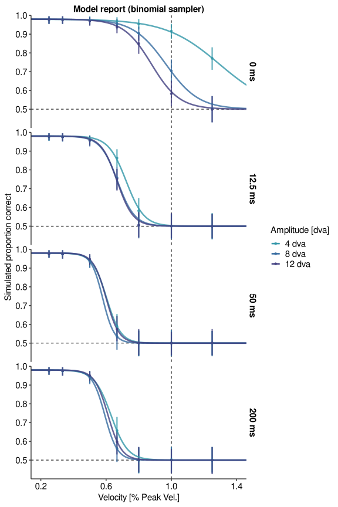<!-- -->

``` r
# horizontal version:
p_sim_p_correct_2 <- p_sim_p_correct + facet_grid(fa~mask_time_f)
```

Now the alternative: 2. The simple Gaussian sampler. Again, we’ll sample
around the mean evidence in each condition and we’ll assume one free
parameter, that is, the SD of the evidence distribution. If the
resulting evidence value is above 0, then it’s correct.

``` r
# this is the SD of the assumed evidence distribution
e_SD <- 4

# simulate responses based on the given evidence, no use of threshold
binom_sampler_nothres <- function(e_mean, e_sd, k=0, n_trials=200, n_rep=1000, lapse_rate = 0.02) {
  # produce n_rep estimates of correct trials
  all_sum <- vector(mode = "numeric", length = n_rep)
  for (rep_i in 1:length(all_sum)) {
    # sample from evidence distribution
    gauss_sample = rnorm(n = n_trials, mean = e_mean, sd = e_sd)
    # apply lapse rate
    gauss_sample[1:round(lapse_rate*length(gauss_sample))] <- 0
    # save this iteration
    all_sum[rep_i] <- sum(gauss_sample > k)
  }
  # make the output
  res_list <- list(m = mean(all_sum), n_trials = n_trials, sd = sd(all_sum), 
                   m_upper = quantile(all_sum, 0.975, names = FALSE), 
                   m_lower = quantile(all_sum, 0.025, names = FALSE) )
  return(res_list)
}

## different readout: Martin does not like no evidence threshold
sim_p_correct_nothres <- prob_sum_agg[ , c(binom_sampler_nothres(e_mean = prob_sum, e_sd = e_SD)), 
                                       by = .(mask_time_f, visual_scale_f, amp_f, velFac_f, velFac)]
sim_p_correct_nothres$n_correct <- round(sim_p_correct_nothres$m)
sim_p_correct_nothres$fa <- "Model report (Gaussian sampler)"
sim_p_correct_nothres$prop_correct <- sim_p_correct_nothres$m / sim_p_correct_nothres$n_trials

# define contrasts for fitting: we'll use sum coding
contrasts(sim_p_correct_nothres$mask_time_f) <- 'contr.sum'
contrasts(sim_p_correct_nothres$amp_f) <- 'contr.sum'
# ... and fit psychometric functions to no-threshold data
# 1. the logistic fit
glm_sim_p_correct_nothres <- glm(data = sim_p_correct_nothres, 
                                 formula = cbind(n_correct, n_trials-n_correct) ~ velFac * mask_time_f * amp_f, 
                                 family = binomial(link = logit.2asym(g = guess_rate, lam = lapse_rate)) )
summary(glm_sim_p_correct_nothres)
```

    ## 
    ## Call:
    ## glm(formula = cbind(n_correct, n_trials - n_correct) ~ velFac * 
    ##     mask_time_f * amp_f, family = binomial(link = logit.2asym(g = guess_rate, 
    ##     lam = lapse_rate)), data = sim_p_correct_nothres)
    ## 
    ## Deviance Residuals: 
    ##     Min       1Q   Median       3Q      Max  
    ## -1.0916  -0.1453   0.6858   1.0156   1.7041  
    ## 
    ## Coefficients:
    ##                              Estimate Std. Error z value Pr(>|z|)    
    ## (Intercept)                 6.6164772  0.2491391  26.557  < 2e-16 ***
    ## velFac                     -9.6014015  0.3984929 -24.094  < 2e-16 ***
    ## mask_time_f1               -1.0512908  0.3558032  -2.955  0.00313 ** 
    ## mask_time_f2               -0.0005808  0.4296183  -0.001  0.99892    
    ## mask_time_f3                0.5506118  0.4678564   1.177  0.23924    
    ## amp_f1                     -0.3575779  0.3368608  -1.062  0.28846    
    ## amp_f2                      0.0733973  0.3550490   0.207  0.83623    
    ## velFac:mask_time_f1         3.9688307  0.4941848   8.031 9.66e-16 ***
    ## velFac:mask_time_f2        -0.0084848  0.6700322  -0.013  0.98990    
    ## velFac:mask_time_f3        -2.1246841  0.7877455  -2.697  0.00699 ** 
    ## velFac:amp_f1               1.0088226  0.5293215   1.906  0.05667 .  
    ## velFac:amp_f2              -0.3655663  0.5750333  -0.636  0.52495    
    ## mask_time_f1:amp_f1         0.3995354  0.4975738   0.803  0.42199    
    ## mask_time_f2:amp_f1        -0.1994587  0.5726380  -0.348  0.72760    
    ## mask_time_f3:amp_f1        -0.1058362  0.6296520  -0.168  0.86651    
    ## mask_time_f1:amp_f2        -0.1329014  0.5000156  -0.266  0.79040    
    ## mask_time_f2:amp_f2         0.1432998  0.6184255   0.232  0.81676    
    ## mask_time_f3:amp_f2        -0.0148410  0.6662745  -0.022  0.98223    
    ## velFac:mask_time_f1:amp_f1 -0.1088262  0.6596967  -0.165  0.86897    
    ## velFac:mask_time_f2:amp_f1  0.3305058  0.8758734   0.377  0.70592    
    ## velFac:mask_time_f3:amp_f1 -0.1416413  1.0525917  -0.135  0.89296    
    ## velFac:mask_time_f1:amp_f2  0.2128352  0.7063872   0.301  0.76318    
    ## velFac:mask_time_f2:amp_f2 -0.2269567  0.9744057  -0.233  0.81582    
    ## velFac:mask_time_f3:amp_f2  0.0315631  1.1349528   0.028  0.97781    
    ## ---
    ## Signif. codes:  0 '***' 0.001 '**' 0.01 '*' 0.05 '.' 0.1 ' ' 1
    ## 
    ## (Dispersion parameter for binomial family taken to be 1)
    ## 
    ##     Null deviance: 3549.538  on 83  degrees of freedom
    ## Residual deviance:   63.715  on 60  degrees of freedom
    ## AIC: 513.38
    ## 
    ## Number of Fisher Scoring iterations: 9

``` r
# 2. Martin Rolfs: Richard, can we use Gumbel functions here (fitted to the -log10(relativeSpeed), as I do for the data?
# Well, the psyphy package does not have Gumbel functions :( but it has Weibull. 
# according to https://palamedestoolbox.org/weibullandfriends.html - no worries
glm_sim_p_correct_nothres_2 <- glm(data = sim_p_correct_nothres, 
                                 formula = cbind(n_correct, n_trials-n_correct) ~ velFac * mask_time_f * amp_f, 
                                 family = binomial(link = weib.2asym(g = guess_rate, lam = lapse_rate)) )
summary(glm_sim_p_correct_nothres_2)
```

    ## 
    ## Call:
    ## glm(formula = cbind(n_correct, n_trials - n_correct) ~ velFac * 
    ##     mask_time_f * amp_f, family = binomial(link = weib.2asym(g = guess_rate, 
    ##     lam = lapse_rate)), data = sim_p_correct_nothres)
    ## 
    ## Deviance Residuals: 
    ##      Min        1Q    Median        3Q       Max  
    ## -0.52891  -0.03324   0.06262   0.35050   1.07104  
    ## 
    ## Coefficients:
    ##                            Estimate Std. Error z value Pr(>|z|)    
    ## (Intercept)                 3.45961    0.14822  23.341  < 2e-16 ***
    ## velFac                     -5.66800    0.25267 -22.433  < 2e-16 ***
    ## mask_time_f1               -0.70004    0.20323  -3.445 0.000572 ***
    ## mask_time_f2               -0.04130    0.24514  -0.168 0.866213    
    ## mask_time_f3                0.39309    0.28737   1.368 0.171342    
    ## amp_f1                     -0.30423    0.19410  -1.567 0.117015    
    ## amp_f2                      0.06563    0.21257   0.309 0.757528    
    ## velFac:mask_time_f1         2.46116    0.30747   8.004  1.2e-15 ***
    ## velFac:mask_time_f2         0.08856    0.40733   0.217 0.827879    
    ## velFac:mask_time_f3        -1.37450    0.51013  -2.694 0.007052 ** 
    ## velFac:amp_f1               0.73113    0.32672   2.238 0.025236 *  
    ## velFac:amp_f2              -0.24512    0.36559  -0.670 0.502562    
    ## mask_time_f1:amp_f1         0.12561    0.27365   0.459 0.646232    
    ## mask_time_f2:amp_f1        -0.05680    0.31875  -0.178 0.858579    
    ## mask_time_f3:amp_f1        -0.03355    0.37429  -0.090 0.928579    
    ## mask_time_f1:amp_f2        -0.02309    0.28918  -0.080 0.936361    
    ## mask_time_f2:amp_f2         0.05330    0.35425   0.150 0.880402    
    ## mask_time_f3:amp_f2        -0.02457    0.41095  -0.060 0.952321    
    ## velFac:mask_time_f1:amp_f1  0.01408    0.39928   0.035 0.971867    
    ## velFac:mask_time_f2:amp_f1  0.13104    0.52058   0.252 0.801253    
    ## velFac:mask_time_f3:amp_f1 -0.09797    0.66229  -0.148 0.882396    
    ## velFac:mask_time_f1:amp_f2  0.07527    0.44239   0.170 0.864891    
    ## velFac:mask_time_f2:amp_f2 -0.09596    0.59356  -0.162 0.871565    
    ## velFac:mask_time_f3:amp_f2  0.03082    0.73561   0.042 0.966580    
    ## ---
    ## Signif. codes:  0 '***' 0.001 '**' 0.01 '*' 0.05 '.' 0.1 ' ' 1
    ## 
    ## (Dispersion parameter for binomial family taken to be 1)
    ## 
    ##     Null deviance: 3549.538  on 83  degrees of freedom
    ## Residual deviance:   11.172  on 60  degrees of freedom
    ## AIC: 460.83
    ## 
    ## Number of Fisher Scoring iterations: 12

``` r
# let the model predict here:
sim_p_correct_nothres_expand <- expand.grid(list(mask_time_f = unique(sim_p_correct_nothres$mask_time_f), 
                                                 visual_scale_f = unique(sim_p_correct_nothres$visual_scale_f),
                                                 amp_f = unique(sim_p_correct_nothres$amp_f), 
                                                 velFac = seq(min(sim_p_correct_nothres$velFac)-0.2, 
                                                              max(sim_p_correct_nothres$velFac)+0.2+expand_to, 
                                                              0.01) ))
sim_p_correct_nothres_expand$glm_predict <- predict(glm_sim_p_correct_nothres, type = "response", 
                                                    newdata = sim_p_correct_nothres_expand)
sim_p_correct_nothres_expand$glm_predict_2 <- predict(glm_sim_p_correct_nothres_2, type = "response", 
                                                      newdata = sim_p_correct_nothres_expand)
sim_p_correct_nothres_expand$fa <- unique(sim_p_correct_nothres$fa)

# plot this
p_sim_p_correct_nothres <- ggplot(data = sim_p_correct_nothres, 
                                  aes(x = velFac, y = prop_correct, 
                                      color = amp_f, group = amp_f)) + 
  geom_hline(yintercept = 0.5, linetype = "dashed") + 
  geom_vline(xintercept = 1, linetype = "dashed") + 
  geom_errorbar(data = sim_p_correct_nothres, aes(x = velFac, ymax = m_upper / n_trials, 
                                                  ymin = m_lower / n_trials, color = amp_f), 
                size = 1, width = 0, alpha = 0.8) + 
  geom_line(data = sim_p_correct_nothres_expand, aes(x = velFac, y = glm_predict_2,
                                                     color = amp_f, group = amp_f),
            size = 1.2, alpha = 0.8) +
  geom_point(size = 1.5, alpha = 0.8) + 
  #geom_line(size = 1.2, alpha = 0.8) + 
  geom_hline(yintercept = 0, linetype = "solid", size = 1) + 
  scale_color_viridis_d(option = "mako", begin = 0.3, end = 0.6, direction = -1) + 
  scale_fill_viridis_d(option = "mako", begin = 0.3, end = 0.6, direction = -1) + 
  facet_grid(mask_time_f~fa) + 
  theme_classic(base_size = 12) + SlomTheme() + 
  scale_x_continuous(breaks = c(0.2, 0.6, 1, 1.25+expand_to)) + 
  scale_y_continuous(breaks = seq(0.5, 1, by = 0.1), 
                     expand = c(0, 0)) + 
  coord_cartesian(xlim = c(0.2, 1.25+expand_to), 
                  ylim = c(0.4, 1.0) ) + 
  labs(x = "Velocity [% Peak Vel.]", y = "Simulated proportion correct", 
       color = "Amplitude [dva]", fill = "Amplitude [dva]")
p_sim_p_correct_nothres
```

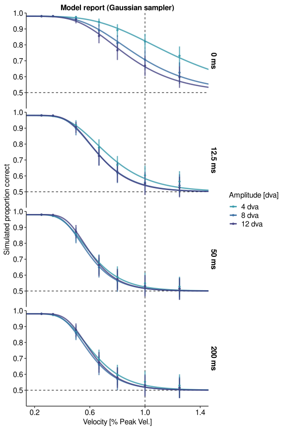<!-- -->

``` r
# horizontal version:
p_sim_p_correct_nothres_2 <- p_sim_p_correct_nothres + facet_grid(fa~mask_time_f)
```

Now combine these into one plot:

``` r
p_model_res <- plot_grid(p_O + theme(legend.position = "bottom"), 
                         p_prob_sum + theme(legend.position = "bottom"), 
                         #p_sim_p_correct + theme(legend.position = "bottom"), 
                         p_sim_p_correct_nothres + theme(legend.position = "bottom"), 
                         nrow = 1, align = "hv", axis = "tblr", rel_widths = c(2.5, 1, 1))
p_model_res
```

<!-- -->

``` r
ggsave(filename = file.path(slmf_fig_path, paste0("p_model_res", ".", output_form)), 
       plot = p_model_res,
       width = 13, height = 7.5, units = "in")
```

And a second version for Martin:

``` r
p_model_res_2 <- plot_grid(p_prob_sum_2 + theme(legend.position = "bottom"), 
                           p_sim_p_correct_nothres_2 + theme(legend.position = "bottom"), 
                           nrow = 2, align = "hv", axis = "tblr", rel_widths = c(1, 1))
p_model_res_2
```

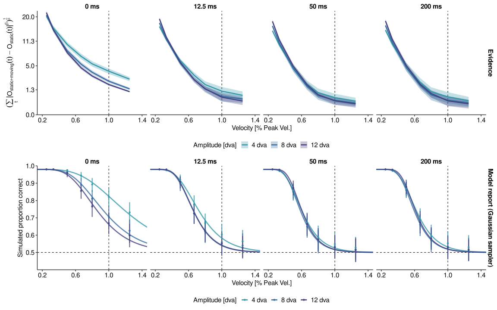<!-- -->

``` r
ggsave(filename = file.path(slmf_fig_path, paste0("p_model_res_2", ".", output_form)), 
       plot = p_model_res_2,
       width = 9.3, height = 7, units = "in")
```

Finally, by reading out the population location response, we can have a
look at the phenomenal appearance of the stimulus. Interestingly, as
velocity increases, the motion does not appear continuous anymore, but
seems more like a step function. Moreover, on the vertical dimension,
the curvature becomes indiscriminable, which is also predicted by the
model.

``` r
# ... x
p_position_signal_x <- ggplot(data = all_res[t>t_start+lat+1], aes(x = t, y = x_full, color = velFac_f)) + 
  geom_ribbon(aes(x = t, ymax = x_full+x_full_SD, ymin = x_full-x_full_SD, fill = velFac_f), 
              alpha = 0.3, color = NA) + # perceived SD
  geom_line(size = 1.2) + # perceived
  scale_color_viridis_d(option = "viridis") + 
  scale_fill_viridis_d(option = "viridis") + 
  facet_grid(mask_time_f~amp_f) + 
  theme_classic(base_size = 12) + SlomTheme() + coord_cartesian(expand = FALSE) + 
  labs(x = "Time [ms]", y = "X position signal [dva]", 
       color = "Velocity [% Peak Vel.]", fill = "Velocity [% Peak Vel.]")
p_position_signal_x
```

<!-- -->

``` r
# ... y
p_position_signal_y <- ggplot(data = all_res[t>t_start+lat+1], aes(x = t, y = y_full, color = velFac_f)) + 
  geom_hline(yintercept = 0, linetype = "dotted") + 
  geom_ribbon(aes(x = t, ymax = y_full+y_full_SD, ymin = y_full-y_full_SD, fill = velFac_f), 
              alpha = 0.3, color = NA) + # perceived SD
  geom_line(size = 1.2) + # perceived
  scale_color_viridis_d(option = "viridis") + 
  scale_fill_viridis_d(option = "viridis") + 
  facet_grid(mask_time_f~amp_f) + 
  theme_classic(base_size = 12) + SlomTheme() + coord_cartesian(expand = FALSE) + 
  labs(x = "Time [ms]", y = "Y position signal [dva]", 
       color = "Velocity [% Peak Vel.]", fill = "Velocity [% Peak Vel.]")
p_position_signal_y
```

<!-- -->

``` r
# combine these plots
p_position_signal <- plot_grid(p_position_signal_x + theme(legend.position = "bottom"), 
                               p_position_signal_y + theme(legend.position = "bottom"), 
                               nrow = 1, align = "hv", axis = "tblr", rel_widths = c(1, 1))
p_position_signal
```

<!-- -->

``` r
ggsave(filename = file.path(slmf_fig_path, paste0("p_position_signal", ".", output_form)), 
       plot = p_position_signal,
       width = 14, height = 7, units = "in")
```

Finally, also add the evidence panel.

``` r
# combine
common_limits_x <- c(150, 500)
p_position_signal_ext <- plot_grid(p_position_signal_x + theme(legend.position = "bottom") + 
                                     xlim(common_limits_x[1], common_limits_x[2]), 
                                   p_position_signal_y + theme(legend.position = "bottom") + 
                                     xlim(common_limits_x[1], common_limits_x[2]), 
                                   p_O + theme(legend.position = "bottom") + 
                                     xlim(common_limits_x[1], common_limits_x[2]), 
                                   nrow = 1, align = "hv", axis = "tblr", rel_widths = c(1, 1, 1))
```

    ## Warning: Removed 2460 row(s) containing missing values (geom_path).
    ## Removed 2460 row(s) containing missing values (geom_path).

    ## Warning: Removed 2880 row(s) containing missing values (geom_path).

``` r
p_position_signal_ext
```

<!-- -->

``` r
ggsave(filename = file.path(slmf_fig_path, paste0("p_position_signal_ext", ".", output_form)), 
       plot = p_position_signal_ext,
       width = 21, height = 7, units = "in")
```
