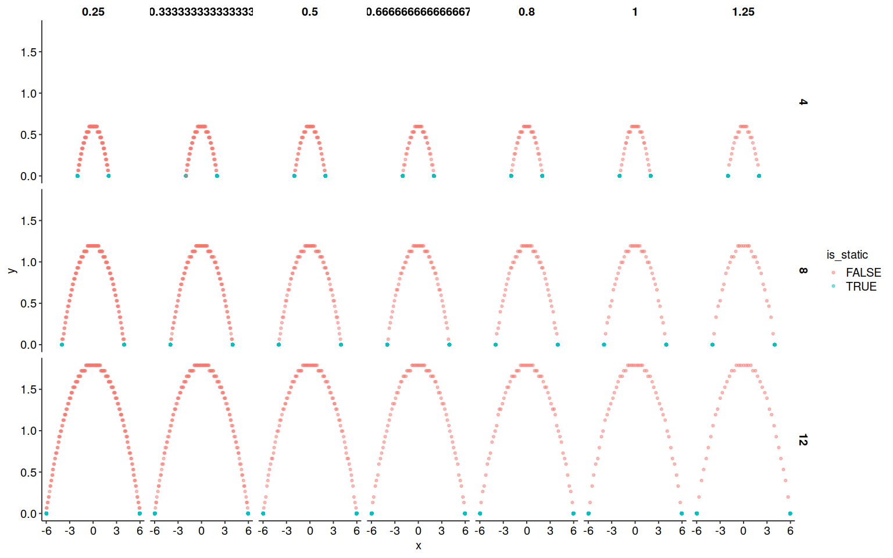
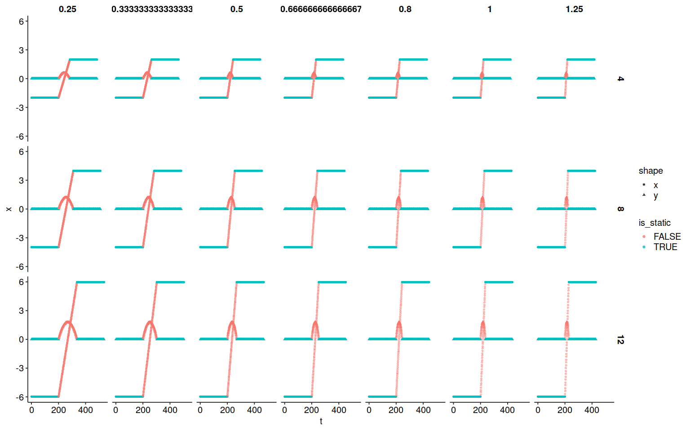
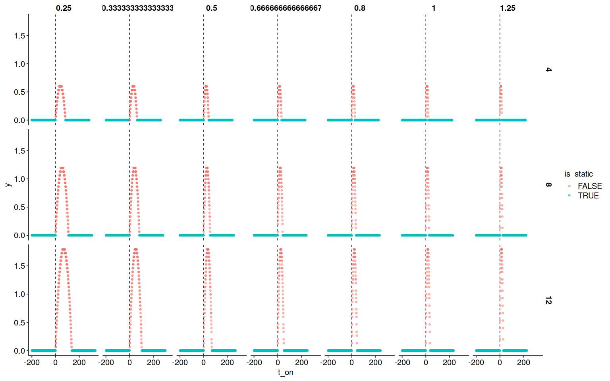
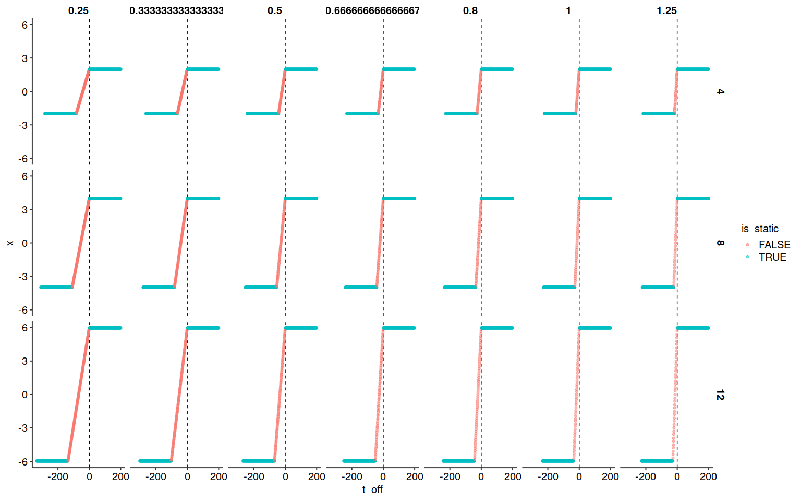
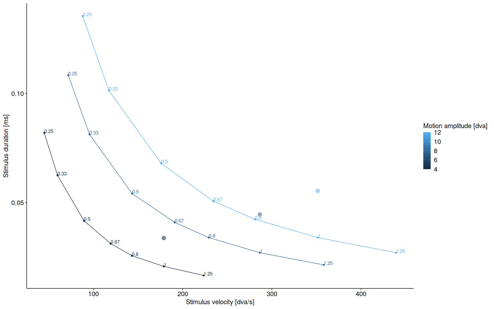
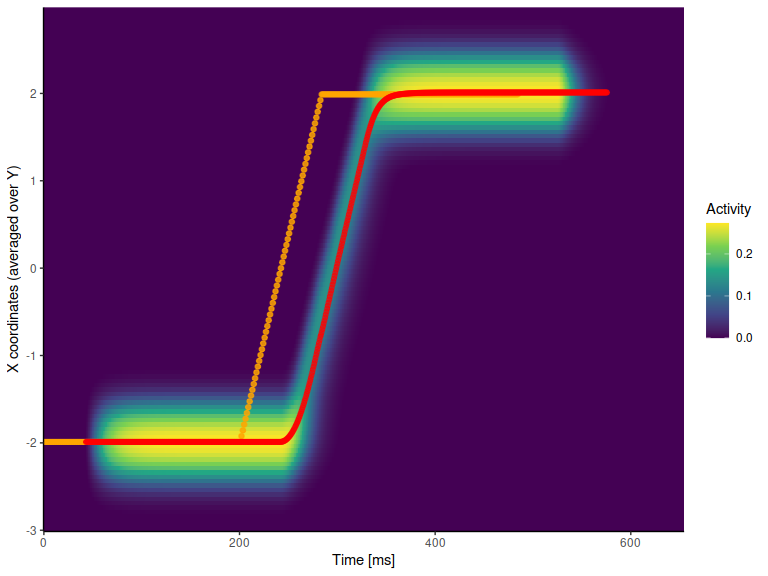
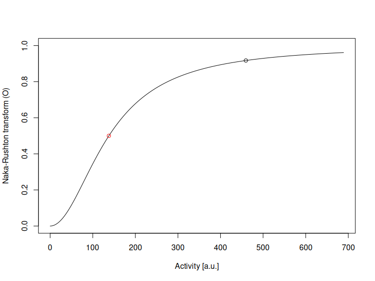

Modeling the visibility of saccade-like motion (simple model)
================
Richard Schweitzer
2023-02-07

# Setup of the model

Load dependencies …

``` r
# libraries
library(R.matlab)
```

    ## R.matlab v3.7.0 (2022-08-25 21:52:34 UTC) successfully loaded. See ?R.matlab for help.

    ## 
    ## Attaching package: 'R.matlab'

    ## The following objects are masked from 'package:base':
    ## 
    ##     getOption, isOpen

``` r
library(lme4)
```

    ## Loading required package: Matrix

``` r
library(data.table)
library(pracma)
```

    ## 
    ## Attaching package: 'pracma'

    ## The following objects are masked from 'package:Matrix':
    ## 
    ##     expm, lu, tril, triu

``` r
library(ggplot2)
library(viridis)
```

    ## Loading required package: viridisLite

``` r
library(psyphy)
library(cowplot)
library(latex2exp)
library(reshape2)
```

    ## 
    ## Attaching package: 'reshape2'

    ## The following objects are masked from 'package:data.table':
    ## 
    ##     dcast, melt

``` r
library(assertthat)
library(torch)
assertthat::assert_that(cuda_is_available()) # check: is cuda available?
```

    ## [1] TRUE

``` r
# relevant custom functions
source("self_avoiding_walk.R")
source("visual_proc_func_rev.R")
source("pop_mean_function.R")
source("ggplot2_theme.R")
source("get_max_se.R")
```

Paths, model parameters and stimulus data here:

``` r
# path to trajectories
slmf_fig_path <- "resulting_figures"  # here we'll save the model figures
mat <- readMat("SLMFAG01_Block1.mat") # this is the stimulus data from the actual experiment

# constants relating to the experiment
scr_fd <- (1000/1440) # duration of a single frame
scr_ppd <- 30.162 / 2 # pixels per degree of visual angle [dva]
stim_sd <- 0.3  # Gabor aperture SD in dva

# constants relating to the model
rf_sd <- 0.15 # RF size in dva
masking_times <- c(0, 12.5, 50, 200) # what masking times to test
spat_res <- 0.05 # spatial resolution of the visual processing grid
lat <- 40 # latency of the temporal response function
all_sca <- c(12.5) # scale/s of the temporal response function
all_sha <- c(1.6) # shape/s of the temporal response function
# make sure we'll only run one temporal response function:
assert_that(length(all_sca)==length(all_sha))
```

    ## [1] TRUE

``` r
assert_that(length(all_sca)==1)
```

    ## [1] TRUE

``` r
(n_visual_proc_conditions <- length(all_sca))
```

    ## [1] 1

``` r
(sca <- all_sca[1])
```

    ## [1] 12.5

``` r
(sha <- all_sha[1])
```

    ## [1] 1.6

``` r
# related to Naka-Rushton normalization and probability summation
c50 <- 0.3 # prop of maximum input signal at which the hyperbolic function is at 50%
beta <- 1.5 # slope of psychometric function
k <- 1 # k is the threshold of the psychometric function

# Noise to the model:
# ... the ocular-drift random walk
lattice_size <- round(2*scr_ppd)+1 # what should be the size of the grid?
lattice_lambda <- 1 # the steepness of the gradient
# ... response-amplitude dependent noise:
add_amp_noise <- TRUE

# how to run the model simulation
do_result_plot <- FALSE
do_this_on_GPU <- TRUE
n_cores <- 4
n_iterations <- 25 # for tests: 25
do_compute_pop_mean <- TRUE # TRUE: stimulus position signal using the 'population response'
```

# Preparation of the visual stimulus

Now parse the mat-file to extract the unique stimulus trajectories.

``` r
# How many block do we have?
(n_blocks <- length(mat$design[, ,1]$b))
```

    ## [1] 8

``` r
(n_trials_per_block <- length(mat$design[, ,1]$b[ , ,1]$trial[1, , ]))
```

    ## [1] 84

``` r
conditions <- NULL # here we'll store the trial descriptives
trajectories <- NULL # here we'll store the actual trajectory in that trial
max_num_pos_samples <- NaN # this is the maximum number of samples in the position vector we detected

# parse the entire block
for (block in (1:n_blocks)) {
  for (trial_b in (1:n_trials_per_block)) {
    # get trial data
    this_condition <- data.table(block = block, trial = trial_b, 
                                 amp = mat$design[ , ,1]$b[ , ,block]$trial[ , ,trial_b]$staAmp[1,1], 
                                 vel = mat$design[ , ,1]$b[ , ,block]$trial[ , ,trial_b]$movVel[1,1], 
                                 velFac = mat$design[ , ,1]$b[ , ,block]$trial[ , ,trial_b]$spdFac[1,1],
                                 dur = mat$design[ , ,1]$b[ , ,block]$trial[ , ,trial_b]$sacDur[1,1], 
                                 iniPos = mat$design[ , ,1]$b[ , ,block]$trial[ , ,trial_b]$iniPos[1,1], 
                                 curDir = mat$design[ , ,1]$b[ , ,block]$trial[ , ,trial_b]$curDir[1,1], 
                                 sf = mat$design[ , ,1]$b[ , ,block]$trial[ , ,trial_b]$staFrq[1,1])
    conditions <- rbind(conditions, this_condition)
    # get trajectory
    this_trajectory <- data.table(x = mat$design[ , ,1]$b[ , ,block]$trial[ , ,trial_b]$stim[ , ,1]$posVec[1,], 
                                  y = mat$design[ , ,1]$b[ , ,block]$trial[ , ,trial_b]$stim[ , ,1]$posVec[2,] )
    this_trajectory <- this_trajectory[x!=0 & y!=0] # these are time points when contrast is zero
    this_trajectory$t <- seq(0, length(this_trajectory$x)*scr_fd, 
                             length.out = length(this_trajectory$x) )
    this_trajectory$block <- block
    this_trajectory$trial <- trial_b
    trajectories <- rbind(trajectories, this_trajectory)
    # check length of trajectory
    if (is.na(max_num_pos_samples) || nrow(this_trajectory) > max_num_pos_samples ) {
      max_num_pos_samples <- nrow(this_trajectory)
    }
  }
}
print(paste("Maximum number of samples detected:", max_num_pos_samples))
```

    ## [1] "Maximum number of samples detected: 773"

``` r
# get a unique condition identifier:
conditions[ , condition_ID := paste(amp, round(velFac, 2), iniPos, curDir)]
# find unique conditions:
unique_conditions <- conditions[ , .(block = block[1], 
                                     trial = trial[1], 
                                     amp = unique(amp), 
                                     velFac = unique(velFac), vel = unique(vel),
                                     dur = unique(dur),
                                     iniPos = unique(iniPos), 
                                     curDir = unique(curDir)), 
                                 by = .(condition_ID)]
unique_conditions <- unique_conditions[iniPos==1 & curDir==1] # one direction is sufficient
unique_conditions <- unique_conditions[order(amp, velFac)]
head(unique_conditions)
```

    ##    condition_ID block trial amp    velFac      vel    dur iniPos curDir
    ## 1:   4 0.25 1 1     1    43   4 0.2500000 178.7832 0.0338      1      1
    ## 2:   4 0.33 1 1     1    49   4 0.3333333 178.7832 0.0338      1      1
    ## 3:    4 0.5 1 1     3     8   4 0.5000000 178.7832 0.0338      1      1
    ## 4:   4 0.67 1 1     1    84   4 0.6666667 178.7832 0.0338      1      1
    ## 5:    4 0.8 1 1     2    61   4 0.8000000 178.7832 0.0338      1      1
    ## 6:      4 1 1 1     3    42   4 1.0000000 178.7832 0.0338      1      1

Now we’ll merge conditions with the respective stimulus trajectories.
We’ll then transform the trajectories, specified in pixels, to
retinotopic coordinates, given that observers fixate at screen center,
that is, right at the midpoint of the trajectory. Finally, we’ll prepare
the samples to make them a bit more convenient to work with.

``` r
st <- merge.data.table(x = unique_conditions, y = trajectories, 
                       by = c("block", "trial"), all.x = TRUE)
st <- st[order(amp, velFac, t)]
head(st)
```

    ##    block trial condition_ID amp velFac      vel    dur iniPos curDir   x   y
    ## 1:     1    43   4 0.25 1 1   4   0.25 178.7832 0.0338      1      1 450 270
    ## 2:     1    43   4 0.25 1 1   4   0.25 178.7832 0.0338      1      1 450 270
    ## 3:     1    43   4 0.25 1 1   4   0.25 178.7832 0.0338      1      1 450 270
    ## 4:     1    43   4 0.25 1 1   4   0.25 178.7832 0.0338      1      1 450 270
    ## 5:     1    43   4 0.25 1 1   4   0.25 178.7832 0.0338      1      1 450 270
    ## 6:     1    43   4 0.25 1 1   4   0.25 178.7832 0.0338      1      1 450 270
    ##            t
    ## 1: 0.0000000
    ## 2: 0.6954408
    ## 3: 1.3908816
    ## 4: 2.0863223
    ## 5: 2.7817631
    ## 6: 3.4772039

``` r
table(st$amp, round(st$velFac, 2)) # make sure we have all conditions
```

    ##     
    ##      0.25 0.33 0.5 0.67 0.8   1 1.25
    ##   4   698  668 638  623 615 608  602
    ##   8   734  695 656  637 627 617  609
    ##   12  773  724 676  651 639 627  617

``` r
# convert to retinotopic reference frame
st$x <- st$x / scr_ppd
st[ , x := x - x[1], by = .(condition_ID)]
st[ , x := x - max(x)/2, by = .(condition_ID)]
st$y <- st$y / scr_ppd
st[ , y := y - y[1], by = .(condition_ID)]

# now mark those samples that specify moving stimulus and plot these
st[ , is_static := (x == x[1] & y == y[1]) | (x == x[length(x)] & y == y[length(y)]), 
    by = .(condition_ID)]
# ... xy plot
ggplot(data = st, aes(x = x, y = y, color = is_static)) + 
  geom_point(alpha = 0.5) + 
  facet_grid(amp~velFac) + 
  theme_minimal() + SlomTheme()
```

<!-- -->

``` r
# ... over-time plot
ggplot(data = st, aes(x = t, y = x, color = is_static, shape = "x")) + 
  geom_point(alpha = 0.5) + 
  geom_point(data = st, aes(x = t, y = y, color = is_static, shape = "y"), 
             alpha = 0.5) + 
  facet_grid(amp~velFac) + 
  theme_minimal() + SlomTheme()
```

<!-- -->

``` r
# determine move onset and offset
st[ , t_on := t - t[min(which(is_static==FALSE))-1], by = .(condition_ID)]
st[ , t_off := t - t[max(which(is_static==FALSE))+1], by = .(condition_ID)]
# ... y relative to onset
ggplot(data = st, aes(x = t_on, y = y, color = is_static)) + 
  geom_vline(xintercept = 0, linetype = "dashed") + 
  geom_point(alpha = 0.5) + facet_wrap(~condition_ID) + 
  facet_grid(amp~velFac) + 
  theme_minimal() + SlomTheme()
```

<!-- -->

``` r
# ... x relative to offset
ggplot(data = st, aes(x = t_off, y = x, color = is_static)) + 
  geom_vline(xintercept = 0, linetype = "dashed") + 
  geom_point(alpha = 0.5) + facet_wrap(~condition_ID) + 
  facet_grid(amp~velFac) + 
  theme_minimal() + SlomTheme()
```

<!-- -->

``` r
# quick aggregate: number of samples
n_samples <- st[ ,
                .(n_samples = sum(is_static==FALSE), 
                  n_samples_all = length(t),
                  vel = unique(vel),
                  dur = unique(dur),
                  abs_vel = unique(vel*velFac)), 
                by = .(amp, velFac)]
n_samples[ , abs_dur := amp / abs_vel]
n_samples[ , dur_2 := n_samples*scr_fd/1000]
n_samples
```

    ##     amp    velFac n_samples n_samples_all      vel    dur   abs_vel    abs_dur
    ##  1:   4 0.2500000       118           698 178.7832 0.0338  44.69580 0.08949386
    ##  2:   4 0.3333333        90           668 178.7832 0.0338  59.59440 0.06712040
    ##  3:   4 0.5000000        60           638 178.7832 0.0338  89.39160 0.04474693
    ##  4:   4 0.6666667        45           623 178.7832 0.0338 119.18881 0.03356020
    ##  5:   4 0.8000000        37           615 178.7832 0.0338 143.02657 0.02796683
    ##  6:   4 1.0000000        30           608 178.7832 0.0338 178.78321 0.02237347
    ##  7:   4 1.2500000        24           602 178.7832 0.0338 223.47901 0.01789877
    ##  8:   8 0.2500000       156           734 286.5366 0.0446  71.63414 0.11167859
    ##  9:   8 0.3333333       117           695 286.5366 0.0446  95.51219 0.08375895
    ## 10:   8 0.5000000        78           656 286.5366 0.0446 143.26828 0.05583930
    ## 11:   8 0.6666667        59           637 286.5366 0.0446 191.02437 0.04187947
    ## 12:   8 0.8000000        49           627 286.5366 0.0446 229.22925 0.03489956
    ## 13:   8 1.0000000        39           617 286.5366 0.0446 286.53656 0.02791965
    ## 14:   8 1.2500000        31           609 286.5366 0.0446 358.17070 0.02233572
    ## 15:  12 0.2500000       195           773 351.4799 0.0554  87.86998 0.13656541
    ## 16:  12 0.3333333       146           724 351.4799 0.0554 117.15998 0.10242405
    ## 17:  12 0.5000000        98           676 351.4799 0.0554 175.73997 0.06828270
    ## 18:  12 0.6666667        73           651 351.4799 0.0554 234.31996 0.05121203
    ## 19:  12 0.8000000        61           639 351.4799 0.0554 281.18395 0.04267669
    ## 20:  12 1.0000000        49           627 351.4799 0.0554 351.47993 0.03414135
    ## 21:  12 1.2500000        39           617 351.4799 0.0554 439.34992 0.02731308
    ##     amp    velFac n_samples n_samples_all      vel    dur   abs_vel    abs_dur
    ##          dur_2
    ##  1: 0.08194444
    ##  2: 0.06250000
    ##  3: 0.04166667
    ##  4: 0.03125000
    ##  5: 0.02569444
    ##  6: 0.02083333
    ##  7: 0.01666667
    ##  8: 0.10833333
    ##  9: 0.08125000
    ## 10: 0.05416667
    ## 11: 0.04097222
    ## 12: 0.03402778
    ## 13: 0.02708333
    ## 14: 0.02152778
    ## 15: 0.13541667
    ## 16: 0.10138889
    ## 17: 0.06805556
    ## 18: 0.05069444
    ## 19: 0.04236111
    ## 20: 0.03402778
    ## 21: 0.02708333
    ##          dur_2

``` r
# plot duration and velocity of stimulus for all conditions
# the thick dots are values based on the saccadic main sequence
ggplot(n_samples, aes(x = abs_vel, y = dur_2, color = amp, group = amp, 
                      label = round(velFac, 2) )) + 
  geom_point(data = n_samples, aes(x = vel, y = dur, 
                                group = amp, 
                                color = amp, label = NA), 
             size = 4, alpha = 0.1) + 
  geom_line() + geom_point() + geom_text(hjust=0, vjust=0) + 
  theme_minimal() + SlomTheme() + 
  labs(x = "Stimulus velocity [dva/s]", y = "Stimulus duration [ms]", 
       color = "Motion amplitude [dva]")
```

    ## Warning: Ignoring unknown aesthetics: label

<!-- -->

# Preparation of the model

Now we’ll empirically determine the maximum weight that can be achieved
in this simulation - normalization will be relative to this estimated
maximum, which heavily depends on the shape of the spatial and temporal
response functions.  
To do that, we’ll use the 200-ms of the lowest speed and the shortest
amplitude and then define noise level and normalization based on that:

``` r
max_resp_index <- st$amp==4 & st$velFac==0.25 & st$iniPos==1 & st$curDir==1
max_resp <- visual_proc_func(do_on_GPU = do_this_on_GPU, 
                             temporal_latency = lat, # temporal delay
                             temporal_scale = sca, temporal_shape = sha, # temporal dynamics
                             contrast_thres = 0.01, 
                             signal_x = st[max_resp_index, x], 
                             signal_y = st[max_resp_index, y], 
                             signal_t = st[max_resp_index, t],
                             signal_x_range = NULL,
                             signal_y_range = NULL,
                             signal_t_range = NULL,
                             temporal_resolution = scr_fd, 
                             spatial_resolution = spat_res, # in dva
                             gaussian_aperture_sd = stim_sd, # in dva
                             spatial_field_sd = rf_sd, # in dva
                             debug_mode = FALSE, show_result_plot = TRUE, 
                             skip_zeros = TRUE, output_final_matrices = TRUE) 
```

<!-- -->

``` r
max_resp_df <- melt(max_resp[[2]], # 2: not normalized, 3: normalized
                    varnames = c("y", "x", "t"), value.name = "w")
rm(max_resp)
# this is the maximum response we can expect based on the visual processing parameters:
(total_max <- max(max_resp_df$w)) 
```

    ## [1] 459.5818

``` r
total_max_plus_noise <- total_max + total_max/2
rm(max_resp_df)

# prop of maximum input signal at which the hyperbolic function is at 50%
C <- total_max * c50
total_max_O <- total_max^2 / (total_max^2 + C^2 )
total_max_plus_noise_O <- total_max_plus_noise^2 / (total_max_plus_noise^2 + C^2)
# simple plot to elucidate this
plot(seq(0, total_max_plus_noise, 1), 
     seq(0, total_max_plus_noise, 1)^2 / (seq(0, total_max_plus_noise, 1)^2 + C^2 ), 
     type = "l", 
     xlab = "Activity [a.u.]", ylab = "Naka-Rushton transform (O)", ylim = c(0, 1))
points(total_max, total_max_O, col = "black") # max
points(C, C^2 / (C^2 + C^2 ), col = "red") # C point
```

<!-- -->

# Illustration of the model

First, make a nice plot the Naka-Rushton transformation of activity:

``` r
NR_df <- NULL
for (c50_test in c(seq(0.1, 1, 0.1) ) ) {
  NR_df <- rbind(NR_df, 
                 data.frame(x = seq(0, total_max_plus_noise, 1), 
                            y = seq(0, total_max_plus_noise, 1)^2 / (seq(0, total_max_plus_noise, 1)^2 +
                                                                       (c50_test*total_max)^2), 
                            c50_test = c50_test, 
                            total_max = total_max,
                            C = c50_test*total_max))
}
p_NR <- ggplot(NR_df, aes(x = x, y = y, color = c50_test, group = c50_test)) + 
  geom_hline(yintercept = 0.5, linetype = "solid", alpha = 0.2) + 
  geom_vline(xintercept = total_max, linetype = "solid", alpha = 0.2) + 
  geom_line(size = 0.75) + 
  geom_line(data = NR_df[round(NR_df$c50_test, 1)==c50, ], aes(x = x, y = y, color = c50_test), 
            size = 1.5) + 
  theme_classic(base_size = 12) + SlomTheme() + 
  coord_cartesian(expand = FALSE, ylim = c(0,1)) + 
  scale_color_continuous(breaks = c(0.1, 0.4, 0.7, 1.0)) + 
  labs(x = "Response, R", y = "Output, O", # Naka-Rushton transform -> 
       color = "C [% ref activity]", fill = "C [% ref activity]" )  +
  annotate("text", x = 500, y = 0.25, 
           label = TeX("$O = \\frac{R^{2}}{ R^{2}+C^{2} }$"), size = 6)
p_NR
```

    ## Warning in is.na(x): is.na() applied to non-(list or vector) of type
    ## 'expression'

<!-- -->
