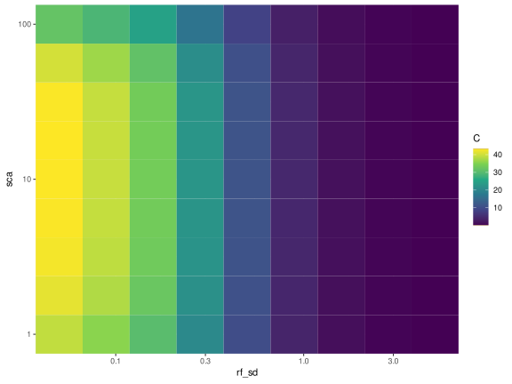
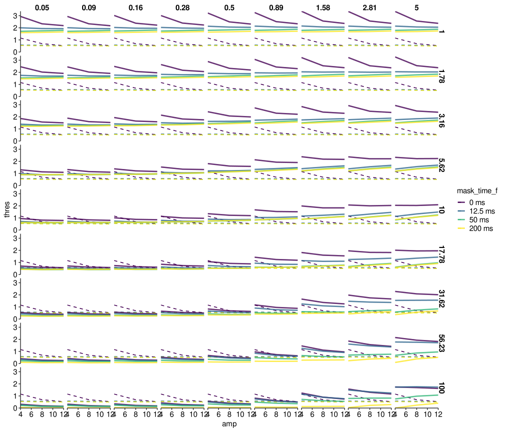
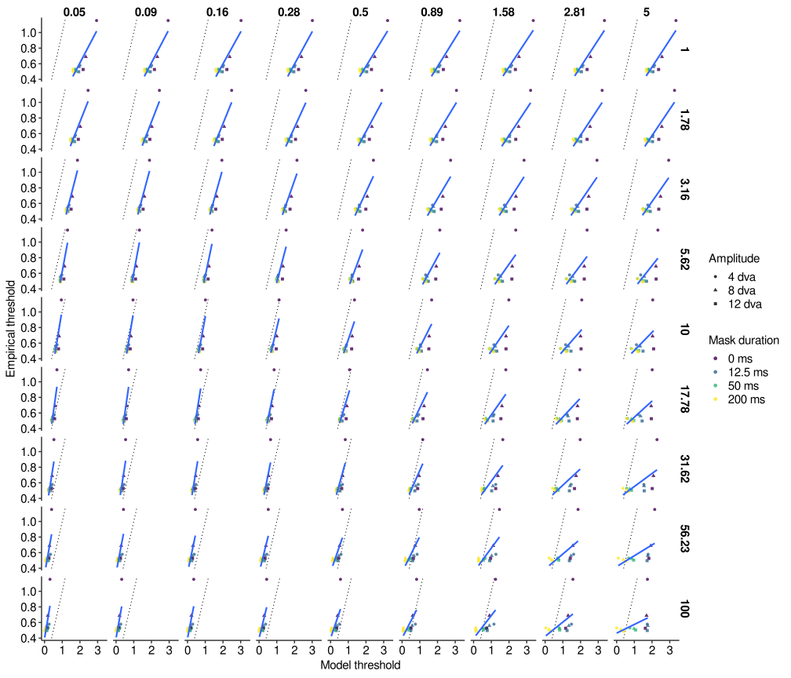
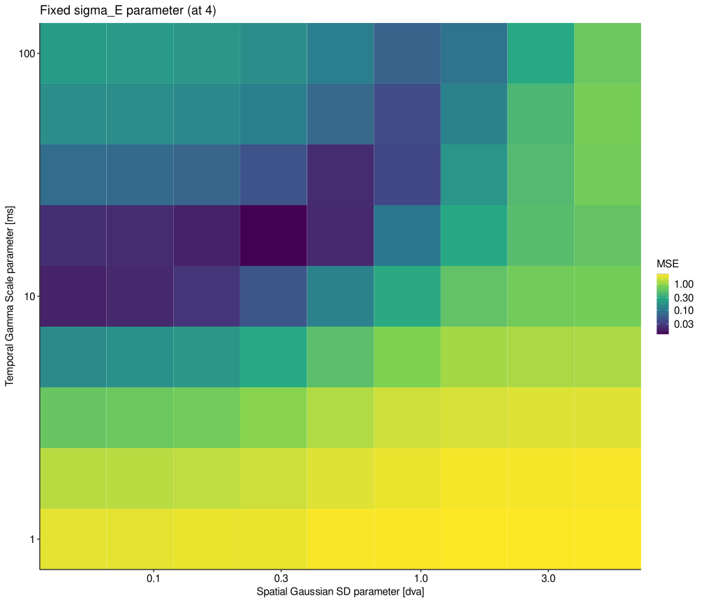
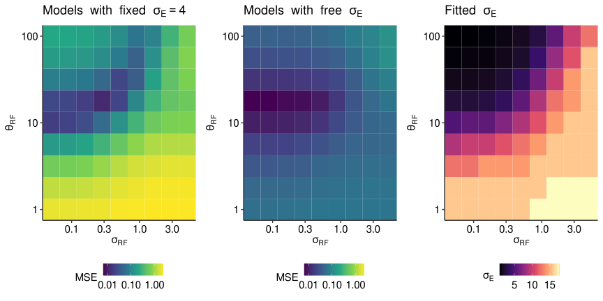
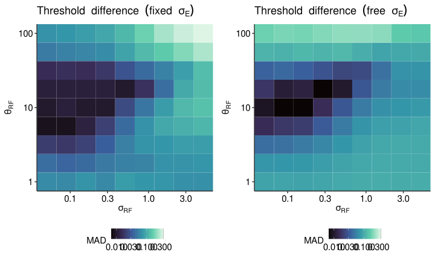
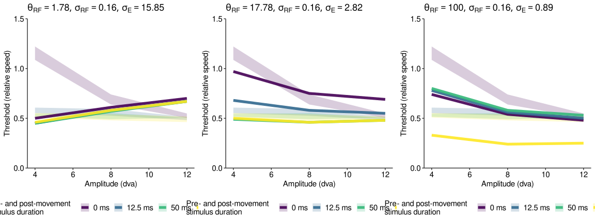

Modeling the visibility of saccade-like motion (grid-search)
================
Richard Schweitzer
2024-03-26

# Setup of the model

Do we want to output every figure as a vector graphics instead of png?
If so, determine here:

``` r
output_form <- 'svg'
knitr::opts_chunk$set(dev = output_form) # set output device to svg or pdf
```

Load dependencies …

``` r
# libraries
library(R.matlab)
```

    ## R.matlab v3.7.0 (2022-08-25 21:52:34 UTC) successfully loaded. See ?R.matlab for help.

    ## 
    ## Attaching package: 'R.matlab'

    ## The following objects are masked from 'package:base':
    ## 
    ##     getOption, isOpen

``` r
library(lme4)
```

    ## Loading required package: Matrix

``` r
library(data.table)
library(pracma)
```

    ## 
    ## Attaching package: 'pracma'

    ## The following objects are masked from 'package:Matrix':
    ## 
    ##     expm, lu, tril, triu

``` r
library(ggplot2)
library(viridis)
```

    ## Loading required package: viridisLite

``` r
library(psyphy)
library(cowplot)
library(latex2exp)
library(reshape2)
```

    ## 
    ## Attaching package: 'reshape2'

    ## The following objects are masked from 'package:data.table':
    ## 
    ##     dcast, melt

``` r
library(assertthat)
library(torch)
cuda_is_available() # check: is cuda available?
```

    ## [1] FALSE

``` r
# relevant custom functions
source("self_avoiding_walk.R")
source("visual_proc_func_rev.R")
source("pop_mean_function.R")
source("ggplot2_theme.R")
source("get_max_se.R")
```

Paths, model parameters and stimulus data here:

``` r
# path to trajectories
slmf_fig_path <- "resulting_figures_2"  # here we'll save the model figures
mat <- readMat("SLMFAG01_Block1.mat") # this is the stimulus data from the actual experiment

# constants relating to the experiment
scr_fd <- (1000/1440) # duration of a single frame
scr_ppd <- 30.162 / 2 # pixels per degree of visual angle [dva]
stim_sd <- 0.3  # Gabor aperture SD in dva

# constants relating to the model
rf_sd <- 0.15 # RF size in dva
masking_times <- c(0, 12.5, 50, 200) # what masking times to test
spat_res <- 0.1 # spatial resolution of the visual processing grid
lat <- 40 # latency of the temporal response function
sha <- 1.6 # shape/s of the temporal response function


# related to Naka-Rushton normalization and probability summation
c50 <- 0.3 # prop of maximum input signal at which the hyperbolic function is at 50%
beta <- 1.5 # slope of psychometric function
# for Model response fits
lapse_rate <- 0.02
guess_rate <- 0.5

# Noise to the model:
# ... the ocular-drift random walk
lattice_size <- round(2*scr_ppd)+1 # what should be the size of the grid?
lattice_lambda <- 1 # the steepness of the gradient
# ... response-amplitude dependent noise:
add_amp_noise <- TRUE

# how to run the model simulation
do_result_plot <- FALSE
do_this_on_GPU <- TRUE
n_cores <- 6 # think about how much GPU memory you have!
n_iterations <- 25 # for tests: 25, otherwise 250
do_compute_pop_mean <- TRUE # TRUE: stimulus position signal using the 'population response'
```

For the grid search, what parameters do we want to test?

``` r
# # 1st run:
# (gridsearch_rf_sd <- exp(seq(log(0.025), log(2.5), length.out = 9)))
# (gridsearch_sca <- exp(seq(log(0.25), log(25), length.out = 9)))

# 
(gridsearch_rf_sd <- exp(seq(log(0.05), log(5), length.out = 9)))
```

    ## [1] 0.05000000 0.08891397 0.15811388 0.28117066 0.50000000 0.88913971 1.58113883
    ## [8] 2.81170663 5.00000000

``` r
(gridsearch_sca <- exp(seq(log(1), log(100), length.out = 9)))
```

    ## [1]   1.000000   1.778279   3.162278   5.623413  10.000000  17.782794  31.622777
    ## [8]  56.234133 100.000000

``` r
# how many visual processing conditions will we have?
(n_visual_proc_conditions <- length(gridsearch_rf_sd)*length(gridsearch_sca))
```

    ## [1] 81

``` r
# all conditions here
gridsearch_df <- expand.grid(list(rf_sd = gridsearch_rf_sd, sca = gridsearch_sca))

# make a plot of all the temporal response functions
nice_colors <- scales::viridis_pal()(length(gridsearch_sca))
all_resp_fun <- NULL
for (sca_i in 1:length(gridsearch_sca)) {
  sca_now <- gridsearch_sca[sca_i]
  resp_fun <- gamma_fun(x_dur = 100, x_step = 0.01, 
                        scale = sca_now, latency = 0, 
                        shape = sha, 
                        make_symmetric = FALSE)
  resp_fun_time <- resp_fun[[2]]
  resp_fun <- resp_fun[[1]] / max(resp_fun[[1]])
  all_resp_fun <- rbind(all_resp_fun, 
                        data.table(resp_fun_time = resp_fun_time, 
                                   resp_fun = resp_fun, 
                                   sca = sca_now))
  if (sca_i == 1) {
    plot(resp_fun_time, (resp_fun), type = "l", col = nice_colors[sca_i], 
         ylim = c(0, max(resp_fun)), lwd = 2, 
         xlab = "Time [ms]", ylab = "Response (normalized by maximum)")
  } else {
    lines(resp_fun_time, (resp_fun), col = nice_colors[sca_i], lwd = 2)
  }
}
legend(80, 1, legend=round(gridsearch_sca, 2),
           col=nice_colors, cex = 0.8, lty=1, lwd = 2, title="TRF Gamma scale")
```

<!-- -->

``` r
# pretty plot of temporal kernel
p_all_resp_fun <- ggplot(data = all_resp_fun, aes(x = resp_fun_time, y = resp_fun, 
                                                  color = sca, 
                                                  group = factor(sca, 
                                                                 levels = sort(unique(all_resp_fun$sca), 
                                                                               decreasing = TRUE)) )) + 
  geom_line(linewidth = 1.5) + 
  SlomTheme() + 
  labs(x = "Time [ms]", y = "Normalized temporal\nresponse function", 
       color = "Gamma scale") + 
  scale_color_viridis_c(option = "plasma", end = 0.9, trans = "log10", direction = -1) + 
  theme(legend.position = "right")


# ... and of the spatial response functions
all_spat_fun <- NULL
for (sd_i in rev(1:length(gridsearch_rf_sd))) {
  spatial_field_sd <- gridsearch_rf_sd[sd_i]
  #
  spat_fun_size <- seq(-3*max(gridsearch_rf_sd), 3*max(gridsearch_rf_sd), 0.1)
  if (mod(length(spat_fun_size), 2) == 0) { # the spatial kernel needs to have odd dimensions for the 2D convolution
    zero_center <- seq(0, 3*max(gridsearch_rf_sd), 0.1)
    spat_fun_size <- c(-1*rev(zero_center)[-length(zero_center)], zero_center)
    assert_that(!(mod(length(spat_fun_size), 2) == 0))
  }
  spat_meshlist <- meshgrid(x = spat_fun_size, y = spat_fun_size)
  spat_kernel <- 1/((spatial_field_sd^2)*2*pi) * exp(-(spat_meshlist$X^2+spat_meshlist$Y^2)/(2*spatial_field_sd^2))
  spat_kernel_x = spat_kernel[round(nrow(spat_kernel)/2), ]
  spat_kernel_x = spat_kernel_x / max(spat_kernel_x)
  all_spat_fun <- rbind(all_spat_fun, 
                        data.table(spat_fun_size = spat_fun_size, 
                                   spat_kernel = spat_kernel_x, 
                                   spatial_field_sd = spatial_field_sd))
  # plot
  if (sd_i == length(gridsearch_rf_sd)) {
    plot(spat_fun_size, (spat_kernel_x), type = "l", col = nice_colors[sd_i], 
         ylim = c(0, max(spat_kernel_x)), lwd = 2, 
         xlab = "Space [dva]", ylab = "Response (normalized by maximum)")
  } else {
    lines(spat_fun_size, (spat_kernel_x), col = nice_colors[sd_i], lwd = 2)
  }
}
legend(5, 1, legend=round(gridsearch_rf_sd, 2),
           col=nice_colors, cex = 0.8, lty=1, lwd = 2, title="RF Gaussian SD")
```

<!-- -->

``` r
# pretty plot of spatial kernel
p_all_spat_fun <- ggplot(data = all_spat_fun, aes(x = spat_fun_size, y = spat_kernel, 
                                                  color = spatial_field_sd, 
                                                  group = factor(spatial_field_sd, 
                                                                 levels = sort(unique(all_spat_fun$spatial_field_sd), 
                                                                               decreasing = TRUE)) )) + 
  geom_line(linewidth = 1.5) + 
  SlomTheme() + 
  labs(x = "Space [dva]", y = "Normalized spatial\nresponse function", 
       color = "Gaussian SD") + 
  scale_color_viridis_c(option = "plasma", end = 0.9, trans = "log10", direction = -1) + 
  theme(legend.position = "right")

# combine
plot_grid(p_all_resp_fun, p_all_spat_fun, nrow = 2, align = "hv") # 5 x 4.75
```

<!-- -->

# Preparation of the visual stimulus

Now parse the mat-file to extract the unique stimulus trajectories.

``` r
# How many block do we have?
(n_blocks <- length(mat$design[, ,1]$b))
```

    ## [1] 8

``` r
(n_trials_per_block <- length(mat$design[, ,1]$b[ , ,1]$trial[1, , ]))
```

    ## [1] 84

``` r
conditions <- NULL # here we'll store the trial descriptives
trajectories <- NULL # here we'll store the actual trajectory in that trial
max_num_pos_samples <- NaN # this is the maximum number of samples in the position vector we detected

# parse the entire block
for (block in (1:n_blocks)) {
  for (trial_b in (1:n_trials_per_block)) {
    # get trial data
    this_condition <- data.table(block = block, trial = trial_b, 
                                 amp = mat$design[ , ,1]$b[ , ,block]$trial[ , ,trial_b]$staAmp[1,1], 
                                 vel = mat$design[ , ,1]$b[ , ,block]$trial[ , ,trial_b]$movVel[1,1], 
                                 velFac = mat$design[ , ,1]$b[ , ,block]$trial[ , ,trial_b]$spdFac[1,1],
                                 dur = mat$design[ , ,1]$b[ , ,block]$trial[ , ,trial_b]$sacDur[1,1], 
                                 iniPos = mat$design[ , ,1]$b[ , ,block]$trial[ , ,trial_b]$iniPos[1,1], 
                                 curDir = mat$design[ , ,1]$b[ , ,block]$trial[ , ,trial_b]$curDir[1,1], 
                                 sf = mat$design[ , ,1]$b[ , ,block]$trial[ , ,trial_b]$staFrq[1,1])
    conditions <- rbind(conditions, this_condition)
    # get trajectory
    this_trajectory <- data.table(x = mat$design[ , ,1]$b[ , ,block]$trial[ , ,trial_b]$stim[ , ,1]$posVec[1,], 
                                  y = mat$design[ , ,1]$b[ , ,block]$trial[ , ,trial_b]$stim[ , ,1]$posVec[2,] )
    this_trajectory <- this_trajectory[x!=0 & y!=0] # these are time points when contrast is zero
    this_trajectory$t <- seq(0, length(this_trajectory$x)*scr_fd, 
                             length.out = length(this_trajectory$x) )
    this_trajectory$block <- block
    this_trajectory$trial <- trial_b
    trajectories <- rbind(trajectories, this_trajectory)
    # check length of trajectory
    if (is.na(max_num_pos_samples) || nrow(this_trajectory) > max_num_pos_samples ) {
      max_num_pos_samples <- nrow(this_trajectory)
    }
  }
}
print(paste("Maximum number of samples detected:", max_num_pos_samples))
```

    ## [1] "Maximum number of samples detected: 773"

``` r
# get a unique condition identifier:
conditions[ , condition_ID := paste(amp, round(velFac, 2), iniPos, curDir)]
# find unique conditions:
unique_conditions <- conditions[ , .(block = block[1], 
                                     trial = trial[1], 
                                     amp = unique(amp), 
                                     velFac = unique(velFac), vel = unique(vel),
                                     dur = unique(dur),
                                     iniPos = unique(iniPos), 
                                     curDir = unique(curDir)), 
                                 by = .(condition_ID)]
unique_conditions <- unique_conditions[iniPos==1 & curDir==1] # one direction is sufficient
unique_conditions <- unique_conditions[order(amp, velFac)]
head(unique_conditions)
```

    ##    condition_ID block trial   amp    velFac      vel    dur iniPos curDir
    ##          <char> <int> <int> <num>     <num>    <num>  <num>  <num>  <num>
    ## 1:   4 0.25 1 1     1    43     4 0.2500000 178.7832 0.0338      1      1
    ## 2:   4 0.33 1 1     1    49     4 0.3333333 178.7832 0.0338      1      1
    ## 3:    4 0.5 1 1     3     8     4 0.5000000 178.7832 0.0338      1      1
    ## 4:   4 0.67 1 1     1    84     4 0.6666667 178.7832 0.0338      1      1
    ## 5:    4 0.8 1 1     2    61     4 0.8000000 178.7832 0.0338      1      1
    ## 6:      4 1 1 1     3    42     4 1.0000000 178.7832 0.0338      1      1

Now we’ll merge conditions with the respective stimulus trajectories.
We’ll then transform the trajectories, specified in pixels, to
retinotopic coordinates, given that observers fixate at screen center,
that is, right at the midpoint of the trajectory. Finally, we’ll prepare
the samples to make them a bit more convenient to work with.

``` r
st <- merge.data.table(x = unique_conditions, y = trajectories, 
                       by = c("block", "trial"), all.x = TRUE)
st <- st[order(amp, velFac, t)]
head(st)
```

    ##    block trial condition_ID   amp velFac      vel    dur iniPos curDir     x
    ##    <int> <int>       <char> <num>  <num>    <num>  <num>  <num>  <num> <num>
    ## 1:     1    43   4 0.25 1 1     4   0.25 178.7832 0.0338      1      1   450
    ## 2:     1    43   4 0.25 1 1     4   0.25 178.7832 0.0338      1      1   450
    ## 3:     1    43   4 0.25 1 1     4   0.25 178.7832 0.0338      1      1   450
    ## 4:     1    43   4 0.25 1 1     4   0.25 178.7832 0.0338      1      1   450
    ## 5:     1    43   4 0.25 1 1     4   0.25 178.7832 0.0338      1      1   450
    ## 6:     1    43   4 0.25 1 1     4   0.25 178.7832 0.0338      1      1   450
    ##        y         t
    ##    <num>     <num>
    ## 1:   270 0.0000000
    ## 2:   270 0.6954408
    ## 3:   270 1.3908816
    ## 4:   270 2.0863223
    ## 5:   270 2.7817631
    ## 6:   270 3.4772039

``` r
table(st$amp, round(st$velFac, 2)) # make sure we have all conditions
```

    ##     
    ##      0.25 0.33 0.5 0.67 0.8   1 1.25
    ##   4   698  668 638  623 615 608  602
    ##   8   734  695 656  637 627 617  609
    ##   12  773  724 676  651 639 627  617

``` r
# convert to retinotopic reference frame
st$x <- st$x / scr_ppd
st[ , x := x - x[1], by = .(condition_ID)]
st[ , x := x - max(x)/2, by = .(condition_ID)]
st$y <- st$y / scr_ppd
st[ , y := y - y[1], by = .(condition_ID)]

# now mark those samples that specify moving stimulus and plot these
st[ , is_static := (x == x[1] & y == y[1]) | (x == x[length(x)] & y == y[length(y)]), 
    by = .(condition_ID)]
# ... xy plot
ggplot(data = st, aes(x = x, y = y, color = is_static)) + 
  geom_point(alpha = 0.5) + 
  facet_grid(amp~velFac) + 
  theme_minimal() + SlomTheme()
```

<!-- -->

``` r
# ... over-time plot
ggplot(data = st, aes(x = t, y = x, color = is_static, shape = "x")) + 
  geom_point(alpha = 0.5) + 
  geom_point(data = st, aes(x = t, y = y, color = is_static, shape = "y"), 
             alpha = 0.5) + 
  facet_grid(amp~velFac) + 
  theme_minimal() + SlomTheme()
```

<!-- -->

``` r
# determine move onset and offset
st[ , t_on := t - t[min(which(is_static==FALSE))-1], by = .(condition_ID)]
st[ , t_off := t - t[max(which(is_static==FALSE))+1], by = .(condition_ID)]
# ... y relative to onset
ggplot(data = st, aes(x = t_on, y = y, color = is_static)) + 
  geom_vline(xintercept = 0, linetype = "dashed") + 
  geom_point(alpha = 0.5) + facet_wrap(~condition_ID) + 
  facet_grid(amp~velFac) + 
  theme_minimal() + SlomTheme()
```

<!-- -->

``` r
# ... x relative to offset
ggplot(data = st, aes(x = t_off, y = x, color = is_static)) + 
  geom_vline(xintercept = 0, linetype = "dashed") + 
  geom_point(alpha = 0.5) + facet_wrap(~condition_ID) + 
  facet_grid(amp~velFac) + 
  theme_minimal() + SlomTheme()
```

<!-- -->

``` r
# quick aggregate: number of samples
n_samples <- st[ ,
                .(n_samples = sum(is_static==FALSE), 
                  n_samples_all = length(t),
                  vel = unique(vel),
                  dur = unique(dur),
                  abs_vel = unique(vel*velFac)), 
                by = .(amp, velFac)]
n_samples[ , abs_dur := amp / abs_vel]
n_samples[ , dur_2 := n_samples*scr_fd/1000]
n_samples
```

    ##       amp    velFac n_samples n_samples_all      vel    dur   abs_vel
    ##     <num>     <num>     <int>         <int>    <num>  <num>     <num>
    ##  1:     4 0.2500000       118           698 178.7832 0.0338  44.69580
    ##  2:     4 0.3333333        90           668 178.7832 0.0338  59.59440
    ##  3:     4 0.5000000        60           638 178.7832 0.0338  89.39160
    ##  4:     4 0.6666667        45           623 178.7832 0.0338 119.18881
    ##  5:     4 0.8000000        37           615 178.7832 0.0338 143.02657
    ##  6:     4 1.0000000        30           608 178.7832 0.0338 178.78321
    ##  7:     4 1.2500000        24           602 178.7832 0.0338 223.47901
    ##  8:     8 0.2500000       156           734 286.5366 0.0446  71.63414
    ##  9:     8 0.3333333       117           695 286.5366 0.0446  95.51219
    ## 10:     8 0.5000000        78           656 286.5366 0.0446 143.26828
    ## 11:     8 0.6666667        59           637 286.5366 0.0446 191.02437
    ## 12:     8 0.8000000        49           627 286.5366 0.0446 229.22925
    ## 13:     8 1.0000000        39           617 286.5366 0.0446 286.53656
    ## 14:     8 1.2500000        31           609 286.5366 0.0446 358.17070
    ## 15:    12 0.2500000       195           773 351.4799 0.0554  87.86998
    ## 16:    12 0.3333333       146           724 351.4799 0.0554 117.15998
    ## 17:    12 0.5000000        98           676 351.4799 0.0554 175.73997
    ## 18:    12 0.6666667        73           651 351.4799 0.0554 234.31996
    ## 19:    12 0.8000000        61           639 351.4799 0.0554 281.18395
    ## 20:    12 1.0000000        49           627 351.4799 0.0554 351.47993
    ## 21:    12 1.2500000        39           617 351.4799 0.0554 439.34992
    ##       amp    velFac n_samples n_samples_all      vel    dur   abs_vel
    ##        abs_dur      dur_2
    ##          <num>      <num>
    ##  1: 0.08949386 0.08194444
    ##  2: 0.06712040 0.06250000
    ##  3: 0.04474693 0.04166667
    ##  4: 0.03356020 0.03125000
    ##  5: 0.02796683 0.02569444
    ##  6: 0.02237347 0.02083333
    ##  7: 0.01789877 0.01666667
    ##  8: 0.11167859 0.10833333
    ##  9: 0.08375895 0.08125000
    ## 10: 0.05583930 0.05416667
    ## 11: 0.04187947 0.04097222
    ## 12: 0.03489956 0.03402778
    ## 13: 0.02791965 0.02708333
    ## 14: 0.02233572 0.02152778
    ## 15: 0.13656541 0.13541667
    ## 16: 0.10242405 0.10138889
    ## 17: 0.06828270 0.06805556
    ## 18: 0.05121203 0.05069444
    ## 19: 0.04267669 0.04236111
    ## 20: 0.03414135 0.03402778
    ## 21: 0.02731308 0.02708333
    ##        abs_dur      dur_2

``` r
# plot duration and velocity of stimulus for all conditions
# the thick dots are values based on the saccadic main sequence
ggplot(n_samples, aes(x = abs_vel, y = dur_2, color = amp, group = amp, 
                      label = round(velFac, 2) )) + 
  geom_point(data = n_samples, aes(x = vel, y = dur, 
                                group = amp, 
                                color = amp, label = NA), 
             size = 4, alpha = 0.1) + 
  geom_line() + geom_point() + geom_text(hjust=0, vjust=0) + 
  theme_minimal() + SlomTheme() + 
  labs(x = "Stimulus velocity [dva/s]", y = "Stimulus duration [ms]", 
       color = "Motion amplitude [dva]")
```

    ## Warning in geom_point(data = n_samples, aes(x = vel, y = dur, group = amp, :
    ## Ignoring unknown aesthetics: label

<!-- -->

# Preparation of the model

Now we’ll empirically determine the maximum weight that can be achieved
in this simulation - normalization will be relative to this estimated
maximum, which heavily depends on the shape of the spatial and temporal
response functions.  
To do that, we’ll use the 200-ms of the lowest speed and the shortest
amplitude and then define noise level and normalization based on that.
We’ll do this for every combination of parameters.

``` r
# which condition to use?
max_resp_index <- st$amp==4 & st$velFac==0.25 & st$iniPos==1 & st$curDir==1

# iterate through parameters
setDT(gridsearch_df)
for (grid_i in 1:nrow(gridsearch_df)) {
  max_resp <- visual_proc_func(do_on_GPU = do_this_on_GPU, 
                               no_CUDA = FALSE,
                               temporal_latency = lat, # temporal delay
                               temporal_scale = gridsearch_df$sca[grid_i], 
                               temporal_shape = sha, # temporal dynamics
                               contrast_thres = 0.01, 
                               signal_x = st[max_resp_index, x], 
                               signal_y = st[max_resp_index, y], 
                               signal_t = st[max_resp_index, t],
                               signal_x_range = NULL,
                               signal_y_range = NULL,
                               signal_t_range = NULL,
                               temporal_resolution = scr_fd, 
                               spatial_resolution = spat_res, # in dva
                               gaussian_aperture_sd = stim_sd,
                               spatial_field_sd = gridsearch_df$rf_sd[grid_i], # in dva
                               debug_mode = FALSE, show_result_plot = FALSE, 
                               skip_zeros = TRUE, output_final_matrices = TRUE) 
  max_resp_df <- melt(max_resp[[2]], # 2: not normalized, 3: normalized
                      varnames = c("y", "x", "t"), value.name = "w")
  rm(max_resp)
  # this is the maximum response we can expect based on the visual processing parameters:
  (total_max_now <- max(max_resp_df$w)) 
  total_max_plus_noise_now <- total_max_now + total_max_now/2
  rm(max_resp_df)
  
  # prop of maximum input signal at which the hyperbolic function is at 50%
  C_now <- total_max_now * c50
  total_max_O_now <- total_max_now^2 / (total_max_now^2 + C_now^2 )
  total_max_plus_noise_O_now <- total_max_plus_noise_now^2 / (total_max_plus_noise_now^2 + C_now^2)
  
  # save
  gridsearch_df[grid_i, total_max := total_max_now]
  gridsearch_df[grid_i, total_max_plus_noise := total_max_plus_noise_now]
  gridsearch_df[grid_i, C := C_now]
  gridsearch_df[grid_i, total_max_O := total_max_O_now]
  gridsearch_df[grid_i, total_max_plus_noise_O := total_max_plus_noise_O_now]
  print(gridsearch_df[grid_i])
}
```

    ##    rf_sd   sca total_max total_max_plus_noise        C total_max_O
    ##    <num> <num>     <num>                <num>    <num>       <num>
    ## 1:  0.05     1  130.1911             195.2867 39.05734   0.9174312
    ##    total_max_plus_noise_O
    ##                     <num>
    ## 1:              0.9615385
    ##         rf_sd   sca total_max total_max_plus_noise        C total_max_O
    ##         <num> <num>     <num>                <num>    <num>       <num>
    ## 1: 0.08891397     1  118.6997             178.0495 35.60991   0.9174312
    ##    total_max_plus_noise_O
    ##                     <num>
    ## 1:              0.9615385
    ##        rf_sd   sca total_max total_max_plus_noise        C total_max_O
    ##        <num> <num>     <num>                <num>    <num>       <num>
    ## 1: 0.1581139     1    101.24             151.8599 30.37199   0.9174312
    ##    total_max_plus_noise_O
    ##                     <num>
    ## 1:              0.9615385
    ##        rf_sd   sca total_max total_max_plus_noise        C total_max_O
    ##        <num> <num>     <num>                <num>    <num>       <num>
    ## 1: 0.2811707     1   68.2354             102.3531 20.47062   0.9174312
    ##    total_max_plus_noise_O
    ##                     <num>
    ## 1:              0.9615385
    ##    rf_sd   sca total_max total_max_plus_noise        C total_max_O
    ##    <num> <num>     <num>                <num>    <num>       <num>
    ## 1:   0.5     1  34.29886             51.44829 10.28966   0.9174312
    ##    total_max_plus_noise_O
    ##                     <num>
    ## 1:              0.9615385
    ##        rf_sd   sca total_max total_max_plus_noise        C total_max_O
    ##        <num> <num>     <num>                <num>    <num>       <num>
    ## 1: 0.8891397     1  13.22794              19.8419 3.968381   0.9174312
    ##    total_max_plus_noise_O
    ##                     <num>
    ## 1:              0.9615385
    ##       rf_sd   sca total_max total_max_plus_noise        C total_max_O
    ##       <num> <num>     <num>                <num>    <num>       <num>
    ## 1: 1.581139     1  4.490294             6.735441 1.347088   0.9174312
    ##    total_max_plus_noise_O
    ##                     <num>
    ## 1:              0.9615385
    ##       rf_sd   sca total_max total_max_plus_noise         C total_max_O
    ##       <num> <num>     <num>                <num>     <num>       <num>
    ## 1: 2.811707     1  1.454839             2.182259 0.4364517   0.9174312
    ##    total_max_plus_noise_O
    ##                     <num>
    ## 1:              0.9615385
    ##    rf_sd   sca total_max total_max_plus_noise         C total_max_O
    ##    <num> <num>     <num>                <num>     <num>       <num>
    ## 1:     5     1 0.4636444            0.6954665 0.1390933   0.9174312
    ##    total_max_plus_noise_O
    ##                     <num>
    ## 1:              0.9615385
    ##    rf_sd      sca total_max total_max_plus_noise        C total_max_O
    ##    <num>    <num>     <num>                <num>    <num>       <num>
    ## 1:  0.05 1.778279  138.6324             207.9486 41.58972   0.9174312
    ##    total_max_plus_noise_O
    ##                     <num>
    ## 1:              0.9615385
    ##         rf_sd      sca total_max total_max_plus_noise        C total_max_O
    ##         <num>    <num>     <num>                <num>    <num>       <num>
    ## 1: 0.08891397 1.778279  126.3959             189.5938 37.91876   0.9174312
    ##    total_max_plus_noise_O
    ##                     <num>
    ## 1:              0.9615385
    ##        rf_sd      sca total_max total_max_plus_noise        C total_max_O
    ##        <num>    <num>     <num>                <num>    <num>       <num>
    ## 1: 0.1581139 1.778279  107.8041             161.7062 32.34123   0.9174312
    ##    total_max_plus_noise_O
    ##                     <num>
    ## 1:              0.9615385
    ##        rf_sd      sca total_max total_max_plus_noise        C total_max_O
    ##        <num>    <num>     <num>                <num>    <num>       <num>
    ## 1: 0.2811707 1.778279  72.65961             108.9894 21.79788   0.9174312
    ##    total_max_plus_noise_O
    ##                     <num>
    ## 1:              0.9615385
    ##    rf_sd      sca total_max total_max_plus_noise        C total_max_O
    ##    <num>    <num>     <num>                <num>    <num>       <num>
    ## 1:   0.5 1.778279  36.52271             54.78407 10.95681   0.9174312
    ##    total_max_plus_noise_O
    ##                     <num>
    ## 1:              0.9615385
    ##        rf_sd      sca total_max total_max_plus_noise       C total_max_O
    ##        <num>    <num>     <num>                <num>   <num>       <num>
    ## 1: 0.8891397 1.778279   14.0856              21.1284 4.22568   0.9174312
    ##    total_max_plus_noise_O
    ##                     <num>
    ## 1:              0.9615385
    ##       rf_sd      sca total_max total_max_plus_noise       C total_max_O
    ##       <num>    <num>     <num>                <num>   <num>       <num>
    ## 1: 1.581139 1.778279  4.781433             7.172149 1.43443   0.9174312
    ##    total_max_plus_noise_O
    ##                     <num>
    ## 1:              0.9615385
    ##       rf_sd      sca total_max total_max_plus_noise         C total_max_O
    ##       <num>    <num>     <num>                <num>     <num>       <num>
    ## 1: 2.811707 1.778279  1.549167             2.323751 0.4647501   0.9174312
    ##    total_max_plus_noise_O
    ##                     <num>
    ## 1:              0.9615385
    ##    rf_sd      sca total_max total_max_plus_noise         C total_max_O
    ##    <num>    <num>     <num>                <num>     <num>       <num>
    ## 1:     5 1.778279 0.4937058            0.7405587 0.1481117   0.9174312
    ##    total_max_plus_noise_O
    ##                     <num>
    ## 1:              0.9615385
    ##    rf_sd      sca total_max total_max_plus_noise        C total_max_O
    ##    <num>    <num>     <num>                <num>    <num>       <num>
    ## 1:  0.05 3.162278  142.1896             213.2844 42.65689   0.9174312
    ##    total_max_plus_noise_O
    ##                     <num>
    ## 1:              0.9615385
    ##         rf_sd      sca total_max total_max_plus_noise        C total_max_O
    ##         <num>    <num>     <num>                <num>    <num>       <num>
    ## 1: 0.08891397 3.162278  129.6391             194.4586 38.89173   0.9174312
    ##    total_max_plus_noise_O
    ##                     <num>
    ## 1:              0.9615385
    ##        rf_sd      sca total_max total_max_plus_noise        C total_max_O
    ##        <num>    <num>     <num>                <num>    <num>       <num>
    ## 1: 0.1581139 3.162278  110.5703             165.8554 33.17109   0.9174312
    ##    total_max_plus_noise_O
    ##                     <num>
    ## 1:              0.9615385
    ##        rf_sd      sca total_max total_max_plus_noise       C total_max_O
    ##        <num>    <num>     <num>                <num>   <num>       <num>
    ## 1: 0.2811707 3.162278  74.52401              111.786 22.3572   0.9174312
    ##    total_max_plus_noise_O
    ##                     <num>
    ## 1:              0.9615385
    ##    rf_sd      sca total_max total_max_plus_noise        C total_max_O
    ##    <num>    <num>     <num>                <num>    <num>       <num>
    ## 1:   0.5 3.162278  37.45987              56.1898 11.23796   0.9174312
    ##    total_max_plus_noise_O
    ##                     <num>
    ## 1:              0.9615385
    ##        rf_sd      sca total_max total_max_plus_noise        C total_max_O
    ##        <num>    <num>     <num>                <num>    <num>       <num>
    ## 1: 0.8891397 3.162278  14.44703             21.67054 4.334108   0.9174312
    ##    total_max_plus_noise_O
    ##                     <num>
    ## 1:              0.9615385
    ##       rf_sd      sca total_max total_max_plus_noise        C total_max_O
    ##       <num>    <num>     <num>                <num>    <num>       <num>
    ## 1: 1.581139 3.162278  4.904121             7.356182 1.471236   0.9174312
    ##    total_max_plus_noise_O
    ##                     <num>
    ## 1:              0.9615385
    ##       rf_sd      sca total_max total_max_plus_noise         C total_max_O
    ##       <num>    <num>     <num>                <num>     <num>       <num>
    ## 1: 2.811707 3.162278  1.588918             2.383377 0.4766754   0.9174312
    ##    total_max_plus_noise_O
    ##                     <num>
    ## 1:              0.9615385
    ##    rf_sd      sca total_max total_max_plus_noise         C total_max_O
    ##    <num>    <num>     <num>                <num>     <num>       <num>
    ## 1:     5 3.162278  0.506374             0.759561 0.1519122   0.9174312
    ##    total_max_plus_noise_O
    ##                     <num>
    ## 1:              0.9615385
    ##    rf_sd      sca total_max total_max_plus_noise        C total_max_O
    ##    <num>    <num>     <num>                <num>    <num>       <num>
    ## 1:  0.05 5.623413  143.6462             215.4694 43.09387   0.9174312
    ##    total_max_plus_noise_O
    ##                     <num>
    ## 1:              0.9615385
    ##         rf_sd      sca total_max total_max_plus_noise        C total_max_O
    ##         <num>    <num>     <num>                <num>    <num>       <num>
    ## 1: 0.08891397 5.623413  130.9671             196.4507 39.29014   0.9174312
    ##    total_max_plus_noise_O
    ##                     <num>
    ## 1:              0.9615385
    ##        rf_sd      sca total_max total_max_plus_noise       C total_max_O
    ##        <num>    <num>     <num>                <num>   <num>       <num>
    ## 1: 0.1581139 5.623413   111.703             167.5545 33.5109   0.9174312
    ##    total_max_plus_noise_O
    ##                     <num>
    ## 1:              0.9615385
    ##        rf_sd      sca total_max total_max_plus_noise        C total_max_O
    ##        <num>    <num>     <num>                <num>    <num>       <num>
    ## 1: 0.2811707 5.623413  75.28745             112.9312 22.58623   0.9174312
    ##    total_max_plus_noise_O
    ##                     <num>
    ## 1:              0.9615385
    ##    rf_sd      sca total_max total_max_plus_noise        C total_max_O
    ##    <num>    <num>     <num>                <num>    <num>       <num>
    ## 1:   0.5 5.623413  37.84361             56.76542 11.35308   0.9174312
    ##    total_max_plus_noise_O
    ##                     <num>
    ## 1:              0.9615385
    ##        rf_sd      sca total_max total_max_plus_noise        C total_max_O
    ##        <num>    <num>     <num>                <num>    <num>       <num>
    ## 1: 0.8891397 5.623413  14.59503             21.89254 4.378509   0.9174312
    ##    total_max_plus_noise_O
    ##                     <num>
    ## 1:              0.9615385
    ##       rf_sd      sca total_max total_max_plus_noise        C total_max_O
    ##       <num>    <num>     <num>                <num>    <num>       <num>
    ## 1: 1.581139 5.623413  4.954361             7.431541 1.486308   0.9174312
    ##    total_max_plus_noise_O
    ##                     <num>
    ## 1:              0.9615385
    ##       rf_sd      sca total_max total_max_plus_noise         C total_max_O
    ##       <num>    <num>     <num>                <num>     <num>       <num>
    ## 1: 2.811707 5.623413  1.605195             2.407792 0.4815585   0.9174312
    ##    total_max_plus_noise_O
    ##                     <num>
    ## 1:              0.9615385
    ##    rf_sd      sca total_max total_max_plus_noise         C total_max_O
    ##    <num>    <num>     <num>                <num>     <num>       <num>
    ## 1:     5 5.623413 0.5115615            0.7673422 0.1534684   0.9174312
    ##    total_max_plus_noise_O
    ##                     <num>
    ## 1:              0.9615385
    ##    rf_sd   sca total_max total_max_plus_noise        C total_max_O
    ##    <num> <num>     <num>                <num>    <num>       <num>
    ## 1:  0.05    10  144.2347              216.352 43.27041   0.9174312
    ##    total_max_plus_noise_O
    ##                     <num>
    ## 1:              0.9615385
    ##         rf_sd   sca total_max total_max_plus_noise       C total_max_O
    ##         <num> <num>     <num>                <num>   <num>       <num>
    ## 1: 0.08891397    10  131.5037             197.2555 39.4511   0.9174312
    ##    total_max_plus_noise_O
    ##                     <num>
    ## 1:              0.9615385
    ##        rf_sd   sca total_max total_max_plus_noise        C total_max_O
    ##        <num> <num>     <num>                <num>    <num>       <num>
    ## 1: 0.1581139    10  112.1606             168.2409 33.64818   0.9174312
    ##    total_max_plus_noise_O
    ##                     <num>
    ## 1:              0.9615385
    ##        rf_sd   sca total_max total_max_plus_noise        C total_max_O
    ##        <num> <num>     <num>                <num>    <num>       <num>
    ## 1: 0.2811707    10  75.59588             113.3938 22.67876   0.9174312
    ##    total_max_plus_noise_O
    ##                     <num>
    ## 1:              0.9615385
    ##    rf_sd   sca total_max total_max_plus_noise        C total_max_O
    ##    <num> <num>     <num>                <num>    <num>       <num>
    ## 1:   0.5    10  37.99863             56.99795 11.39959   0.9174312
    ##    total_max_plus_noise_O
    ##                     <num>
    ## 1:              0.9615385
    ##        rf_sd   sca total_max total_max_plus_noise        C total_max_O
    ##        <num> <num>     <num>                <num>    <num>       <num>
    ## 1: 0.8891397    10  14.65482             21.98222 4.396445   0.9174312
    ##    total_max_plus_noise_O
    ##                     <num>
    ## 1:              0.9615385
    ##       rf_sd   sca total_max total_max_plus_noise        C total_max_O
    ##       <num> <num>     <num>                <num>    <num>       <num>
    ## 1: 1.581139    10  4.974656             7.461984 1.492397   0.9174312
    ##    total_max_plus_noise_O
    ##                     <num>
    ## 1:              0.9615385
    ##       rf_sd   sca total_max total_max_plus_noise         C total_max_O
    ##       <num> <num>     <num>                <num>     <num>       <num>
    ## 1: 2.811707    10  1.611771             2.417656 0.4835312   0.9174312
    ##    total_max_plus_noise_O
    ##                     <num>
    ## 1:              0.9615385
    ##    rf_sd   sca total_max total_max_plus_noise         C total_max_O
    ##    <num> <num>     <num>                <num>     <num>       <num>
    ## 1:     5    10  0.513657            0.7704855 0.1540971   0.9174312
    ##    total_max_plus_noise_O
    ##                     <num>
    ## 1:              0.9615385
    ##    rf_sd      sca total_max total_max_plus_noise        C total_max_O
    ##    <num>    <num>     <num>                <num>    <num>       <num>
    ## 1:  0.05 17.78279  144.4642             216.6964 43.33927   0.9174312
    ##    total_max_plus_noise_O
    ##                     <num>
    ## 1:              0.9615385
    ##         rf_sd      sca total_max total_max_plus_noise       C total_max_O
    ##         <num>    <num>     <num>                <num>   <num>       <num>
    ## 1: 0.08891397 17.78279   131.713             197.5695 39.5139   0.9174312
    ##    total_max_plus_noise_O
    ##                     <num>
    ## 1:              0.9615385
    ##        rf_sd      sca total_max total_max_plus_noise        C total_max_O
    ##        <num>    <num>     <num>                <num>    <num>       <num>
    ## 1: 0.1581139 17.78279  112.3393             168.5089 33.70178   0.9174312
    ##    total_max_plus_noise_O
    ##                     <num>
    ## 1:              0.9615385
    ##        rf_sd      sca total_max total_max_plus_noise        C total_max_O
    ##        <num>    <num>     <num>                <num>    <num>       <num>
    ## 1: 0.2811707 17.78279  75.71651             113.5748 22.71495   0.9174312
    ##    total_max_plus_noise_O
    ##                     <num>
    ## 1:              0.9615385
    ##    rf_sd      sca total_max total_max_plus_noise        C total_max_O
    ##    <num>    <num>     <num>                <num>    <num>       <num>
    ## 1:   0.5 17.78279  38.05958             57.08937 11.41787   0.9174312
    ##    total_max_plus_noise_O
    ##                     <num>
    ## 1:              0.9615385
    ##        rf_sd      sca total_max total_max_plus_noise        C total_max_O
    ##        <num>    <num>     <num>                <num>    <num>       <num>
    ## 1: 0.8891397 17.78279  14.67847              22.0177 4.403541   0.9174312
    ##    total_max_plus_noise_O
    ##                     <num>
    ## 1:              0.9615385
    ##       rf_sd      sca total_max total_max_plus_noise        C total_max_O
    ##       <num>    <num>     <num>                <num>    <num>       <num>
    ## 1: 1.581139 17.78279  4.982736             7.474103 1.494821   0.9174312
    ##    total_max_plus_noise_O
    ##                     <num>
    ## 1:              0.9615385
    ##       rf_sd      sca total_max total_max_plus_noise         C total_max_O
    ##       <num>    <num>     <num>                <num>     <num>       <num>
    ## 1: 2.811707 17.78279    1.6144               2.4216 0.4843199   0.9174312
    ##    total_max_plus_noise_O
    ##                     <num>
    ## 1:              0.9615385
    ##    rf_sd      sca total_max total_max_plus_noise        C total_max_O
    ##    <num>    <num>     <num>                <num>    <num>       <num>
    ## 1:     5 17.78279 0.5144966            0.7717449 0.154349   0.9174312
    ##    total_max_plus_noise_O
    ##                     <num>
    ## 1:              0.9615385
    ##    rf_sd      sca total_max total_max_plus_noise        C total_max_O
    ##    <num>    <num>     <num>                <num>    <num>       <num>
    ## 1:  0.05 31.62278  143.7874             215.6811 43.13622   0.9174312
    ##    total_max_plus_noise_O
    ##                     <num>
    ## 1:              0.9615385
    ##         rf_sd      sca total_max total_max_plus_noise     C total_max_O
    ##         <num>    <num>     <num>                <num> <num>       <num>
    ## 1: 0.08891397 31.62278     131.1               196.65 39.33   0.9174312
    ##    total_max_plus_noise_O
    ##                     <num>
    ## 1:              0.9615385
    ##        rf_sd      sca total_max total_max_plus_noise        C total_max_O
    ##        <num>    <num>     <num>                <num>    <num>       <num>
    ## 1: 0.1581139 31.62278  111.8263             167.7394 33.54788   0.9174312
    ##    total_max_plus_noise_O
    ##                     <num>
    ## 1:              0.9615385
    ##        rf_sd      sca total_max total_max_plus_noise        C total_max_O
    ##        <num>    <num>     <num>                <num>    <num>       <num>
    ## 1: 0.2811707 31.62278  75.38548             113.0782 22.61564   0.9174312
    ##    total_max_plus_noise_O
    ##                     <num>
    ## 1:              0.9615385
    ##    rf_sd      sca total_max total_max_plus_noise        C total_max_O
    ##    <num>    <num>     <num>                <num>    <num>       <num>
    ## 1:   0.5 31.62278  37.91508             56.87262 11.37452   0.9174312
    ##    total_max_plus_noise_O
    ##                     <num>
    ## 1:              0.9615385
    ##        rf_sd      sca total_max total_max_plus_noise        C total_max_O
    ##        <num>    <num>     <num>                <num>    <num>       <num>
    ## 1: 0.8891397 31.62278  14.63609             21.95413 4.390826   0.9174312
    ##    total_max_plus_noise_O
    ##                     <num>
    ## 1:              0.9615385
    ##       rf_sd      sca total_max total_max_plus_noise        C total_max_O
    ##       <num>    <num>     <num>                <num>    <num>       <num>
    ## 1: 1.581139 31.62278  4.973997             7.460995 1.492199   0.9174312
    ##    total_max_plus_noise_O
    ##                     <num>
    ## 1:              0.9615385
    ##       rf_sd      sca total_max total_max_plus_noise        C total_max_O
    ##       <num>    <num>     <num>                <num>    <num>       <num>
    ## 1: 2.811707 31.62278   1.61329             2.419935 0.483987   0.9174312
    ##    total_max_plus_noise_O
    ##                     <num>
    ## 1:              0.9615385
    ##    rf_sd      sca total_max total_max_plus_noise         C total_max_O
    ##    <num>    <num>     <num>                <num>     <num>       <num>
    ## 1:     5 31.62278 0.5144548            0.7716822 0.1543364   0.9174312
    ##    total_max_plus_noise_O
    ##                     <num>
    ## 1:              0.9615385
    ##    rf_sd      sca total_max total_max_plus_noise        C total_max_O
    ##    <num>    <num>     <num>                <num>    <num>       <num>
    ## 1:  0.05 56.23413  134.3855             201.5782 40.31564   0.9174312
    ##    total_max_plus_noise_O
    ##                     <num>
    ## 1:              0.9615385
    ##         rf_sd      sca total_max total_max_plus_noise        C total_max_O
    ##         <num>    <num>     <num>                <num>    <num>       <num>
    ## 1: 0.08891397 56.23413  122.5537             183.8306 36.76612   0.9174312
    ##    total_max_plus_noise_O
    ##                     <num>
    ## 1:              0.9615385
    ##        rf_sd      sca total_max total_max_plus_noise        C total_max_O
    ##        <num>    <num>     <num>                <num>    <num>       <num>
    ## 1: 0.1581139 56.23413  104.5996             156.8994 31.37987   0.9174312
    ##    total_max_plus_noise_O
    ##                     <num>
    ## 1:              0.9615385
    ##        rf_sd      sca total_max total_max_plus_noise        C total_max_O
    ##        <num>    <num>     <num>                <num>    <num>       <num>
    ## 1: 0.2811707 56.23413  70.61054             105.9158 21.18316   0.9174312
    ##    total_max_plus_noise_O
    ##                     <num>
    ## 1:              0.9615385
    ##    rf_sd      sca total_max total_max_plus_noise        C total_max_O
    ##    <num>    <num>     <num>                <num>    <num>       <num>
    ## 1:   0.5 56.23413  35.66442             53.49664 10.69933   0.9174312
    ##    total_max_plus_noise_O
    ##                     <num>
    ## 1:              0.9615385
    ##        rf_sd      sca total_max total_max_plus_noise        C total_max_O
    ##        <num>    <num>     <num>                <num>    <num>       <num>
    ## 1: 0.8891397 56.23413  13.87043             20.80564 4.161128   0.9174312
    ##    total_max_plus_noise_O
    ##                     <num>
    ## 1:              0.9615385
    ##       rf_sd      sca total_max total_max_plus_noise        C total_max_O
    ##       <num>    <num>     <num>                <num>    <num>       <num>
    ## 1: 1.581139 56.23413  4.772585             7.158877 1.431775   0.9174312
    ##    total_max_plus_noise_O
    ##                     <num>
    ## 1:              0.9615385
    ##       rf_sd      sca total_max total_max_plus_noise         C total_max_O
    ##       <num>    <num>     <num>                <num>     <num>       <num>
    ## 1: 2.811707 56.23413  1.567478             2.351218 0.4702435   0.9174312
    ##    total_max_plus_noise_O
    ##                     <num>
    ## 1:              0.9615385
    ##    rf_sd      sca total_max total_max_plus_noise         C total_max_O
    ##    <num>    <num>     <num>                <num>     <num>       <num>
    ## 1:     5 56.23413 0.5037515            0.7556272 0.1511254   0.9174312
    ##    total_max_plus_noise_O
    ##                     <num>
    ## 1:              0.9615385
    ##    rf_sd   sca total_max total_max_plus_noise       C total_max_O
    ##    <num> <num>     <num>                <num>   <num>       <num>
    ## 1:  0.05   100  105.7707              158.656 31.7312   0.9174312
    ##    total_max_plus_noise_O
    ##                     <num>
    ## 1:              0.9615385
    ##         rf_sd   sca total_max total_max_plus_noise        C total_max_O
    ##         <num> <num>     <num>                <num>    <num>       <num>
    ## 1: 0.08891397   100  96.49287             144.7393 28.94786   0.9174312
    ##    total_max_plus_noise_O
    ##                     <num>
    ## 1:              0.9615385
    ##        rf_sd   sca total_max total_max_plus_noise       C total_max_O
    ##        <num> <num>     <num>                <num>   <num>       <num>
    ## 1: 0.1581139   100  82.44066              123.661 24.7322   0.9174312
    ##    total_max_plus_noise_O
    ##                     <num>
    ## 1:              0.9615385
    ##        rf_sd   sca total_max total_max_plus_noise        C total_max_O
    ##        <num> <num>     <num>                <num>    <num>       <num>
    ## 1: 0.2811707   100  55.93621             83.90432 16.78086   0.9174312
    ##    total_max_plus_noise_O
    ##                     <num>
    ## 1:              0.9615385
    ##    rf_sd   sca total_max total_max_plus_noise        C total_max_O
    ##    <num> <num>     <num>                <num>    <num>       <num>
    ## 1:   0.5   100  28.38761             42.58142 8.516283   0.9174312
    ##    total_max_plus_noise_O
    ##                     <num>
    ## 1:              0.9615385
    ##        rf_sd   sca total_max total_max_plus_noise        C total_max_O
    ##        <num> <num>     <num>                <num>    <num>       <num>
    ## 1: 0.8891397   100  11.19944             16.79915 3.359831   0.9174312
    ##    total_max_plus_noise_O
    ##                     <num>
    ## 1:              0.9615385
    ##       rf_sd   sca total_max total_max_plus_noise       C total_max_O
    ##       <num> <num>     <num>                <num>   <num>       <num>
    ## 1: 1.581139   100  3.961934             5.942901 1.18858   0.9174312
    ##    total_max_plus_noise_O
    ##                     <num>
    ## 1:              0.9615385
    ##       rf_sd   sca total_max total_max_plus_noise        C total_max_O
    ##       <num> <num>     <num>                <num>    <num>       <num>
    ## 1: 2.811707   100  1.344923             2.017385 0.403477   0.9174312
    ##    total_max_plus_noise_O
    ##                     <num>
    ## 1:              0.9615385
    ##    rf_sd   sca total_max total_max_plus_noise         C total_max_O
    ##    <num> <num>     <num>                <num>     <num>       <num>
    ## 1:     5   100 0.4412947             0.661942 0.1323884   0.9174312
    ##    total_max_plus_noise_O
    ##                     <num>
    ## 1:              0.9615385

``` r
# values of C for each condition
ggplot(data = gridsearch_df, aes(x = rf_sd, y = sca, fill = C)) + 
  scale_x_log10() + scale_y_log10() + 
  geom_tile() +
  scale_fill_viridis_c() + 
  coord_cartesian(expand = FALSE)
```

<!-- -->

# Running the model

Now this is where the heavy computation starts. We’ll run through all
conditions and perform a number of iterations for each single condition,
adding noise add each step.

``` r
# shall we compute it again or should we simply load the results?
do_run_model <- FALSE

# run the simulation?
if (do_run_model) {
  
  # these are the lists where results will be saved
  all_res <- vector(mode = "list", 
                    length = length(unique(st$condition_ID))*length(masking_times)*n_visual_proc_conditions)
  all_stim <- vector(mode = "list", 
                     length = length(unique(st$condition_ID))*length(masking_times)*n_visual_proc_conditions)
  
  # run through conditions
  all_condition_i <- 0
  for (visual_proc_condition_i in rev(1:n_visual_proc_conditions)) {
    for (masking_time in masking_times) {
      for (this_condition_i in 1:length(unique(st$condition_ID))) {
        
        # get the right parameters
        sca_now <- gridsearch_df[visual_proc_condition_i, sca]
        rf_sd_now <- gridsearch_df[visual_proc_condition_i, rf_sd]
        C_now <- gridsearch_df[visual_proc_condition_i, C]
        
        # get the right condition
        all_condition_i <- all_condition_i + 1
        this_condition <- unique(st$condition_ID)[this_condition_i]
        condition_def <- paste(all_condition_i, length(all_stim),
                               paste("Gridsearch:", round(rf_sd_now, 3), round(sca_now, 3), round(C_now, 3) ), 
                               paste("Condition:", masking_time, this_condition), sep = ", ")
        print(condition_def)
        
        # this is the condition specification that we'll save for later
        this_readout <- st[condition_ID==this_condition, c("amp", "velFac")]
        this_readout <- this_readout[ , lapply(.SD, unique)]
        this_readout$t_start <- st[condition_ID==this_condition & t_on>=(-masking_time), min(t)]
        this_readout$t_end <- st[condition_ID==this_condition & t_off<=(masking_time), max(t)]
        this_readout$mask_time <- masking_time
        this_readout$visual_scale <- sca_now
        this_readout$spatial_rf_sd <- rf_sd_now
        this_readout$C <- C_now
        this_readout$visual_shape <- sha
        
        # find the stimulus according to this condition
        trial_index <- st$condition_ID==this_condition & st$t>=this_readout$t_start & st$t<=this_readout$t_end
        # get (and save) that stimulus
        st_trial <- st[trial_index]
        st_trial$mask_time <- masking_time
        st_trial$visual_scale <- sca_now
        st_trial$visual_shape <- sha
        st_trial$spatial_rf_sd <- rf_sd_now
        st_trial$C <- C_now
        all_stim[[all_condition_i]] <- st_trial
        rm(st_trial)
        
        # make a cluster
        if (n_iterations > 1 & n_cores > 1) {
          require(doSNOW)
          snowCluster <- makeCluster(n_cores) # , outfile=""
          Sys.sleep(0.01)
          registerDoSNOW(snowCluster)
          Sys.sleep(0.01)
          `%dofun%` <- `%dopar%`
        } else {
          require(foreach)
          snowCluster <- NULL
          `%dofun%` <- `%do%`
        }
        # do the iterations
        res <- foreach(iter_i = 1:n_iterations, .verbose = FALSE, .errorhandling = "stop",
                       .packages = c("data.table", "assertthat", "doSNOW", "foreach", "torch"), 
                       #.export = c('visual_proc_func', 'self_avoiding_walk', 'noise_gen'),
                       .combine = 'rbind' ) %dofun% {
                         
                         # this is this iteration's trial
                         st_trial <- st[trial_index]
                         
                         # simulate drift motion for this iteration
                         walk_present <- self_avoiding_walk(n_steps=nrow(st_trial), # how many steps for the random walk?
                                                            L=lattice_size, # dimensions of the lattice
                                                            U_slope=lattice_lambda, # the slope of the 2D quadratic potential
                                                            do_final_smooth=TRUE) 
                         walk_present$x <- (walk_present$x - lattice_size/2) / scr_ppd
                         walk_present$y <- (walk_present$y - lattice_size/2) / scr_ppd
                         # add the drift, i.e., the noise
                         st_trial$x <- st_trial$x + walk_present$x
                         st_trial$y <- st_trial$y + walk_present$y
                         rm(walk_present)
                         
                         # find the range
                         trial_x_range <- c(min(st_trial[ , x]), max(st_trial[ , x]))
                         trial_y_range <- c(min(st_trial[ , y]), max(st_trial[ , y]))
                         trial_t_range <- c(min(st_trial[ , t]), max(st_trial[ , t]))
                         # select the conditions
                         st_present <- st_trial[is_static==FALSE]
                         st_absent <- st_trial[is_static==TRUE]
                         
                         ## perform visual processing
                         # PRESENT
                         this_worked <- FALSE
                         try({
                           sim_present <- visual_proc_func(do_on_GPU = do_this_on_GPU, 
                                                           temporal_latency = lat, # temporal delay
                                                           temporal_scale = sca_now, # GRIDSEARCH: Gamma scale
                                                           temporal_shape = sha, # temporal dynamics
                                                           contrast_thres = 0, 
                                                           signal_x = st_present[ , x], 
                                                           signal_y = st_present[ , y], 
                                                           signal_t = st_present[ , t],
                                                           signal_x_range = trial_x_range,
                                                           signal_y_range = trial_y_range,
                                                           signal_t_range = trial_t_range,
                                                           temporal_resolution = scr_fd, 
                                                           spatial_resolution = spat_res, # in dva
                                                           gaussian_aperture_sd = stim_sd, # in dva
                                                           spatial_field_sd = rf_sd_now, # GRIDSEARCH: Gaussian SD
                                                           debug_mode = FALSE, show_result_plot = FALSE, 
                                                           output_final_matrices = TRUE) 
                           this_worked <- TRUE
                         })
                         if (this_worked==FALSE) {
                           print("Re-running 'present' condition on CPU ...")
                           sim_present <- visual_proc_func(do_on_GPU = do_this_on_GPU, 
                                                           no_CUDA = TRUE, # RE-RUN ON CPU !!!
                                                           temporal_latency = lat, # temporal delay
                                                           temporal_scale = sca_now, # GRIDSEARCH: Gamma scale
                                                           temporal_shape = sha, # temporal dynamics
                                                           contrast_thres = 0, 
                                                           signal_x = st_present[ , x], 
                                                           signal_y = st_present[ , y], 
                                                           signal_t = st_present[ , t],
                                                           signal_x_range = trial_x_range,
                                                           signal_y_range = trial_y_range,
                                                           signal_t_range = trial_t_range,
                                                           temporal_resolution = scr_fd, 
                                                           spatial_resolution = spat_res, # in dva
                                                           gaussian_aperture_sd = stim_sd, # in dva
                                                           spatial_field_sd = rf_sd_now, # GRIDSEARCH: Gaussian SD
                                                           debug_mode = FALSE, show_result_plot = FALSE, 
                                                           output_final_matrices = TRUE)
                         }
                         sim_sac_df_present <- reshape2::melt(sim_present[[2]], # 2: not normalized, 3: normalized
                                                              varnames = c("y", "x", "t"), value.name = "w_present")
                         setDT(sim_sac_df_present)
                         rm(sim_present)
                         # ABSENT
                         this_worked <- FALSE
                         try({
                           sim_absent <- visual_proc_func(do_on_GPU = do_this_on_GPU, 
                                                          temporal_latency = lat, # temporal delay
                                                          temporal_scale = sca_now, # GRIDSEARCH: Gamma scale
                                                          temporal_shape = sha, # temporal dynamics
                                                          contrast_thres = 0, 
                                                          signal_x = st_absent[ , x], 
                                                          signal_y = st_absent[ , y], 
                                                          signal_t = st_absent[ , t],
                                                          signal_x_range = trial_x_range,
                                                          signal_y_range = trial_y_range,
                                                          signal_t_range = trial_t_range,
                                                          temporal_resolution = scr_fd, 
                                                          spatial_resolution = spat_res, # in dva
                                                          gaussian_aperture_sd = stim_sd, # in dva
                                                          spatial_field_sd = rf_sd_now, # GRIDSEARCH: Gaussian SD
                                                          debug_mode = FALSE, show_result_plot = FALSE, 
                                                          output_final_matrices = TRUE) 
                           this_worked <- TRUE
                         })
                         if (this_worked==FALSE) {
                           print("Re-running 'absent' condition on CPU ...")
                           sim_absent <- visual_proc_func(do_on_GPU = do_this_on_GPU, 
                                                          no_CUDA = TRUE, # RE-RUN ON CPU !!!
                                                          temporal_latency = lat, # temporal delay
                                                          temporal_scale = sca_now, # GRIDSEARCH: Gamma scale
                                                          temporal_shape = sha, # temporal dynamics
                                                          contrast_thres = 0, 
                                                          signal_x = st_absent[ , x], 
                                                          signal_y = st_absent[ , y], 
                                                          signal_t = st_absent[ , t],
                                                          signal_x_range = trial_x_range,
                                                          signal_y_range = trial_y_range,
                                                          signal_t_range = trial_t_range,
                                                          temporal_resolution = scr_fd, 
                                                          spatial_resolution = spat_res, # in dva
                                                          gaussian_aperture_sd = stim_sd, # in dva
                                                          spatial_field_sd = rf_sd_now, # GRIDSEARCH: Gaussian SD
                                                          debug_mode = FALSE, show_result_plot = FALSE, 
                                                          output_final_matrices = TRUE) 
                         }
                         sim_sac_df_absent <- reshape2::melt(sim_absent[[2]], # 2: not normalized, 3: normalized
                                                             varnames = c("y", "x", "t"), value.name = "w_absent")
                         setDT(sim_sac_df_absent)
                         rm(sim_absent)
                         
                         # # merge the two activity patterns
                         # sim_sac_df <- merge.data.table(sim_sac_df_absent, sim_sac_df_present, by = c("y", "x", "t"))
                         # setDT(sim_sac_df)
                         
                         # instead of merging, which takes considerable time, let us cbind
                         # check whether data frames are identical (they should be)
                         assert_that(all(sim_sac_df_absent[ , c("t","x","y")]==sim_sac_df_present[ , c("t","x","y")]))
                         # now cbind, only via reference
                         sim_sac_df <- sim_sac_df_present
                         sim_sac_df[ , w_absent := sim_sac_df_absent[ , c("w_absent")] ]
                         # clean up
                         rm(sim_sac_df_present, sim_sac_df_absent)
                         
                         # add amplitude-dependent noise
                         if (add_amp_noise) {
                           sim_sac_df[ , w_absent := w_absent + rnorm(n = length(w_absent), 
                                                                      mean = 0, sd = w_absent/8)]
                           sim_sac_df[ , w_present := w_present + rnorm(n = length(w_present), 
                                                                        mean = 0, sd = w_present/8)]
                         }
                         
                         # combine activity
                         sim_sac_df[ , w_full := w_absent + w_present]
                         # compute the model by Diamond et al (2000)
                         sim_sac_df[ , O_present := w_present^2 / (w_present^2 + C_now^2)]
                         sim_sac_df[ , O_absent := w_absent^2 / (w_absent^2 + C_now^2)]
                         sim_sac_df[ , O_full := w_full^2 / (w_full^2 + C_now^2)]
                         
                         # compute the locus of maximum evidence at each time point
                         max_O <- sim_sac_df[ , c(pop_mean(x = x, y = y, z = w_present, w = O_present, 
                                                           do_compute_pop_mean = do_compute_pop_mean), 
                                                  pop_mean(x = x, y = y, z = w_absent, w = O_absent, 
                                                           do_compute_pop_mean = do_compute_pop_mean), 
                                                  pop_mean(x = x, y = y, z = w_full, w = O_full, 
                                                           do_compute_pop_mean = do_compute_pop_mean)), 
                                              by = .(t)]
                         colnames(max_O) <- c("t", 
                                              "O_present", "x_present", "y_present", "w_present", 
                                              "x_present_m", "y_present_m", "w_present_m", 
                                              "O_absent", "x_absent", "y_absent", "w_absent", 
                                              "x_absent_m", "y_absent_m", "w_absent_m", 
                                              "O_full", "x_full", "y_full", "w_full", 
                                              "x_full_m", "y_full_m", "w_full_m")
                         
                         # now perform the probability summation (Pelli, 1987)
                         max_O$prob_sum <- 0
                         for (t_now in max_O$t) {
                           max_O$prob_sum[max_O$t==t_now] <- sum(abs(max_O$O_full[max_O$t<=t_now]-
                                                                       max_O$O_absent[max_O$t<=t_now])^beta)^(1/beta)
                         }
                         max_O$iter_i <- iter_i
                         rm(sim_sac_df)
                         
                         # return this readout
                         return(max_O)
                       } # end of iterations
        # stop cluster
        if (!is.null(snowCluster)) {
          Sys.sleep(0.01)
          stopCluster(snowCluster)
          Sys.sleep(0.01)
        }
        
        # aggregate across iterations!
        res_agg <- res[ , .(O_present = mean(O_present), O_present_SD = sd(O_present), 
                            x_present = mean(x_present), x_present_SD = sd(x_present), 
                            y_present = mean(y_present), y_present_SD = sd(y_present),
                            w_present = mean(w_present), w_present_SD = sd(w_present),
                            x_present.m = mean(x_present_m), x_present.m_SD = sd(x_present_m), 
                            y_present.m = mean(y_present_m), y_present.m_SD = sd(y_present_m),
                            w_present.m = mean(w_present_m), w_present.m_SD = sd(w_present_m),
                            O_absent = mean(O_absent), O_absent_SD = sd(O_absent), 
                            x_absent = mean(x_absent), x_absent_SD = sd(x_absent), 
                            y_absent = mean(y_absent), y_absent_SD = sd(y_absent), 
                            w_absent = mean(w_absent), w_absent_SD = sd(w_absent),
                            x_absent.m = mean(x_absent_m), x_absent.m_SD = sd(x_absent_m), 
                            y_absent.m = mean(y_absent_m), y_absent.m_SD = sd(y_absent_m),
                            w_absent.m = mean(w_absent_m), w_absent.m_SD = sd(w_absent_m),
                            O_full = mean(O_full), O_full_SD = sd(O_full), 
                            x_full = mean(x_full), x_full_SD = sd(x_full), 
                            y_full = mean(y_full), y_full_SD = sd(y_full),
                            w_full = mean(w_full), w_full_SD = sd(w_full),
                            x_full.m = mean(x_full_m), x_full.m_SD = sd(x_full_m), 
                            y_full.m = mean(y_full_m), y_full.m_SD = sd(y_full_m),
                            w_full.m = mean(w_full_m), w_full.m_SD = sd(w_full_m),
                            prob_sum = mean(prob_sum), prob_sum_SD = sd(prob_sum) ), 
                        by = .(t)]
        res_agg <- cbind(res_agg, this_readout) # append condition descriptions
        
        # plot current results, if that's needed
        if (do_result_plot) {
          par(mfrow=c(1,5))
          # also, add a 5th plot for the maximum weights over time
          plot(res_agg$t, res_agg$w_full, main = condition_def, type = "l", col = "red", 
               ylim = c(0, max(res_agg$w_full))) 
          lines(res_agg$t, res_agg$w_present, col = "blue")
          lines(res_agg$t, res_agg$w_absent, col = "black")
          # O over time
          plot(res_agg$t, res_agg$O_full, type = "l", col = "red", ylim = c(0, 1))
          lines(res_agg$t, res_agg$O_present, col = "blue")
          lines(res_agg$t, res_agg$O_absent, col = "black")
          # compute evidence for signal 
          plot(res_agg$t, res_agg$prob_sum, type = "l")
          abline(h = k)
          # show the real retinal trajectory
          plot(st[trial_index, t], st[trial_index, x], col = "red", type = "l", 
               ylim = c(min(st[trial_index, x])-0.2, max(st[trial_index, x])+0.2))
          lines(st[trial_index, t], st[trial_index, y], col = "red")
          points(st[trial_index & is_static==TRUE, t], st[trial_index & is_static==TRUE, x], col = "black", pch = '.')
          points(st[trial_index & is_static==TRUE, t], st[trial_index & is_static==TRUE, y], col = "black", pch = '.')
          # show the position signal
          plot(res_agg$t[round(res_agg$t, 1)>res_agg$t[1]+lat], 
               res_agg$x_full.m[round(res_agg$t, 1)>res_agg$t[1]+lat], col = "red", type = "l", 
               ylim = c(min(st[trial_index, x])-0.2, max(st[trial_index, x])+0.2))
          lines(res_agg$t[round(res_agg$t, 1)>res_agg$t[1]+lat], 
                res_agg$y_full.m[round(res_agg$t, 1)>res_agg$t[1]+lat], col = "red")
          points(res_agg$t[round(res_agg$t, 1)>res_agg$t[1]+lat], 
                 res_agg$x_absent.m[round(res_agg$t, 1)>res_agg$t[1]+lat], col = "black", pch = '.')
          points(res_agg$t[round(res_agg$t, 1)>res_agg$t[1]+lat], 
                 res_agg$y_absent.m[round(res_agg$t, 1)>res_agg$t[1]+lat], col = "black", pch = '.')
          # end of plot
          par(mfrow=c(1,1))
        }
        
        # save current results
        all_res[[all_condition_i]] <- res_agg
      }
    }
  }
  
  ## convert to data frame
  all_res <- rbindlist(all_res)
  all_stim <- rbindlist(all_stim)
  
  # save the entire image
  save.image(file = paste0("visual_proc_on_SLMF_gridsearch.rda"), compress = "xz")
  
} else { # simply load the results file
  
  load(file = paste0("visual_proc_on_SLMF_gridsearch.rda"))
  
}
```

Okay, done.

# Analysis of model output

Now let’s apply some aesthetics before we get to the results …

``` r
# merge with stimulus data frame to get the absolute velocity
abs_vels <- st[ , .(vel = unique(vel)), by = .(amp, velFac)]
all_res <- merge.data.table(x = all_res, all.x = TRUE, 
                            y = abs_vels)
all_res[ , abs_vel := vel * velFac]

# now apply aesthetics to ...
# ... results
all_res$velFac_f <- ordered(round(all_res$velFac, 2))
all_res$amp_f <- ordered(all_res$amp)
levels(all_res$amp_f) <- paste(levels(all_res$amp_f), 'dva')
all_res$mask_time_f <- ordered(all_res$mask_time)
levels(all_res$mask_time_f) <- paste(levels(all_res$mask_time_f), 'ms')
all_res$visual_scale_f <- ordered(all_res$visual_scale)
levels(all_res$visual_scale_f) <- paste0("sca=", levels(all_res$visual_scale_f))
# ... stimulus data
all_stim$velFac_f <- ordered(round(all_stim$velFac, 2))
all_stim$amp_f <- ordered(all_stim$amp)
levels(all_stim$amp_f) <- paste(levels(all_stim$amp_f), 'dva')
all_stim$mask_time_f <- ordered(all_stim$mask_time)
levels(all_stim$mask_time_f) <- paste(levels(all_stim$mask_time_f), 'ms')
all_stim$visual_scale_f <- ordered(all_stim$visual_scale)
levels(all_stim$visual_scale_f) <- paste0("sca=", levels(all_stim$visual_scale_f))
```

Now we can look at the difference in output over time for each
condition, and according to the probability summation idea, we can sum
this difference to compute evidence.

``` r
# this is the SD of the assumed evidence distribution
e_SD <- 4 # 4 in the original analysis

# simulate responses based on the given evidence, no use of threshold
binom_sampler_nothres <- function(e_mean, e_sd, k=0, n_trials=200, n_rep=1000, lapse_rate = 0.02) {
  # produce n_rep estimates of correct trials
  all_sum <- vector(mode = "numeric", length = n_rep)
  for (rep_i in 1:length(all_sum)) {
    # sample from evidence distribution
    gauss_sample = rnorm(n = n_trials, mean = e_mean, sd = e_sd)
    # apply lapse rate
    gauss_sample[1:round(lapse_rate*length(gauss_sample))] <- 0
    # save this iteration
    all_sum[rep_i] <- sum(gauss_sample > k)
  }
  # make the output
  res_list <- list(m = mean(all_sum), n_trials = n_trials, sd = sd(all_sum), 
                   m_upper = quantile(all_sum, 0.975, names = FALSE), 
                   m_lower = quantile(all_sum, 0.025, names = FALSE) )
  return(res_list)
}

# the highest velocity is 1.25 * vpeak, but Martin usually plots to 1.5 * vpeak
expand_to <- 0.15 # set to 0 to just plot until 1.25 * vpeak

all_prob_sum_plots <- vector(mode = "list", 
                             length = length(unique(all_res$visual_scale))*length(unique(all_res$spatial_rf_sd)))
all_sim_p_plots <- vector(mode = "list", 
                          length = length(unique(all_res$visual_scale))*length(unique(all_res$spatial_rf_sd)))
all_prob_sum_plots_i <- 0
for (vis_scale_now in sort(unique(all_res$visual_scale))) {
  for (rf_sd_now in sort(unique(all_res$spatial_rf_sd))) {
    # probability summation results
    prob_sum_agg <- all_res[visual_scale==vis_scale_now & spatial_rf_sd==rf_sd_now, 
                            .(prob_sum = max(prob_sum), 
                              prob_sum_SD = mean(prob_sum_SD[prob_sum==max(prob_sum)]), 
                              abs_vel = unique(abs_vel)), 
                            by = .(visual_scale, spatial_rf_sd, 
                                   mask_time_f, amp_f, velFac_f, velFac)]
    prob_sum_agg$fa <- "Evidence"
    # here comes the plot
    p_prob_sum <- ggplot(data = prob_sum_agg, aes(x = velFac, y = prob_sum, 
                                                  color = amp_f, group = amp_f)) + 
      geom_vline(xintercept = 1, linetype = "dashed") + 
      geom_hline(yintercept = 0, linetype = "dashed") + 
      geom_ribbon(data = prob_sum_agg, aes(x = velFac, ymax = prob_sum+prob_sum_SD*2, 
                                           ymin = prob_sum-prob_sum_SD*2, fill = amp_f), 
                  alpha = 0.3, color = NA) + 
      geom_line(size = 1.2) + 
      scale_color_viridis_d(option = "mako", begin = 0.3, end = 0.6, direction = -1) + 
      scale_fill_viridis_d(option = "mako", begin = 0.3, end = 0.6, direction = -1) + 
      facet_wrap(~mask_time_f, nrow = 2) + 
      theme_void() + theme(legend.position = "none") + 
      scale_y_sqrt(breaks = round(seq(sqrt(0), sqrt(20), length.out = 5)^2, 1), 
                   expand = c(0,0)) + 
      scale_x_continuous(breaks = c(0.2, 0.6, 1, 1.25+expand_to), 
                         limits = c(0.2, 1.25+expand_to)) + 
      labs(x = "Velocity [% Peak Vel.]", 
           y = TeX("$(\\sum_{t}^{} |O_{static+moving}(t)\ -\ O_{static}(t)|^{\\beta})^{\\frac{1}{\\beta}}$"), 
           color = "Amplitude [dva]", fill = "Amplitude [dva]", 
           title = paste("scale =", round(unique(prob_sum_agg$visual_scale), 2), 
                         ", sd =", round(unique(prob_sum_agg$spatial_rf_sd), 2)))
    p_prob_sum
    all_prob_sum_plots_i <- all_prob_sum_plots_i + 1
    all_prob_sum_plots[[all_prob_sum_plots_i]] <- p_prob_sum
    
    ## different readout: Martin does not like no evidence threshold
    sim_p_correct_nothres <- prob_sum_agg[ , c(binom_sampler_nothres(e_mean = prob_sum, e_sd = e_SD)), 
                                           by = .(visual_scale, spatial_rf_sd, 
                                                  mask_time_f, amp_f, velFac_f, velFac)]
    sim_p_correct_nothres$n_correct <- round(sim_p_correct_nothres$m)
    sim_p_correct_nothres$fa <- "Model report (Gaussian sampler)"
    sim_p_correct_nothres$prop_correct <- sim_p_correct_nothres$m / sim_p_correct_nothres$n_trials
    
    # define contrasts for fitting: we'll use sum coding
    contrasts(sim_p_correct_nothres$mask_time_f) <- 'contr.sum'
    contrasts(sim_p_correct_nothres$amp_f) <- 'contr.sum'
    # ... and fit psychometric functions to no-threshold data
    glm_sim_p_correct_nothres_2 <- glm(data = sim_p_correct_nothres, 
                                       formula = cbind(n_correct, n_trials-n_correct) ~ velFac * mask_time_f * amp_f, 
                                       family = binomial(link = weib.2asym(g = guess_rate, lam = lapse_rate)) )
    summary(glm_sim_p_correct_nothres_2)
    # let the model predict here:
    sim_p_correct_nothres_expand <- expand.grid(list(mask_time_f = unique(sim_p_correct_nothres$mask_time_f), 
                                                     visual_scale = unique(sim_p_correct_nothres$visual_scale),
                                                     spatial_rf_sd = unique(sim_p_correct_nothres$spatial_rf_sd),
                                                     amp_f = unique(sim_p_correct_nothres$amp_f), 
                                                     velFac = seq(min(sim_p_correct_nothres$velFac)-0.2, 
                                                                  max(sim_p_correct_nothres$velFac)+0.2+expand_to, 
                                                                  0.01) ))
    sim_p_correct_nothres_expand$glm_predict_2 <- predict(glm_sim_p_correct_nothres_2, type = "response", 
                                                          newdata = sim_p_correct_nothres_expand)
    sim_p_correct_nothres_expand$fa <- unique(sim_p_correct_nothres$fa)
    # plot
    p_sim_p <- ggplot(data = sim_p_correct_nothres, aes(x = velFac, y = prop_correct, 
                                                  color = amp_f, group = amp_f)) + 
      geom_vline(xintercept = 1, linetype = "dashed") + 
      geom_hline(yintercept = 0.5, linetype = "dashed") + 
      geom_point(size = 1) +
      geom_line(data = sim_p_correct_nothres_expand, aes(x = velFac, y = glm_predict_2, 
                                                  color = amp_f, group = amp_f), 
                size = 1.2) + 
      scale_color_viridis_d(option = "mako", begin = 0.3, end = 0.6, direction = -1) + 
      scale_fill_viridis_d(option = "mako", begin = 0.3, end = 0.6, direction = -1) + 
      facet_wrap(~mask_time_f, nrow = 2) + 
      theme_void() + theme(legend.position = "none") + 
      scale_x_continuous(breaks = c(0.2, 0.6, 1, 1.25+expand_to)) + 
      scale_y_continuous(breaks = seq(0.5, 1, by = 0.1), 
                         expand = c(0, 0)) + 
      coord_cartesian(xlim = c(0.2, 1.25+expand_to), 
                      ylim = c(0.4, 1.0) ) + 
      labs(x = "Velocity [% Peak Vel.]", 
           y = TeX("$(\\sum_{t}^{} |O_{static+moving}(t)\ -\ O_{static}(t)|^{\\beta})^{\\frac{1}{\\beta}}$"), 
           color = "Amplitude [dva]", fill = "Amplitude [dva]", 
           title = paste("scale =", round(unique(prob_sum_agg$visual_scale), 2), 
                         ", sd =", round(unique(prob_sum_agg$spatial_rf_sd), 2)))
    p_sim_p
    all_sim_p_plots[[all_prob_sum_plots_i]] <- p_sim_p
    
  }
}
# arrange probability summation plots
plot_grid(plotlist = all_prob_sum_plots, nrow = length(unique(all_res$visual_scale)))
```

<!-- -->

``` r
# arrange simulated responses plots
plot_grid(plotlist = all_sim_p_plots, nrow = length(unique(all_res$visual_scale)))
```

<!-- -->

These individual fits are not great, thus we should try a mixed-effects
approach…

``` r
# test a different sigma_E?
e_SD_2 <- 4

# probability summation results
prob_sum_all <- all_res[ , 
                        .(prob_sum = max(prob_sum), 
                          prob_sum_SD = mean(prob_sum_SD[prob_sum==max(prob_sum)]), 
                          abs_vel = unique(abs_vel)), 
                        by = .(visual_scale, spatial_rf_sd, 
                               mask_time_f, amp_f, velFac_f, velFac)]
prob_sum_all$fa <- "Evidence"

## different readout: Martin does not like no evidence threshold
sim_p_correct_nothres_all <- prob_sum_all[ , c(binom_sampler_nothres(e_mean = prob_sum, e_sd = e_SD_2)), 
                                       by = .(visual_scale, spatial_rf_sd, 
                                              mask_time_f, amp_f, velFac_f, velFac)]
sim_p_correct_nothres_all$n_correct <- round(sim_p_correct_nothres_all$m)
sim_p_correct_nothres_all$fa <- "Model report (Gaussian sampler)"
sim_p_correct_nothres_all$prop_correct <- sim_p_correct_nothres_all$m / sim_p_correct_nothres_all$n_trials

# define contrasts for fitting: we'll use sum coding
contrasts(sim_p_correct_nothres_all$mask_time_f) <- 'contr.sum'
contrasts(sim_p_correct_nothres_all$amp_f) <- 'contr.sum'
sim_p_correct_nothres_all$cond <- paste(sim_p_correct_nothres_all$visual_scale, sim_p_correct_nothres_all$spatial_rf_sd)
# ... and fit psychometric functions to no-threshold data
require(lme4)
glm_sim_p_correct_nothres_all_2 <- glmer(data = sim_p_correct_nothres_all, 
                                         formula = cbind(n_correct, n_trials-n_correct) ~ velFac * mask_time_f * amp_f + 
                                           (1 + velFac + mask_time_f + amp_f | cond), 
                                         family = binomial(link = weib.2asym(g = guess_rate, lam = lapse_rate)) )
```

    ## boundary (singular) fit: see help('isSingular')

``` r
summary(glm_sim_p_correct_nothres_all_2)
```

    ## Generalized linear mixed model fit by maximum likelihood (Laplace
    ##   Approximation) [glmerMod]
    ##  Family: binomial  ( cloglog.2asym(0.5, 0.02) )
    ## Formula: cbind(n_correct, n_trials - n_correct) ~ velFac * mask_time_f *  
    ##     amp_f + (1 + velFac + mask_time_f + amp_f | cond)
    ##    Data: sim_p_correct_nothres_all
    ## 
    ##      AIC      BIC   logLik deviance df.resid 
    ##  34379.0  34733.9 -17137.5  34275.0     6752 
    ## 
    ## Scaled residuals: 
    ##     Min      1Q  Median      3Q     Max 
    ## -3.6447 -0.1159  0.0033  0.2718  3.6817 
    ## 
    ## Random effects:
    ##  Groups Name         Variance Std.Dev. Corr                               
    ##  cond   (Intercept)  0.589440 0.76775                                     
    ##         velFac       2.630447 1.62187   0.71                              
    ##         mask_time_f1 0.363560 0.60296  -0.49 -0.64                        
    ##         mask_time_f2 0.235862 0.48566  -0.72 -0.49  0.75                  
    ##         mask_time_f3 0.096307 0.31033   0.00  0.38 -0.83 -0.43            
    ##         amp_f1       0.172045 0.41478  -0.82 -0.90  0.59  0.61 -0.24      
    ##         amp_f2       0.004546 0.06743   0.77  0.94 -0.58 -0.44  0.28 -0.96
    ## Number of obs: 6804, groups:  cond, 81
    ## 
    ## Fixed effects:
    ##                             Estimate Std. Error z value Pr(>|z|)    
    ## (Intercept)                 2.868785   0.089415  32.084  < 2e-16 ***
    ## velFac                     -3.419003   0.182655 -18.718  < 2e-16 ***
    ## mask_time_f1                0.029953   0.076755   0.390  0.69636    
    ## mask_time_f2               -0.133026   0.061532  -2.162  0.03063 *  
    ## mask_time_f3               -0.047284   0.045238  -1.045  0.29592    
    ## amp_f1                     -0.394352   0.051506  -7.656 1.91e-14 ***
    ## amp_f2                      0.006017   0.024478   0.246  0.80581    
    ## velFac:mask_time_f1         0.771104   0.040390  19.091  < 2e-16 ***
    ## velFac:mask_time_f2         0.386631   0.033697  11.474  < 2e-16 ***
    ## velFac:mask_time_f3        -0.258534   0.034954  -7.396 1.40e-13 ***
    ## velFac:amp_f1               0.428286   0.026170  16.365  < 2e-16 ***
    ## velFac:amp_f2              -0.052515   0.027118  -1.936  0.05281 .  
    ## mask_time_f1:amp_f1         0.118675   0.025662   4.624 3.76e-06 ***
    ## mask_time_f2:amp_f1         0.119418   0.021874   5.459 4.78e-08 ***
    ## mask_time_f3:amp_f1        -0.040817   0.020122  -2.028  0.04251 *  
    ## mask_time_f1:amp_f2        -0.014269   0.024842  -0.574  0.56570    
    ## mask_time_f2:amp_f2        -0.028902   0.021787  -1.327  0.18466    
    ## mask_time_f3:amp_f2         0.008791   0.020652   0.426  0.67033    
    ## velFac:mask_time_f1:amp_f1 -0.016203   0.029767  -0.544  0.58622    
    ## velFac:mask_time_f2:amp_f1 -0.075743   0.025557  -2.964  0.00304 ** 
    ## velFac:mask_time_f3:amp_f1 -0.018053   0.025286  -0.714  0.47525    
    ## velFac:mask_time_f1:amp_f2  0.004582   0.029290   0.156  0.87568    
    ## velFac:mask_time_f2:amp_f2  0.024758   0.025700   0.963  0.33538    
    ## velFac:mask_time_f3:amp_f2 -0.002055   0.026030  -0.079  0.93706    
    ## ---
    ## Signif. codes:  0 '***' 0.001 '**' 0.01 '*' 0.05 '.' 0.1 ' ' 1

    ## 
    ## Correlation matrix not shown by default, as p = 24 > 12.
    ## Use print(x, correlation=TRUE)  or
    ##     vcov(x)        if you need it

    ## optimizer (Nelder_Mead) convergence code: 4 (failure to converge in 10000 evaluations)
    ## boundary (singular) fit: see help('isSingular')
    ## failure to converge in 10000 evaluations

``` r
# let the model predict here:
sim_p_correct_nothres_all_expand <- expand.grid(list(mask_time_f = unique(sim_p_correct_nothres_all$mask_time_f), 
                                                     visual_scale = unique(sim_p_correct_nothres_all$visual_scale),
                                                     spatial_rf_sd = unique(sim_p_correct_nothres_all$spatial_rf_sd),
                                                     amp_f = unique(sim_p_correct_nothres_all$amp_f), 
                                                     velFac = seq(min(sim_p_correct_nothres_all$velFac)-0.2, 
                                                                  max(sim_p_correct_nothres_all$velFac)+0.2+expand_to, 
                                                                  0.01) ))
sim_p_correct_nothres_all_expand$cond <- paste(sim_p_correct_nothres_all_expand$visual_scale, 
                                               sim_p_correct_nothres_all_expand$spatial_rf_sd)
sim_p_correct_nothres_all_expand$glm_predict_2 <- predict(glm_sim_p_correct_nothres_all_2, type = "response", 
                                                          newdata = sim_p_correct_nothres_all_expand)
sim_p_correct_nothres_all_expand$fa <- unique(sim_p_correct_nothres_all$fa)

p_sim_p_all <- ggplot(data = sim_p_correct_nothres_all, aes(x = velFac, y = prop_correct, 
                                                            color = amp_f, group = amp_f)) + 
  geom_vline(xintercept = 1, linetype = "dashed") + 
  geom_hline(yintercept = 0.5, linetype = "dashed") + 
  geom_point(size = 1) +
  geom_line(data = sim_p_correct_nothres_all_expand, aes(x = velFac, y = glm_predict_2, 
                                                         color = amp_f, group = amp_f), 
            size = 1.2) + 
  scale_color_viridis_d(option = "mako", begin = 0.3, end = 0.6, direction = -1) + 
  scale_fill_viridis_d(option = "mako", begin = 0.3, end = 0.6, direction = -1) + 
  facet_wrap(~round(visual_scale, 2)+round(spatial_rf_sd, 2)+mask_time_f, nrow = 9) + 
  theme_void() + theme(legend.position = "none") + 
  scale_x_continuous(breaks = c(0.2, 0.6, 1, 1.25+expand_to)) + 
  scale_y_continuous(breaks = seq(0.5, 1, by = 0.1), 
                     expand = c(0, 0)) + 
  coord_cartesian(xlim = c(0.2, 1.25+expand_to), 
                  ylim = c(0.4, 1.0) ) + 
  labs(x = "Velocity [% Peak Vel.]", 
       y = TeX("$(\\sum_{t}^{} |O_{static+moving}(t)\ -\ O_{static}(t)|^{\\beta})^{\\frac{1}{\\beta}}$"), 
       color = "Amplitude [dva]", fill = "Amplitude [dva]")
p_sim_p_all
```

<!-- -->

These fits make more sense. Let us thus estimate thresholds.

``` r
superexpand <- expand.grid(list(mask_time_f = unique(sim_p_correct_nothres_all$mask_time_f), 
                                visual_scale = unique(sim_p_correct_nothres_all$visual_scale),
                                spatial_rf_sd = unique(sim_p_correct_nothres_all$spatial_rf_sd),
                                amp_f = unique(sim_p_correct_nothres_all$amp_f), 
                                velFac = seq(0, 10, 0.01) ))
superexpand$cond <- paste(superexpand$visual_scale, superexpand$spatial_rf_sd)
superexpand$glm_predict_2 <- predict(glm_sim_p_correct_nothres_all_2, type = "response", 
                                     newdata = superexpand)
arbitrary_thres <- 81.6
setDT(superexpand)
superexpand_agg <- superexpand[ , .(thres = velFac[min(which(glm_predict_2<(arbitrary_thres/100)))]), 
                                by = .(visual_scale, spatial_rf_sd, mask_time_f, amp_f)]
superexpand_agg[ , amp := sapply(X = amp_f, 
                                 FUN = function(x) { as.numeric(strsplit(x = as.character(x), split = " ")[[1]][[1]]) })]
                 
hist(superexpand_agg$thres, breaks = 1000)
```

<!-- -->

``` r
# thresholds over velFac
ggplot(data = superexpand_agg, aes(x = amp, y = thres, color = mask_time_f, group = mask_time_f)) + 
  geom_hline(yintercept = 0.5, linetype = "dotted") + 
  geom_line(size = 1.5, alpha = 0.8) + 
  facet_grid(round(visual_scale, 2)~round(spatial_rf_sd, 2)) + 
  coord_cartesian(expand = FALSE) + SlomTheme()
```

<!-- -->

Good, we now have thresholds resolved over amplitude and mask duration,
for each point in the grid. As a next step, we can load the empirical
thresholds…

``` r
true_thres <- read.csv("relVel.csv", sep = "\t") # load empirical thresholds
setDT(true_thres)
table(true_thres$Amplitude, true_thres$MaskDur)
```

    ##     
    ##       0 0.013 0.05 0.2
    ##   4  11    11   11  11
    ##   6  11    11   11  11
    ##   8  11    11   11  11
    ##   10 11    11   11  11
    ##   12 11    11   11  11

``` r
true_thres_agg <- true_thres[ , .(thres_true = mean(Threshold_RelVel), 
                                  thres_true_se = sd(Threshold_RelVel) / sqrt(length(unique(Subject)))), 
                              by = .(Amplitude, MaskDur)]
# these are the thresholds from the paper
ggplot(true_thres_agg, aes(x = Amplitude, y = thres_true )) + 
  geom_line(size = 1.5) + 
  geom_line(data = true_thres, aes(x = Amplitude, y = Threshold_RelVel, group = Subject)) + 
  SlomTheme() + 
  facet_wrap(~MaskDur, nrow = 1) + 
  scale_color_viridis_d() + 
  coord_cartesian(expand = TRUE)
```

<!-- -->

… and plot them alongside the model predictions.

``` r
# merge empirical thresholds with modeled thresholds
true_thres_agg[ , amp := Amplitude]
true_thres_agg[ , mask_time_f := ordered(MaskDur)]
levels(true_thres_agg$mask_time_f) <- levels(superexpand_agg$mask_time_f)

superexpand_true <- merge.data.table(x = superexpand_agg, y = true_thres_agg, 
                                     by = c("amp", "mask_time_f"), all.x = TRUE)
# show thresholds over velFac
ggplot(data = superexpand_true, aes(x = amp, y = thres, color = mask_time_f, group = mask_time_f)) + 
  geom_line(aes(y = thres_true), linetype = "dashed", size = 0.75) + 
  geom_line(size = 1.25, alpha = 0.8) + 
  facet_grid(round(visual_scale, 2)~round(spatial_rf_sd, 2)) + 
  coord_cartesian(expand = FALSE) + SlomTheme()
```

<!-- -->

From this, we can compute the mean squared error as a quantitative
metric and a slope as a qualitative metric.

``` r
# alternative plot
ggplot(data = superexpand_true, aes(x = thres, y = thres_true)) + 
  geom_abline(intercept = 0, slope = 1, linetype = "dotted") + 
  geom_point(aes(color = mask_time_f, shape = amp_f), size = 1.5, alpha = 0.8) + 
  geom_smooth(method = "lm", se = FALSE) + 
  facet_grid(round(visual_scale, 2)~round(spatial_rf_sd, 2)) + 
  labs(x = "Model threshold", y = "Empirical threshold", 
       color = "Mask duration", shape = "Amplitude") + 
  SlomTheme()
```

    ## Warning: Using shapes for an ordinal variable is not advised

    ## `geom_smooth()` using formula = 'y ~ x'

<!-- -->

``` r
# extract parameters
get_lm_param <- function(x, y, extract_what=2) {
  lm_xy <- lm(y ~ x)
  if (extract_what==3) {
    res <- summary(lm_xy)$r.squared
  } else {
    res <- as.numeric(coef(lm_xy)[extract_what])
  }
  return(res)
}

superexpand_true_diff <- superexpand_true[ , .(mean_thres_diff = mean((thres - thres_true)^2), 
                                               slope = get_lm_param(thres, thres_true, 2), 
                                               intercept = get_lm_param(thres, thres_true, 1), 
                                               r_sq = get_lm_param(thres, thres_true, 3)), 
                                           by = .(visual_scale, spatial_rf_sd)]
# show MSE
ggplot(data = superexpand_true_diff, aes(x = spatial_rf_sd, y = visual_scale, 
                               fill = mean_thres_diff )) + 
  scale_x_log10() + scale_y_log10() + 
  #geom_raster(interpolate = TRUE) + 
  geom_tile() + 
  coord_cartesian(expand = FALSE) + 
  scale_fill_viridis_c(trans = "log10") + 
  #scale_fill_gradient2(midpoint = 1) + 
  SlomTheme() + 
  labs(x = "Spatial Gaussian SD parameter [dva]", y = "Temporal Gamma Scale parameter [ms]", 
       fill = "MSE", # (model threshold - empirical threshold)
       title = "Fixed sigma_E parameter (at 4)"
  )
```

<!-- -->

``` r
# show slope 
ggplot(data = superexpand_true_diff, aes(x = spatial_rf_sd, y = visual_scale, 
                               fill = slope )) + 
  scale_x_log10() + scale_y_log10() + 
  #geom_raster(interpolate = TRUE) + 
  geom_tile() + 
  coord_cartesian(expand = FALSE) + 
  scale_fill_viridis_c() + 
  #scale_fill_gradient2(midpoint = 1) + 
  SlomTheme() + 
  labs(x = "Spatial Gaussian SD parameter [dva]", y = "Temporal Gamma Scale parameter [ms]", 
       fill = "Slope"
  )
```

<!-- -->

``` r
# show intercept 
ggplot(data = superexpand_true_diff, aes(x = spatial_rf_sd, y = visual_scale, 
                               fill = intercept )) + 
  scale_x_log10() + scale_y_log10() + 
  #geom_raster(interpolate = TRUE) + 
  geom_tile() + 
  coord_cartesian(expand = FALSE) + 
  scale_fill_viridis_c() + 
  #scale_fill_gradient2(midpoint = 1) + 
  SlomTheme() + 
  labs(x = "Spatial Gaussian SD parameter [dva]", y = "Temporal Gamma Scale parameter [ms]", 
       fill = "Intercept"
  )
```

<!-- -->

``` r
# show R-squared as qualitative measure
ggplot(data = superexpand_true_diff, aes(x = spatial_rf_sd, y = visual_scale, 
                               fill = r_sq )) + 
  scale_x_log10() + scale_y_log10() + 
  #geom_raster(interpolate = TRUE) + 
  geom_tile() + 
  coord_cartesian(expand = FALSE) + 
  scale_fill_viridis_c() + 
  #scale_fill_gradient2(midpoint = 1) + 
  SlomTheme() + 
  labs(x = "Spatial Gaussian SD parameter [dva]", y = "Temporal Gamma Scale parameter [ms]", 
       fill = "R^2"
  )
```

<!-- -->

Determine the best sigma_E parameter for each grid point here!

``` r
# test a different sigma_E?
all_e_SD <- exp(seq(log(0.1), log(10000), length.out = 101))
all_arbitrary_thres <- 81.6
do_plot_during <- FALSE

# do this for every grid point
all_best_e_SD_fits <- NULL
for (vis_scale_now in sort(unique(all_res$visual_scale))) {
  for (rf_sd_now in sort(unique(all_res$spatial_rf_sd))) {
    # 1. probability summation results
    prob_sum_now <- all_res[visual_scale==vis_scale_now & spatial_rf_sd==rf_sd_now, 
                            .(prob_sum = max(prob_sum), 
                              prob_sum_SD = mean(prob_sum_SD[prob_sum==max(prob_sum)]), 
                              abs_vel = unique(abs_vel)), 
                            by = .(visual_scale, spatial_rf_sd, 
                                   mask_time_f, amp_f, velFac_f, velFac)]
    prob_sum_now$fa <- "Evidence"
    # ITERATE through all the different sigma_E's to find which one produces the best fit
    all_thres_diff <- NULL
    current_best_thres_diff <- Inf
    current_best_thres_fit <- NULL
    for (e_SD_now in all_e_SD) {
      
      # 2. let the sampler compute proportion corrects
      sim_p_correct_nothres_now <- prob_sum_now[ , c(binom_sampler_nothres(e_mean = prob_sum, 
                                                                           e_sd = e_SD_now)), # use current test value!
                                                 by = .(visual_scale, spatial_rf_sd, 
                                                        mask_time_f, amp_f, velFac_f, velFac)]
      sim_p_correct_nothres_now$e_SD <- e_SD_now
      sim_p_correct_nothres_now$n_correct <- round(sim_p_correct_nothres_now$m)
      sim_p_correct_nothres_now$fa <- "Model report (Gaussian sampler)"
      sim_p_correct_nothres_now$prop_correct <- sim_p_correct_nothres_now$m / sim_p_correct_nothres_now$n_trials
      
      # 3. fit the psychometric function model
      contrasts(sim_p_correct_nothres_now$mask_time_f) <- 'contr.sum'
      contrasts(sim_p_correct_nothres_now$amp_f) <- 'contr.sum'
      # ... and fit psychometric functions to no-threshold data
      glm_sim_p_correct_nothres_now_2 <- glm(data = sim_p_correct_nothres_now, 
                                             formula = cbind(n_correct, n_trials-n_correct) ~ velFac * mask_time_f * amp_f, 
                                             family = binomial(link = weib.2asym(g = guess_rate, lam = lapse_rate)) )
      summary(glm_sim_p_correct_nothres_now_2)
      
      # 4. let the model predict
      superexpand_now <- expand.grid(list(mask_time_f = unique(sim_p_correct_nothres_now$mask_time_f), 
                                          visual_scale = unique(sim_p_correct_nothres_now$visual_scale),
                                          spatial_rf_sd = unique(sim_p_correct_nothres_now$spatial_rf_sd),
                                          e_SD = unique(sim_p_correct_nothres_now$e_SD),
                                          amp_f = unique(sim_p_correct_nothres_now$amp_f), 
                                          velFac = seq(0, 10, 0.01) ))
      superexpand_now$glm_predict_2 <- predict(glm_sim_p_correct_nothres_now_2, type = "response", 
                                               newdata = superexpand_now)
      if (do_plot_during) {
        p_sim_p_now <- ggplot(data = sim_p_correct_nothres_now, aes(x = velFac, y = prop_correct, 
                                                                    color = amp_f, group = amp_f)) + 
          geom_vline(xintercept = 1, linetype = "dashed") + 
          geom_hline(yintercept = 0.5, linetype = "dashed") + 
          geom_point(size = 1) +
          geom_line(data = superexpand_now, aes(x = velFac, y = glm_predict_2, 
                                                color = amp_f, group = amp_f), 
                    size = 1.2) + 
          scale_color_viridis_d(option = "mako", begin = 0.3, end = 0.6, direction = -1) + 
          scale_fill_viridis_d(option = "mako", begin = 0.3, end = 0.6, direction = -1) + 
          facet_wrap(~mask_time_f, nrow = 2) + 
          theme_void() + theme(legend.position = "none") + 
          scale_x_continuous(breaks = c(0.2, 0.6, 1, 1.25+expand_to)) + 
          scale_y_continuous(breaks = seq(0.5, 1, by = 0.1), 
                             expand = c(0, 0)) + 
          coord_cartesian(xlim = c(0.2, 1.25+expand_to), 
                          ylim = c(0.4, 1.0) ) + 
          labs(x = "Velocity [% Peak Vel.]", 
               y = "Proportion correct", 
               color = "Amplitude [dva]", fill = "Amplitude [dva]", 
               title = paste("scale =", round(unique(superexpand_now$visual_scale), 2), 
                             ", sd =", round(unique(superexpand_now$spatial_rf_sd), 2)))
        p_sim_p_now
      }
      
      # 5. extract threshold
      setDT(superexpand_now)
      superexpand_now_agg <- superexpand_now[ , .(thres = velFac[min(which(glm_predict_2<(all_arbitrary_thres/100)))]), 
                                              by = .(visual_scale, spatial_rf_sd, e_SD, 
                                                     mask_time_f, amp_f)]
      superexpand_now_agg[ , amp := sapply(X = amp_f, 
                                           FUN = function(x) { as.numeric(strsplit(x = as.character(x), 
                                                                                   split = " ")[[1]][[1]]) })]
      
      # 6. merge and compare with true thresholds
      superexpand_now_true <- merge.data.table(x = superexpand_now_agg, y = true_thres_agg, 
                                               by = c("amp", "mask_time_f"), all.x = TRUE)
      superexpand_now_true
      if (do_plot_during) {
        ggplot(data = superexpand_now_true, 
               aes(x = amp, y = thres, color = mask_time_f, group = mask_time_f)) + 
          geom_line(aes(y = thres_true), linetype = "dashed", size = 0.75) + 
          geom_line(size = 1.25, alpha = 0.8) + 
          coord_cartesian(expand = FALSE) + SlomTheme() + 
          labs(title = paste("scale =", round(unique(prob_sum_agg$visual_scale), 2), 
                             ", sd =", round(unique(prob_sum_agg$spatial_rf_sd), 2)))
      }
      
      # 7. compute final MSE
      superexpand_now_true_diff <- superexpand_now_true[ , .(mean_thres_diff = mean((thres - thres_true)^2)), 
                                                         by = .(visual_scale, spatial_rf_sd, e_SD)]
      all_thres_diff <- c(all_thres_diff, superexpand_now_true_diff$mean_thres_diff)
      if (!is.na(superexpand_now_true_diff$mean_thres_diff) &&
          superexpand_now_true_diff$mean_thres_diff < current_best_thres_diff) {
        current_best_thres_diff <- superexpand_now_true_diff$mean_thres_diff
        current_best_thres_fit <- superexpand_now_true
        if (do_plot_during) {
          print(paste(round(superexpand_now_true_diff$visual_scale, 2), 
                      round(superexpand_now_true_diff$spatial_rf_sd, 2), 
                      round(superexpand_now_true_diff$e_SD), "->", 
                      superexpand_now_true_diff$mean_thres_diff))
        }
      }
    } # end of looping through e_SD
    
    # present the best fit
    if (do_plot_during) {
      ggplot(data = current_best_thres_fit, 
             aes(x = amp, y = thres, color = mask_time_f, group = mask_time_f)) + 
        geom_line(aes(y = thres_true), linetype = "dashed", size = 0.75) + 
        geom_line(size = 1.25, alpha = 0.8) + 
        coord_cartesian(expand = FALSE) + SlomTheme() + 
        labs(title = paste("scale =", round(unique(current_best_thres_fit$visual_scale), 2), 
                           ", sd =", round(unique(current_best_thres_fit$spatial_rf_sd), 2)))
      
      # show goodness of fit over e_SD
      loglog(all_e_SD, all_thres_diff, 
             main =  paste("scale =", round(unique(current_best_thres_fit$visual_scale), 2), 
                           ", sd =", round(unique(current_best_thres_fit$spatial_rf_sd), 2)), 
             xlab = "e_SD", ylab = "MSE")
    }
    
    # save all best e fits
    all_best_e_SD_fits <- rbind(all_best_e_SD_fits, current_best_thres_fit)
    
  }
} # end of iterating through grid points

# now show the best fitting sigma_E and the lowest MSE we achieve
superexpand_grid_true_diff <- all_best_e_SD_fits[ , .(mean_thres_diff = mean((thres - thres_true)^2), 
                                                      e_SD = unique(e_SD)), 
                                                         by = .(visual_scale, spatial_rf_sd)]

# fixed e_SD
p_fixed_e_SD <- ggplot(data = superexpand_true_diff, aes(x = spatial_rf_sd, y = visual_scale, 
                                                         fill = mean_thres_diff )) + 
  scale_x_log10() + scale_y_log10() + 
  #geom_raster(interpolate = TRUE) + 
  geom_tile() + 
  coord_cartesian(expand = FALSE) + 
  scale_fill_viridis_c(trans = "log10", 
                       limits = c(min(superexpand_grid_true_diff$mean_thres_diff), 
                                  max(superexpand_true_diff$mean_thres_diff)), 
                       breaks = c(0.01, 0.1, 1)) + 
  SlomTheme() + theme(legend.position = "bottom") + 
  labs(#x = "Spatial Gaussian SD parameter [dva]", y = "Temporal Gamma Scale parameter [ms]", 
       x = TeX("$\\sigma_{RF}$"), y = TeX("$\\theta_{RF}$"),
       fill = "MSE", 
       title = TeX("$Models\\ with\\ fixed\\  \\sigma_{E}=4$") #title = "Fixed sigma_E parameter (at 4)"
  )

# free e_SD
p_flexible_e_SD <- ggplot(data = superexpand_grid_true_diff, aes(x = spatial_rf_sd, y = visual_scale, 
                                                               fill = mean_thres_diff )) + 
  scale_x_log10() + scale_y_log10() + 
  #geom_raster(interpolate = TRUE) + 
  geom_tile() + 
  coord_cartesian(expand = FALSE) + 
  scale_fill_viridis_c(trans = "log10", 
                       limits = c(min(superexpand_grid_true_diff$mean_thres_diff), 
                                  max(superexpand_true_diff$mean_thres_diff)), 
                       breaks = c(0.01, 0.1, 1)) + 
  SlomTheme() + theme(legend.position = "bottom") + 
  labs(#x = "Spatial Gaussian SD parameter [dva]", y = "Temporal Gamma Scale parameter [ms]", 
       x = TeX("$\\sigma_{RF}$"), y = TeX("$\\theta_{RF}$"),
       fill = "MSE", 
       title = TeX("$Models\\ with\\ free\\ \\sigma_{E}$") #title = "Free sigma_E parameter"
  )

# best-fitting e_SD
p_best_e_SD <- ggplot(data = superexpand_grid_true_diff, aes(x = spatial_rf_sd, y = visual_scale, 
                                                             fill = e_SD )) + 
  scale_x_log10() + scale_y_log10() + 
  #geom_raster(interpolate = TRUE) + 
  geom_tile() + 
  coord_cartesian(expand = FALSE) + 
  scale_fill_viridis_c(option = "magma") + 
  SlomTheme() + theme(legend.position = "bottom") + 
  labs(#x = "Spatial Gaussian SD parameter [dva]", y = "Temporal Gamma Scale parameter [ms]", 
       x = TeX("$\\sigma_{RF}$"), y = TeX("$\\theta_{RF}$"),
       fill = TeX("$\\sigma_{E}$"),
       title = TeX("$Fitted\\ \\sigma_{E}$") #title = "Best-fitting sigma_E"
  )

# combine and show
plot_grid(p_fixed_e_SD, p_flexible_e_SD, p_best_e_SD, nrow = 1, align = "hv")
```

<!-- -->

Now determine threshold dissimilarity between amplitudes for 50 ms and
200 ms, which is the signature feature.

``` r
# mean absolute deviation function
mad <- function(x, m) {
  m <- mean(x)
  res <- sum(abs(x-m)) / length(x)
  return(res)
}
# compute the MAD for model predictions for fixed and fitted sigma_E
signature_fixed <- superexpand_true[ , 
                                     .(mad = mad(thres[MaskDur>0.02]), 
                                       mad_other = mad(thres[MaskDur<0.02]) ), 
                                    by = .(visual_scale, spatial_rf_sd)]
signature_fitted <- all_best_e_SD_fits[ , 
                                     .(mad = mad(thres[MaskDur>0.02]), 
                                       mad_other = mad(thres[MaskDur<0.02]) ), 
                                    by = .(visual_scale, spatial_rf_sd)]
# plot
p_signature_fixed <- ggplot(data = signature_fixed, aes(x = spatial_rf_sd, y = visual_scale, 
                                                             fill = mad )) + 
  scale_x_log10() + scale_y_log10() + 
  #geom_raster(interpolate = TRUE) + 
  geom_tile() + 
  coord_cartesian(expand = FALSE) + 
  scale_fill_viridis_c(option = "mako", trans = "log10", 
                       limits = c(min(signature_fitted$mad), 
                                  max(signature_fixed$mad)) ) + 
  SlomTheme() + theme(legend.position = "bottom") + 
  labs(#x = "Spatial Gaussian SD parameter [dva]", y = "Temporal Gamma Scale parameter [ms]", 
       x = TeX("$\\sigma_{RF}$"), y = TeX("$\\theta_{RF}$"),
       fill = "MAD", 
       #title = "Threshold difference (fixed sigma_E)"
       title = TeX("$Threshold\\ difference\\ (fixed\\ \\sigma_{E})$")
  )

# compute the MAD for model predictions for fitted sigma_E
p_signature_fitted <- ggplot(data = signature_fitted, aes(x = spatial_rf_sd, y = visual_scale, 
                                                             fill = mad )) + 
  scale_x_log10() + scale_y_log10() + 
  #geom_raster(interpolate = TRUE) + 
  geom_tile() + 
  coord_cartesian(expand = FALSE) + 
  scale_fill_viridis_c(option = "mako", trans = "log10", 
                       limits = c(min(signature_fitted$mad), 
                                  max(signature_fixed$mad)) ) + 
  SlomTheme() + theme(legend.position = "bottom") + 
  labs(#x = "Spatial Gaussian SD parameter [dva]", y = "Temporal Gamma Scale parameter [ms]", 
       x = TeX("$\\sigma_{RF}$"), y = TeX("$\\theta_{RF}$"),
       fill = "MAD", 
       #title = "Difference between thresholds at 50 and 200 ms mask duration (free sigma_{E})" 
       title = TeX("$Threshold\\ difference\\ (free\\ \\sigma_{E})$")
  )

# combine and show
plot_grid(p_signature_fixed, p_signature_fitted, nrow = 1, align = "hv") # 11*2/3 x 4.75
```

<!-- -->

``` r
# non-signature plots (short or no mask durations)
# plot
p_nonsignature_fixed <- ggplot(data = signature_fixed, aes(x = spatial_rf_sd, y = visual_scale, 
                                                             fill = mad_other )) + 
  scale_x_log10() + scale_y_log10() + 
  #geom_raster(interpolate = TRUE) + 
  geom_tile() + 
  coord_cartesian(expand = FALSE) + 
  scale_fill_viridis_c(option = "mako", trans = "log10", 
                       limits = c(min(signature_fitted$mad_other), 
                                  max(signature_fixed$mad_other)) ) + 
  SlomTheme() + theme(legend.position = "bottom") + 
  labs(#x = "Spatial Gaussian SD parameter [dva]", y = "Temporal Gamma Scale parameter [ms]", 
       x = TeX("$\\sigma_{RF}$"), y = TeX("$\\theta_{RF}$"),
       fill = "MAD", 
       #title = "Threshold difference (fixed sigma_E)"
       title = TeX("$Threshold\\ difference\\ (fixed\\ \\sigma_{E})$")
  )

# compute the MAD for model predictions for fitted sigma_E
p_nonsignature_fitted <- ggplot(data = signature_fitted, aes(x = spatial_rf_sd, y = visual_scale, 
                                                             fill = mad_other )) + 
  scale_x_log10() + scale_y_log10() + 
  #geom_raster(interpolate = TRUE) + 
  geom_tile() + 
  coord_cartesian(expand = FALSE) + 
  scale_fill_viridis_c(option = "mako", trans = "log10", 
                       limits = c(min(signature_fitted$mad_other), 
                                  max(signature_fixed$mad_other)) ) + 
  SlomTheme() + theme(legend.position = "bottom") + 
  labs(#x = "Spatial Gaussian SD parameter [dva]", y = "Temporal Gamma Scale parameter [ms]", 
       x = TeX("$\\sigma_{RF}$"), y = TeX("$\\theta_{RF}$"),
       fill = "MAD", 
       #title = "Difference between thresholds at 50 and 200 ms mask duration (free sigma_{E})" 
       title = TeX("$Threshold\\ difference\\ (free\\ \\sigma_{E})$")
  )

# combine and show the non-signature results
plot_grid(p_nonsignature_fixed, p_nonsignature_fitted, nrow = 1, align = "hv") # 11 x 4.75
```

<!-- -->

Now create a few snapshots from different grid points, to elucidate the
goodness of fit.

``` r
all_test_this_scale_i <-  c(2, 6, 9)
snapshot_plots_list <- vector(mode = "list", length = length(all_test_this_scale_i))
for (test_this_scale_i in 1:length(all_test_this_scale_i) ) {
  
  test_this_scale <- sort(unique(sim_p_correct_nothres_all_expand$visual_scale))[all_test_this_scale_i[test_this_scale_i]]
  test_this_sd <- sort(unique(sim_p_correct_nothres_all_expand$spatial_rf_sd))[3]
  
  all_best_e_SD_fits_snapshot <- 
    all_best_e_SD_fits[visual_scale==test_this_scale & spatial_rf_sd==test_this_sd]
  
  snapshot_plots_list[[test_this_scale_i]] <- 
    ggplot(data = all_best_e_SD_fits_snapshot, 
         aes(x = amp, y = thres, color = mask_time_f, group = mask_time_f)) + 
    geom_ribbon(aes(ymax = thres_true + 2*thres_true_se, 
                    ymin = thres_true - 2*thres_true_se, 
                    fill = mask_time_f), color = NA, alpha = 0.2) + 
    geom_line(size = 2.5, alpha = 0.9) + 
    scale_y_continuous(limits = c(0, 1.5), expand = c(0,0)) + 
    SlomTheme() + theme(legend.position = "bottom") + 
    labs(x = "Amplitude (dva)", y = "Threshold (relative speed)", 
         color = "Pre- and post-movement\nstimulus duration", 
         fill = "Pre- and post-movement\nstimulus duration", 
         title = TeX(paste0("$\\theta_{RF}=", round(test_this_scale, 2),
                            ", \\sigma_{RF}=", round(test_this_sd, 2), 
                            ", \\sigma_{E}=", round(unique(all_best_e_SD_fits_snapshot$e_SD), 2), 
                            "$"))
    )
}

# combine them
plot_grid(plotlist = snapshot_plots_list, nrow = 1, align = "hv", greedy = TRUE)
```

<!-- -->
